# 湿度/温度センサー AM2321

[AM2321](http://akizukidenshi.com/catalog/g/gM-07001/)

## 端子の追加

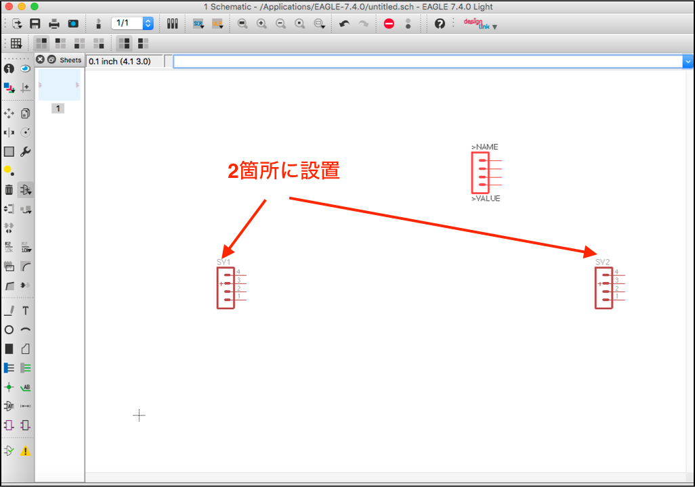

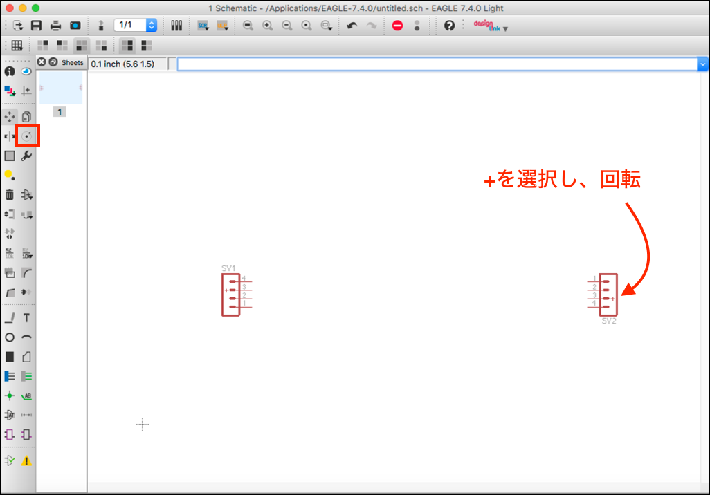

## VCCの追加

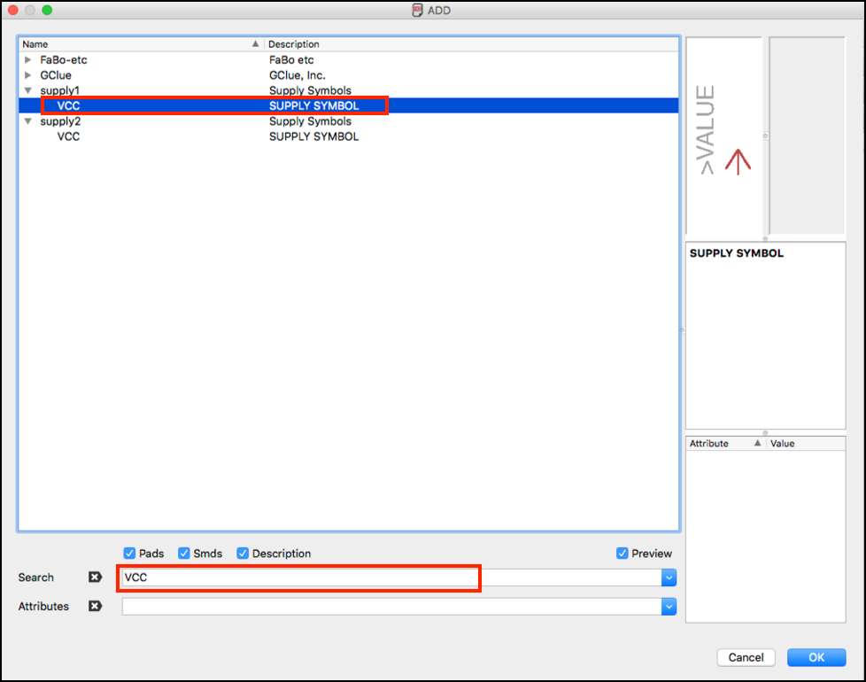

## GNDの追加

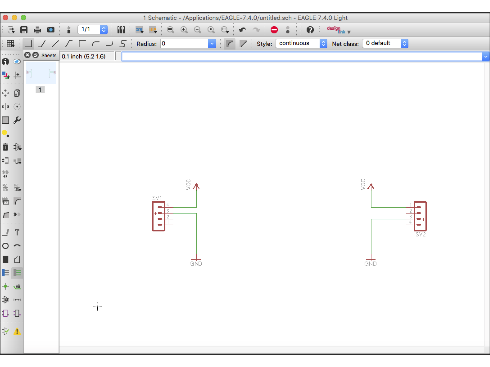

## SDA, SCLの追加

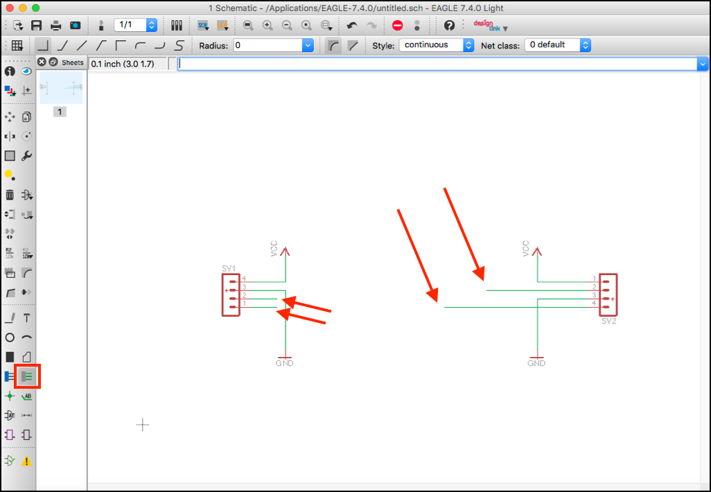

## SDA, SCLをプルアップ

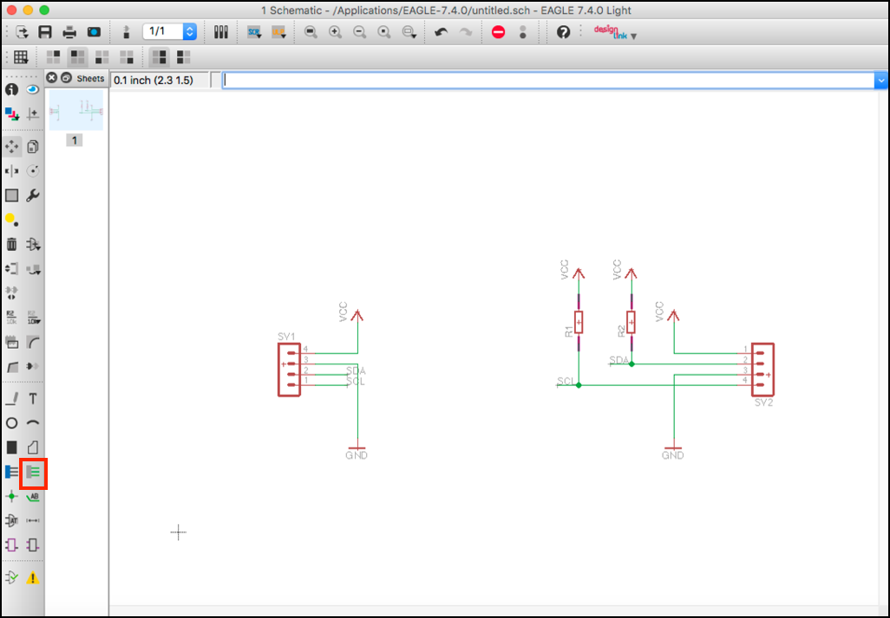

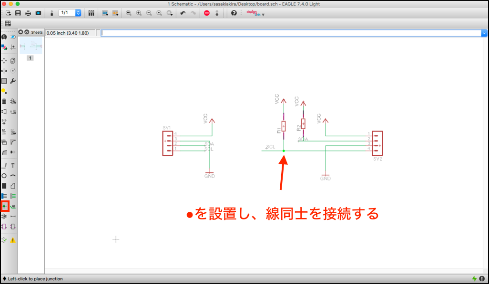

## 完成図

## レイアウトの作成

## テキストの追加

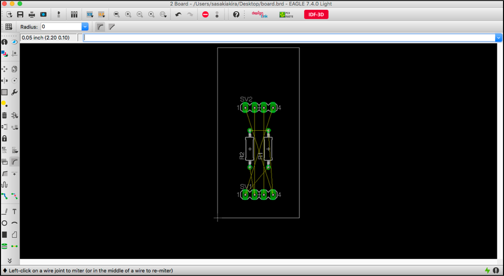

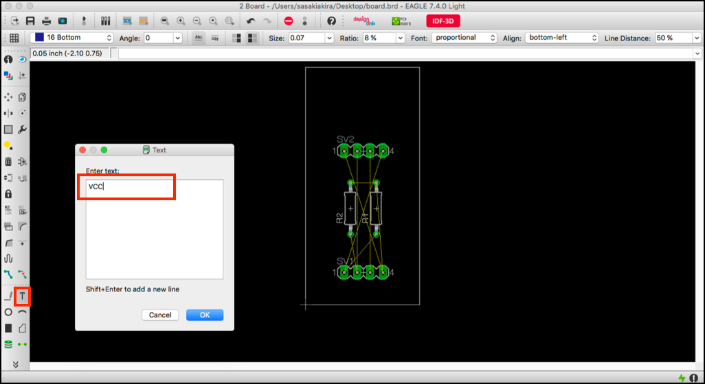

## センサー名を追加

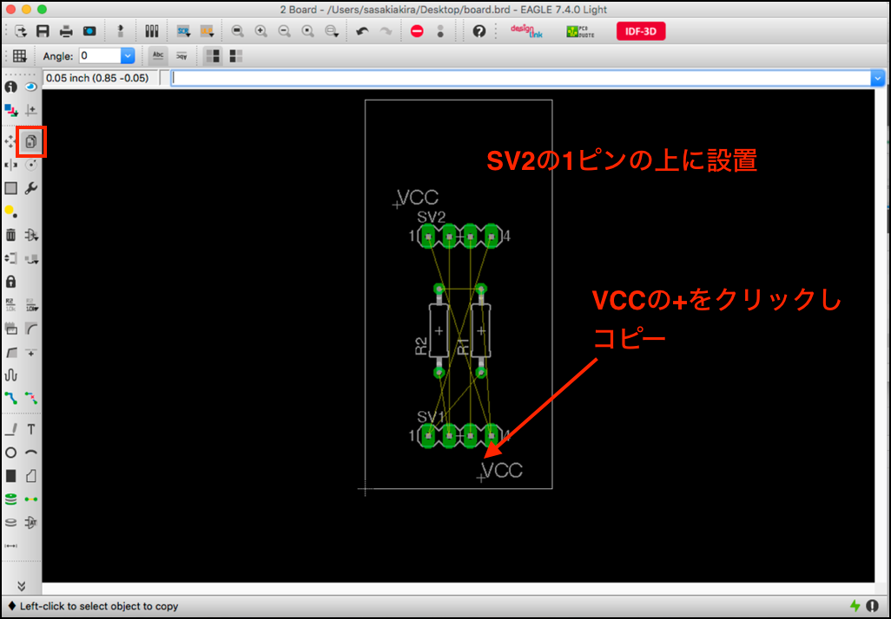

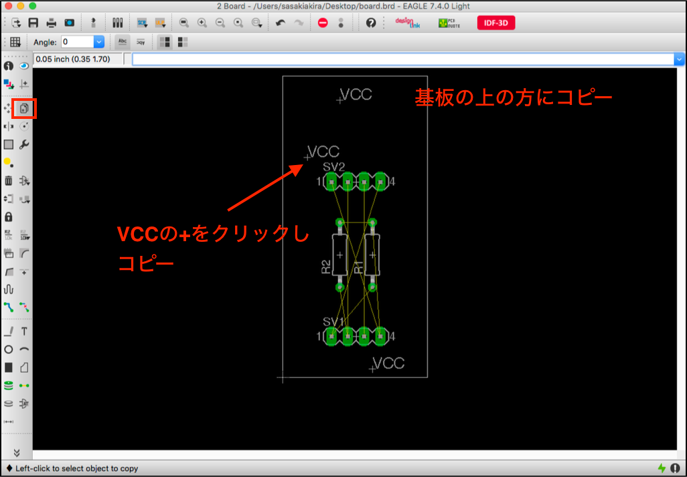

## 角を丸める

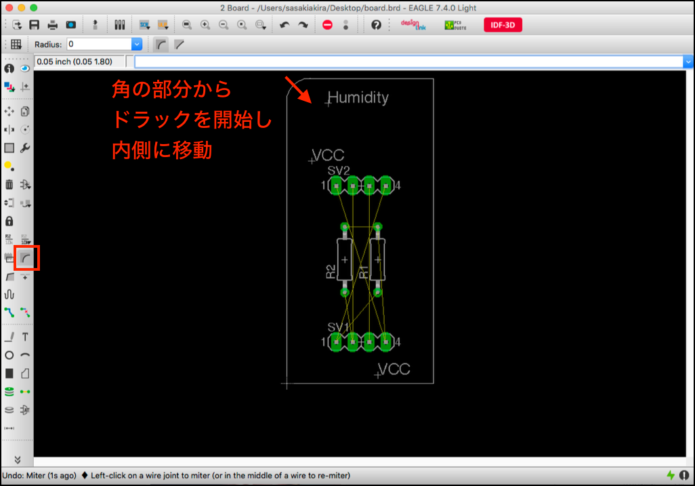

## Autorouter

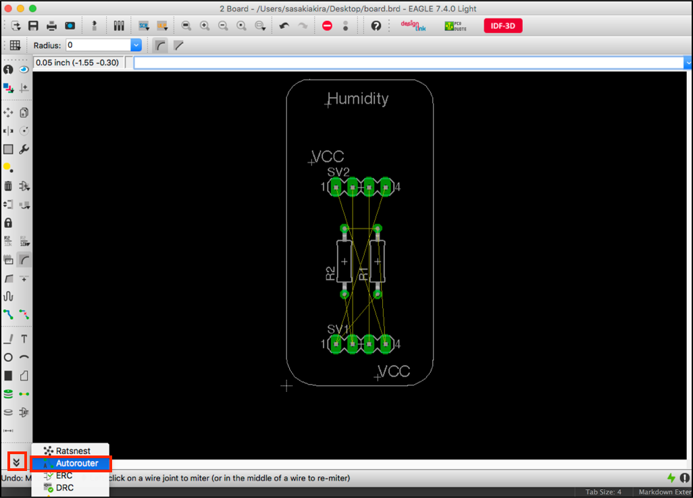

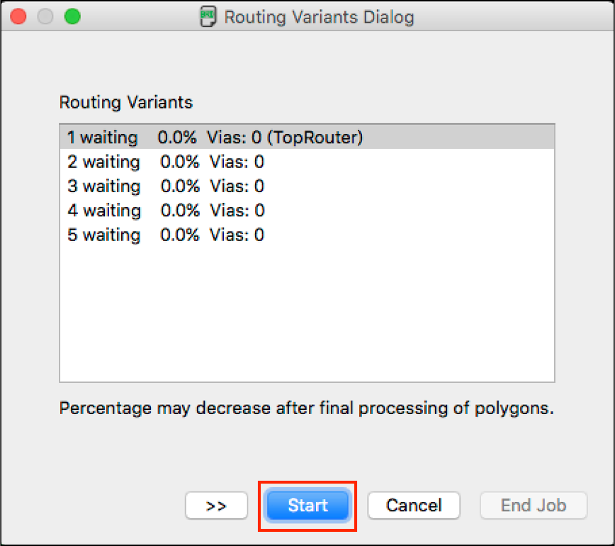

## 線を再度引き直す

