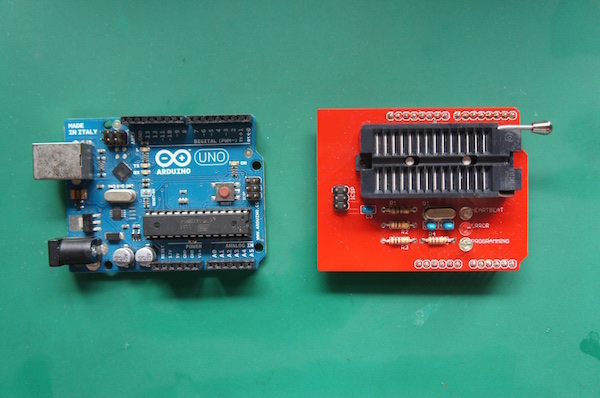

# マイコンへの書込み

####ROMライター装着

ArduinoUnoにRomライターシールドを差し込み、ATEMEGA328P−PUをPCに接続する。

####ArduinoをISPに設定

ArduinoIDEを起動し、メニューより、[ファイル]→[スケッチの例]→ [11.ArduinoISP]→[ArduinoISP]を選択します。
 

メニューより[ツール]→[マイコンボード]→[Arduino Uno]を選択します。
 

メニューの[ツール]→[シリアルポート]→[/dev/cu.usb◯◯◯(Arduino Uno)]を選択します。
 

画面左上の「→」ボタンを押すと書き込みが行われます。
画像では「書込装置を使って書き込む」と書いてありますが、実際は「マイコンボードに書込む」が表示されます。

####ブートローダーの書込み

メニューの[ツール]→[書込装置]→[Arduino as ISP]→[Arduino as ISP]を選択します。
 

メニューの[ツール]→[ブートローダーを書き込む]を選択します。
 

ここでエラーがでなければ完了です。

 
