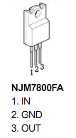
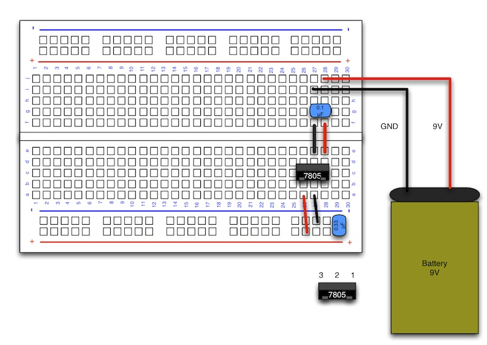

# 5Vへの電圧変換

#### ここで使用するもの

ブレッドボード
 
http://akizukidenshi.com/catalog/g/gP-05294/

3端子レギュレータ(7805)
 
http://akizukidenshi.com/catalog/g/gI-01373/

セラミックコンデンサ 0.1μF
 
http://akizukidenshi.com/catalog/g/gP-02211/

セラミックコンデンサ 0.33μF
 
http://akizukidenshi.com/catalog/g/gP-04227/

９V アルカリ電池
 
http://akizukidenshi.com/catalog/g/gB-03257/

バッテリースナップ（電池スナップ）「縦型」
 
http://akizukidenshi.com/catalog/g/gP-00452/

テスター
 
http://akizukidenshi.com/catalog/g/gM-05910/
 

#### 説明

**・ブレッドボード**

ブレッドボードは、ハンダ付けを行わずにセンサーやコードなどを穴に差し込むだけで電子回路を作成できる基盤です。
 
部品の付け替えが容易なため、回路の試作などに利用されます。

 
**・３端子レギュレータ**

　電圧を大きい電力を決まった電圧まで下げることができる端子です。
　この端子で下げた電圧は熱に変換されます。

　この3端子レギュレータ(7805)を使って、9V(単三の場合は6V)から5Vの電圧を作り出します。

 

#### 配線図

#### 計測

　テスターを使って、３端子レギュレータの前後の電圧を計測すると、
電池側で約９V、反対側で約５Vを表示します。
　電圧が下がったと事が確認できます。

