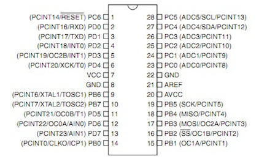
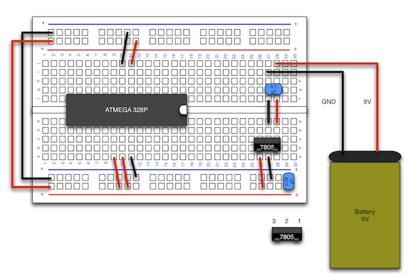

# ICの接続

#### ここで使用するもの

ATMEGA 328P

 

#### 説明

**・ATMEGA328P**
 

プログラムを動作させるために必要になります。
 
ArduinoIDEにてマイコンにプログラムを書込む場合、先にArduino用のブートローダーを書込む必要がありますが、
今回はブートローダーが既に入っているものを使用します。

 

**ATMEGA 328P 配線図**
 

 

ATMEGA 328Pのピンの説明

|1|2|3|4|5|6|7　|8|9|10|11|12|13|14|
|--|--|--|--|--|--|--|--|--|--|--|--|--|--|
|Reset|D0|D1|D2|D3|D4|5V 入力|GND|XTAL|XTAL|D5|D6|D7|D8| 
|15|16|17|18|19|20　|21　 |22|23|24|25|26|27|28| 
|D9|D10|D11|D12|D13|5V 入力|外部参照電圧|GND|A0|A1|A2|A3|A4|A5| 
 D：Digitalピン
  
 A：Analogピン
  
 XTAL：水晶発信子

赤い部分に5V、黒い部分にGNDを接続します。
 

 

#### 配線図

