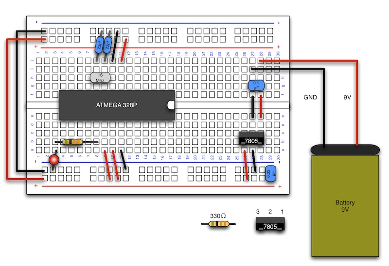

# LEDの接続

#### ここで使用するもの

抵抗　 330Ω　（カラー：橙橙茶金）
 
http://akizukidenshi.com/catalog/g/gR-25331/

LED
 
http://akizukidenshi.com/catalog/g/gI-00562/

 

#### 説明
ATMEGA 328PのArduinoのスケッチ上でのピン配置は下記の通りになります。

 

#### 配線図
digital 13のpinに330Ωの抵抗を接続し、LEDに接続します。
 
LEDは、digital 13の方が+(長い方)になります。
 
向きを間違えるとLEDが破損しますので注意して下さい。

