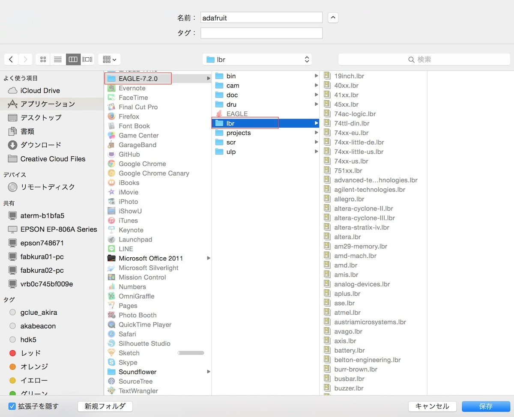
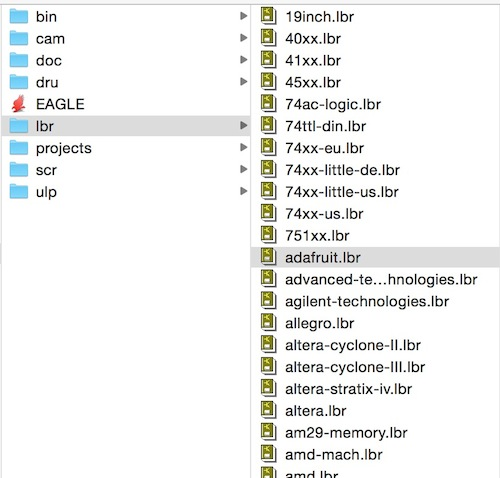
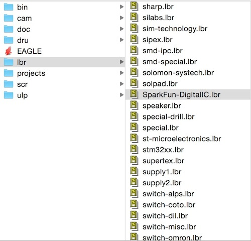
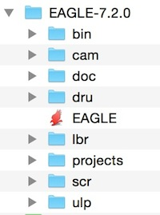
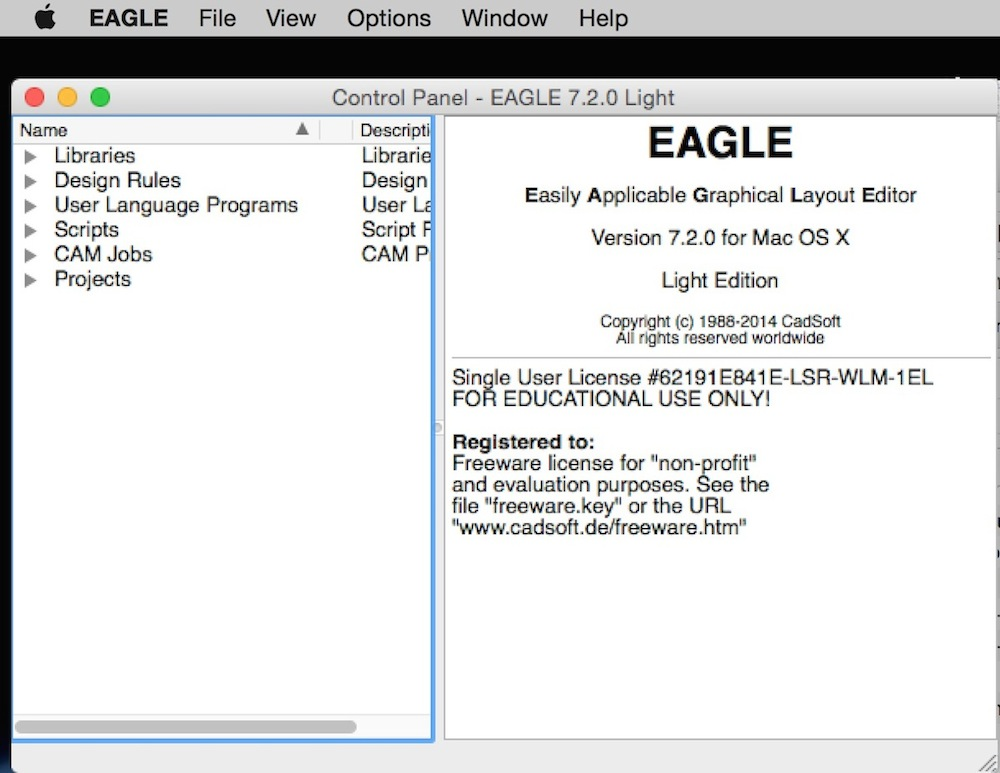

# 環境設定

## Eagleのダウンロード

基板データ作成にはEagleという回路図作成用のCADツールを使用します。

Eagleのダウンロード
 
http://www.cadsoftusa.com/download-eagle/

 
## ライブラリを取り込む

下記のライブラリをダウンロードし「Eagle-7.2.0 > lbr」に保存します。
 

**Adafruit**
 
https://github.com/adafruit/Adafruit-Eagle-Library
 

**Sparkfun**
 
https://github.com/sparkfun/SparkFun-Eagle-Libraries/blob/master/SparkFun-DigitalIC.lbr
 

 

## Eagleの実行

Eagleを実行します。
 

「Run as Freeware」を選択します。
 
※商用で販売する基板や、企業で使う場合はライセンスを購入してください。
 

これで準備は完了です。
 

