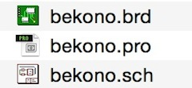
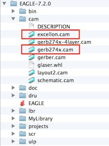
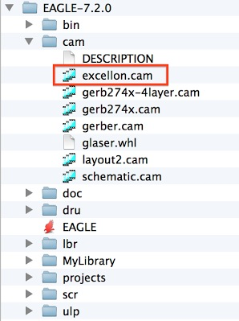
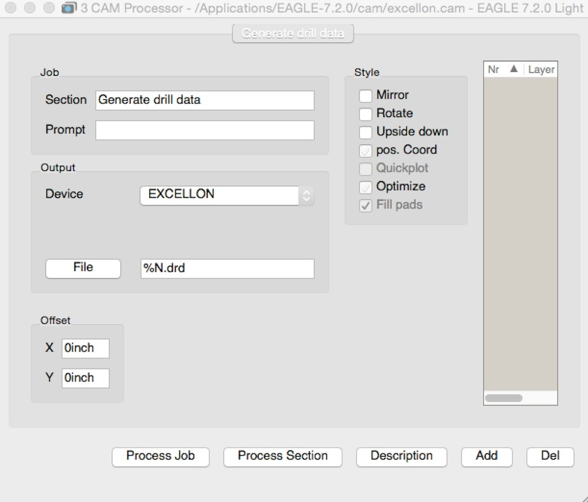
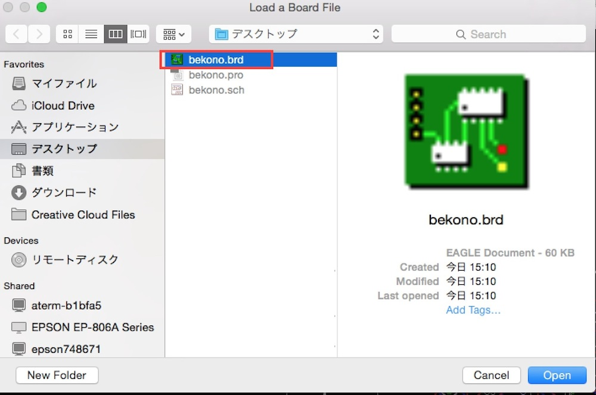
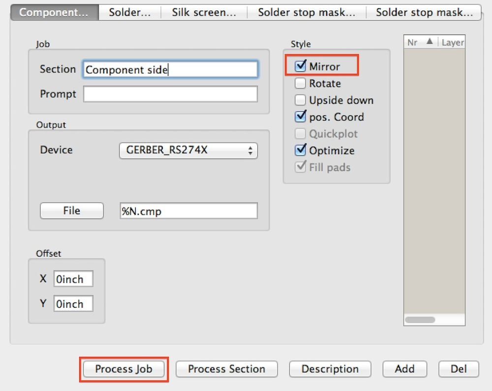
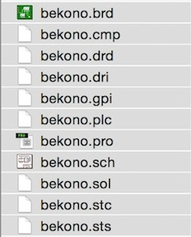

# 発注用データ作成

発注用データ作成には以下の３ファイルを使用します。
 

 

EAGLEフォルダ（実行ファイルがあるフォルダ）内にあるcamより、以下の２つのものを使用します。
 

 

最初に「excellon.cam」を実行します。
 

 

excellon.camを実行すると、以下のウィンドウが表示されます。
 

 

メニューより、「File」>「Open」>「Board…」を選択します。
 

 

今回作成したボードファイルを開きます。
拡張子が「brd」のものがボードファイルになります。
 

 

Styleの「Mirror」にチェックを付け、「Process Job」ボタンを押します。
 

 

処理が終わると以下のようなファイルが作成されます。
 

 

次に「gerb247.cam」を実行します。
 

 

先ほどと同じようなウィンドウが表示されますので、StyleよりMirrorにチェックを付け、「Prosess Job」ボタンを押します。
 

 

作成したファイルが以下のようになれば完了となります。
 

