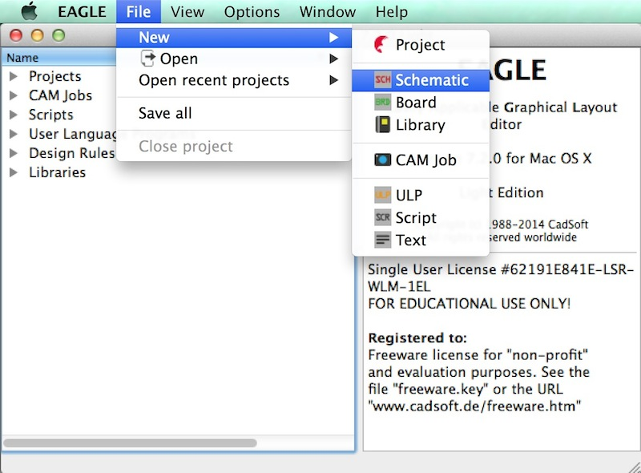
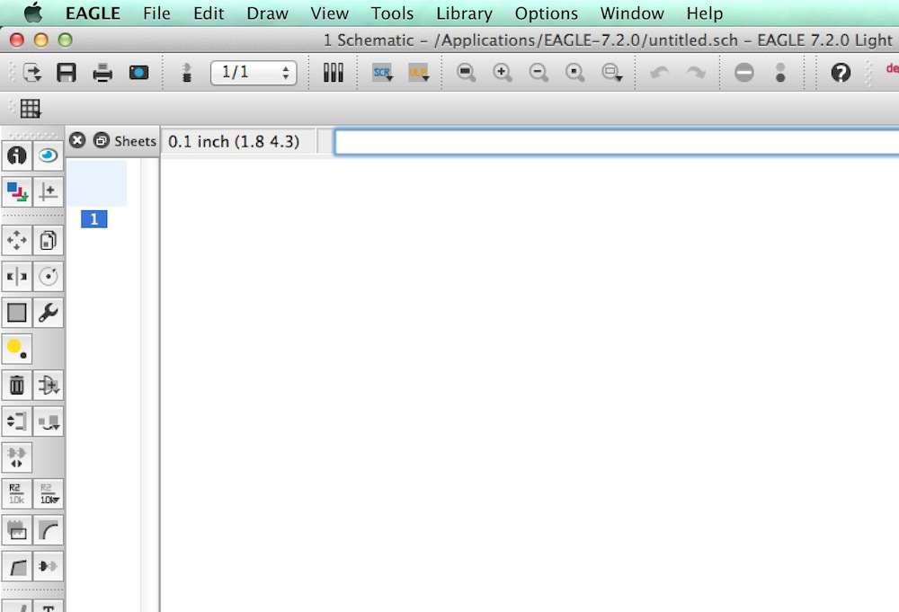
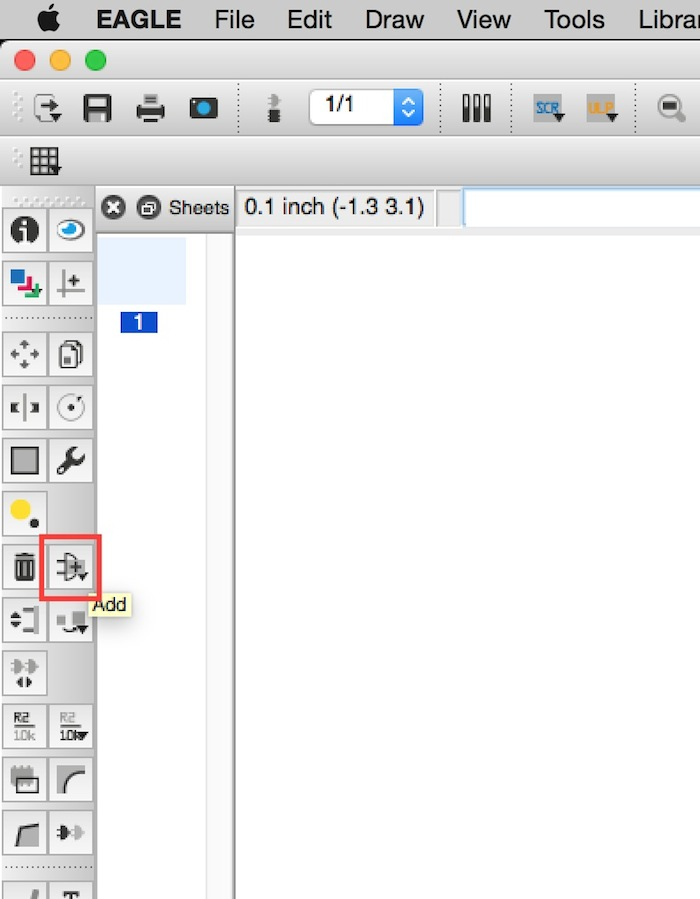
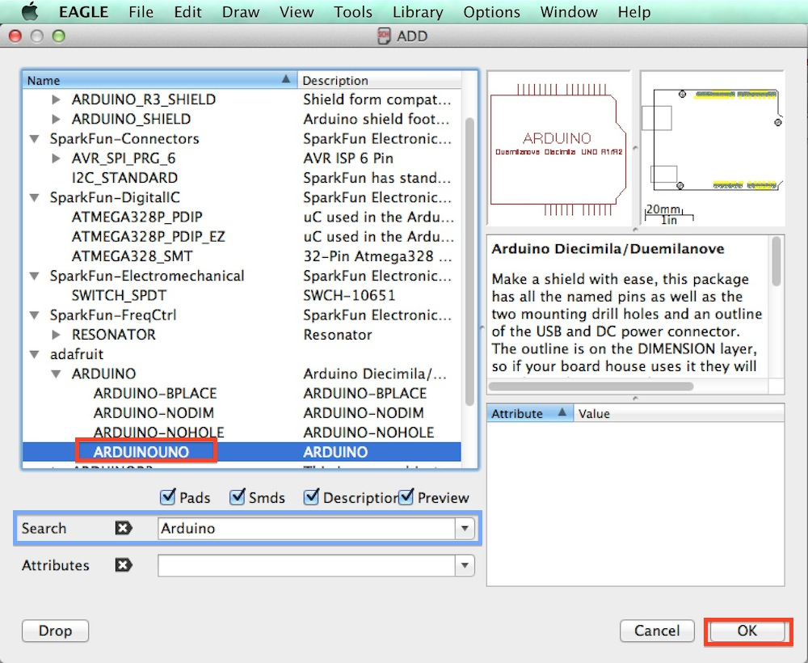
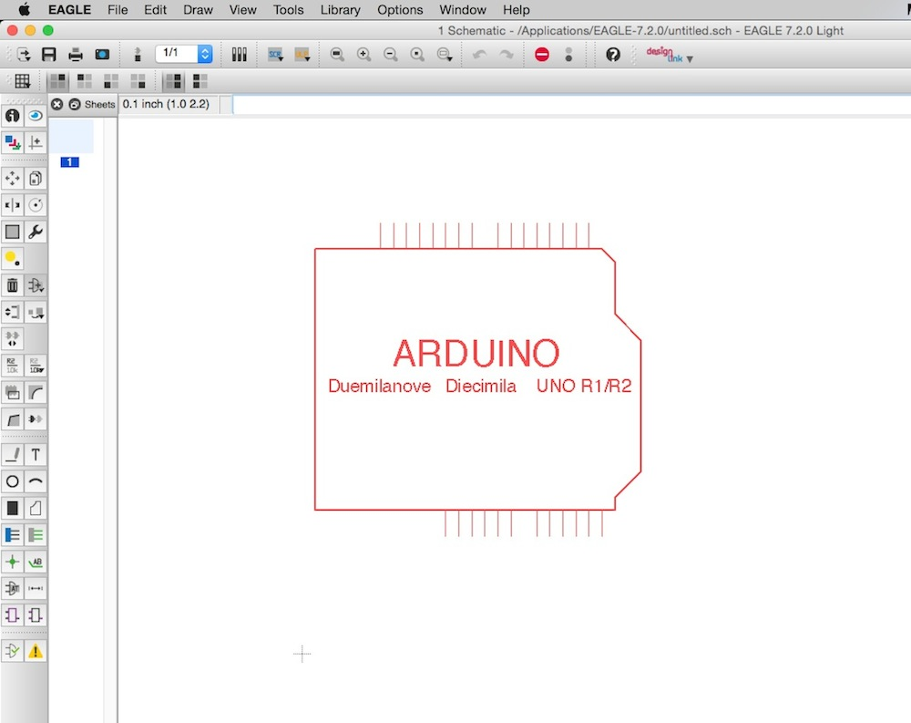
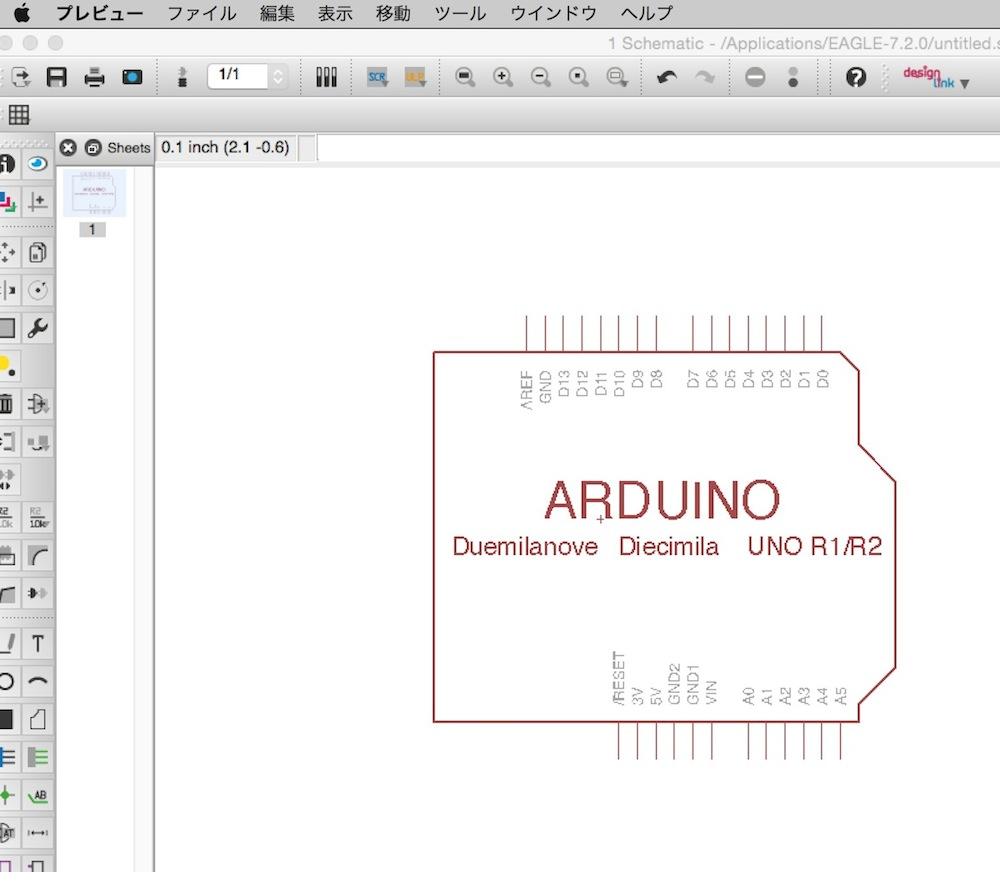

# 下地の配置

## 新規ファイルの作成
メニューより、File > New > Schematicを選択します。
 

 

新規ファイルが作成されました。
 

 

 
## 下地の配置
ファイルを作成しましたら、まず下地となる基板のデータを配置します。
 
ツールバーより「Add」を選択します。
 

 

ADDのウィンドウが表示されました。
ここから「adafruit」より「ARDUINOUNO」を選択し、「OK」ボタンを押下します。
 

 
青で印を付けている「Serch」という項目に検索文字を入力することで、絞り込みを行う事ができます。
 
「Ard*****」のように「*****」を使用することで一部の文字が一致するものを検索することもできます。
 

 

赤い線の基板が表示されました。
この状態では配置されていないので、配置したい場所でクリックします。
 

クリックすることで色が少し変わります。
これで基板のデータが配置されました。
 

 

なお、この状態でもう一度別の場所をクリックするともう１つ基板データが配置されてしまいます。
 
この状態を解除するにはエスケープキーを押下するか、別のツールを選択します。