# レギュレータ、DCジャックの配置

3端子レギュレータ(7805)
 
http://akizukidenshi.com/catalog/g/gI-01373/
 
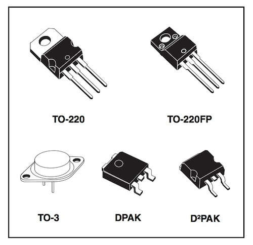

## 部品の配置

３端子レギュレータを配置します。
 
基板の時と同様に、ツールバーより「Add」を選択します。
 

 

今回使用するものは「TO220H」になります。
 

 

図のように配置します。
 

 

次に電源ジャックを配置します。
 
「DC JACK」で検索して対象のものを選択します。
 

 

こちらも図のように配置します。
 
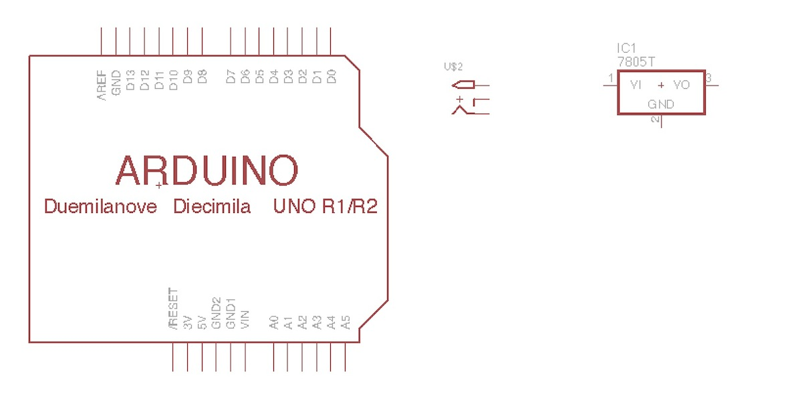

 

次はコンデンサの配置です。
 
「capacitor」で検索し、「c2.5/2」の型のものを選択します。
 
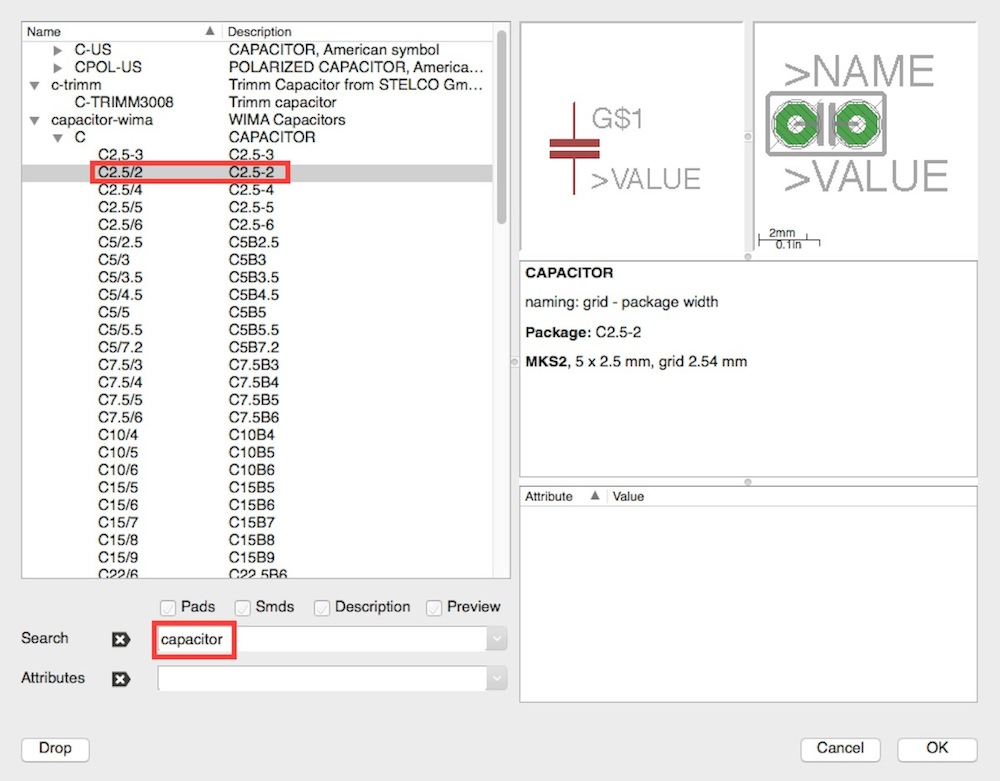

 

３端子レギュレータの両側に１つずつ配置します。
 

 

## 値の設定
配置部品の値を設定します。
 
ツールバーより、「Value」を選択します。
 

 

「C１」のコンデンサを選択すると、「New value for C1」と表示されるので、「0.1uF」と入力し、「OK」ボタンを押下します。
 

 

同様に「C２」に「0.33uF」と入力します。
 
入力が終わると画面上でコンデンサの値が見えるようになりました。
 
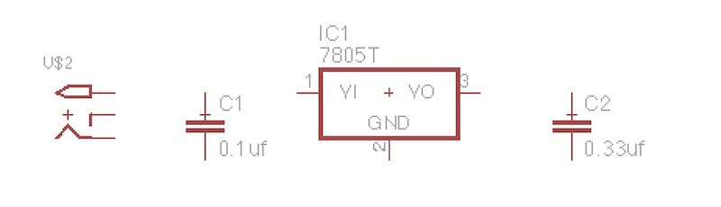

 

## 線を引く
部品同士を接続するために線を引きます。
 
ツールバーより「Net」を選択します。
 
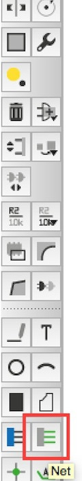

 

部品の線がでている部分を始点に線を引いて行きます。
 

 

交差ポイントに緑の丸点がでてこない場合は線が繋がっていない状態なので、自分で追加します。
 
ツールバーより「Junction」を選択します。
 
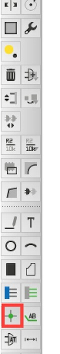

 
交差ポイントをクリックする事で丸点を配置することができます。
 
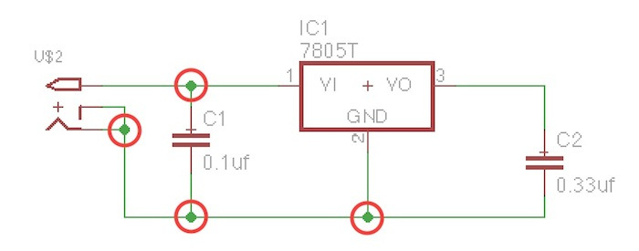

 

## GNDを追加
GNDを追加します。
ツールバーより「Add」を選択します。
「GND」で検索し、「supply1」の「GND」を選択します。
 

 

GNDは先ほど作成した回路の下部分に配置します。
 
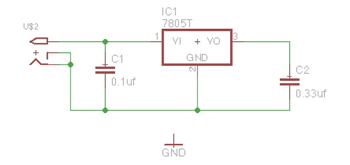

 

配置の次は配線です。ツールバーより「Net」を選択します。
 
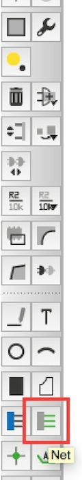

GNDから上に線を引き、上の回路に繋げます。
 

 

## 出力される5V
次にレギュレータによって出力される「5V」を配置します。
 
「+5V」で検索し、「supply1」の「+5V」を選択します。
 
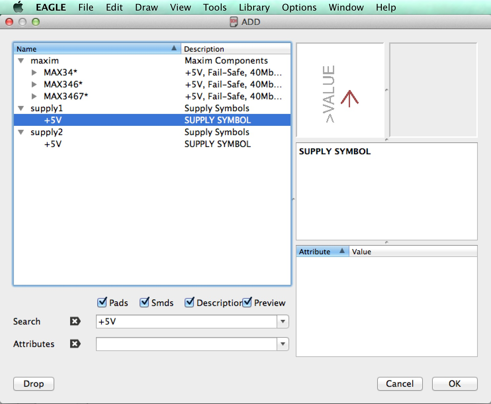

 

先ほど作成した回路の右上に配置します。
 
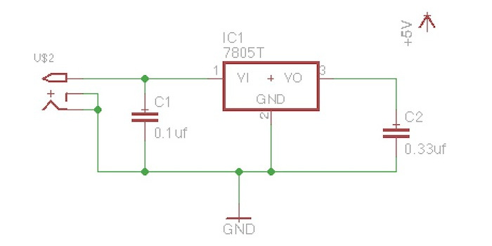

 

「ツールバー」より「Net」を選択し、+5Vと先ほどの回路に線を引きます。
 
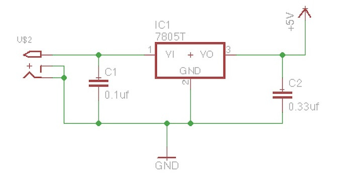

 

## データの保存
ここまで出来ましたら一旦データを保存します。
 
メニューより、File > Save as...を選択し、ファイル名を設定して保存します。
 

 
エラー等でEagleが終了してしまった場合にやり直しになってしまうので、頻繁に保存することをおすすめします。

