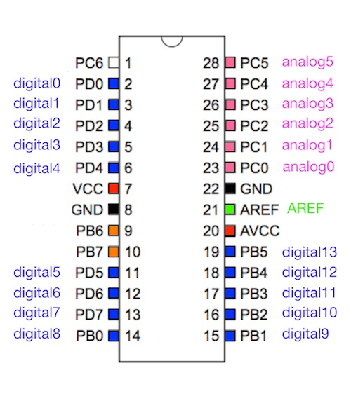
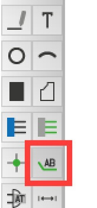
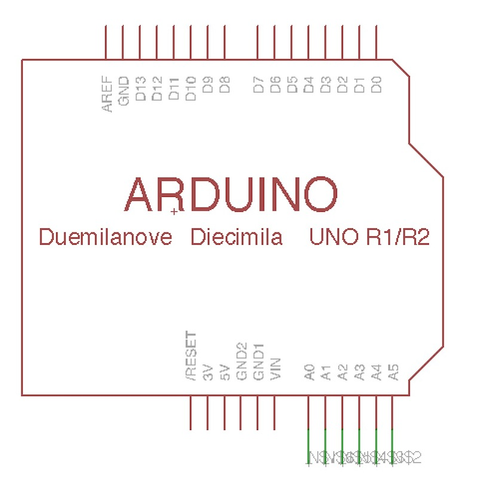
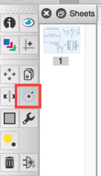
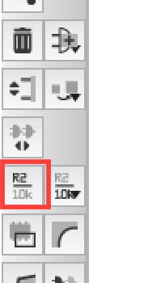
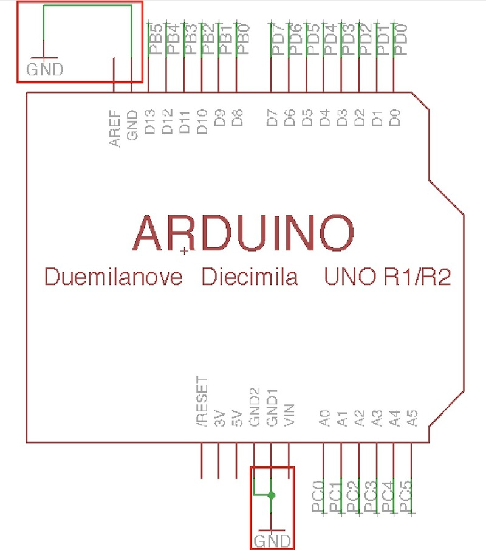
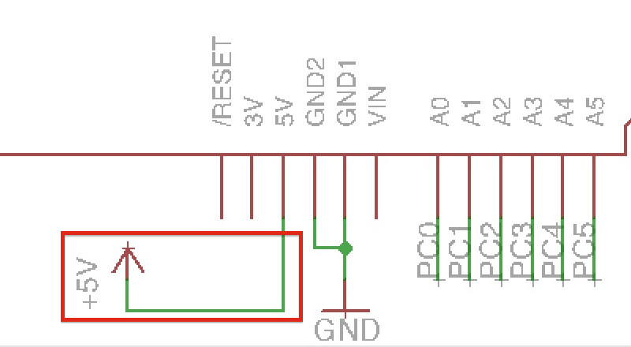
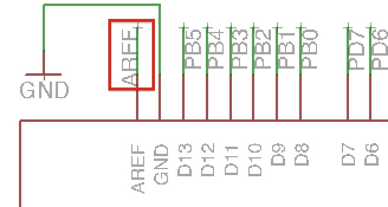

# 配線

基板とICの配線を行います。
 

#### Analogの配線
analog0-analog5(a0-a5)まで配線します。
 
ツールバーより「Net」を選択します。
 

 
基板データの右下にある「A0」〜「A5」に対して線を引きます。
 

 

ツールバーより「Label」を選択します。
 

先ほど引いた線をクリックしラベルを追加します。
 

 

この状態ではラベルの文字が見えないので文字を回転させます。
 
ツールバーより「Rotate」を選択します。
 

 

文字の隣にある小さな「+」の箇所を選択すると文字を回転させることができます。
 
全てに対して回転を行い、下のようにします。
 

 

次にラベルの名称を変更します。
 
ツールバーより「Name」を選択します。
 

 

それぞれの名前を変更します。
 

 

#### Digitalの配線
Digital 0-13(D0-D13)も配線します。
 
ツールバーの「Net」と「Name」を使用し配線後、名前を変更します。
 

 

#### 5V、GNDの配線
配置済みのGNDをコピーし、新たに２つ配置します。
 
上下のGNDに対してそれぞれ配線します。
 

 

+5Vも同様に配置し、配線します。
 

 

AREFから線を引き、名称を「AREF」に変更します。
 

