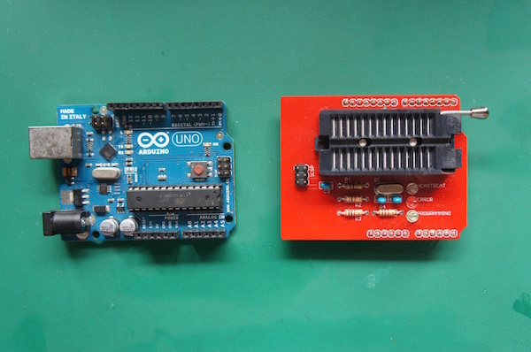
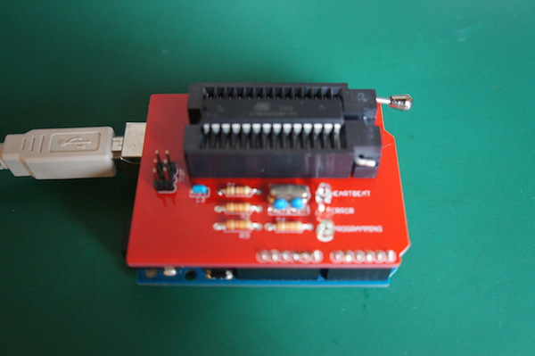

# 0.2 マイコンへの書込み

## ROMライター装着

ArduinoUnoにRomライターシールドを差し込み、ATEMEGA328P−PUをPCに接続する。

## ArduinoをISPに設定

1. ArduinoIDEを起動し、メニューより、++"ファイル"+"スケッチの例"+"11.ArduinoISP"+"ArduinoISP"++を選択します。

2. メニューより++"ツール"+"マイコンボード"+"Arduino Uno"++を選択します。

3. メニューの++"ツール"+"シリアルポート"+"/dev/cu.usb◯◯◯(Arduino Uno)"++を選択します。

4. 画面左上の「→」ボタンを押すと書き込みが行われます。
画像では「書込装置を使って書き込む」と書いてありますが、実際は「マイコンボードに書込む」が表示されます。

## ブートローダーの書込み

1. メニューの++"ツール"+"書込装置"+"2Arduino as ISP"+"Arduino as ISP"++を選択します。

2. メニューの++"ツール"+"ブートローダーを書き込む"++を選択します。

ここでエラーがでなければ完了です。
