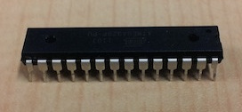
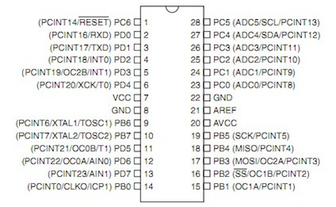
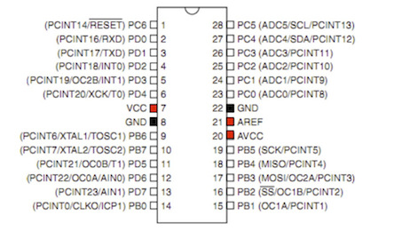
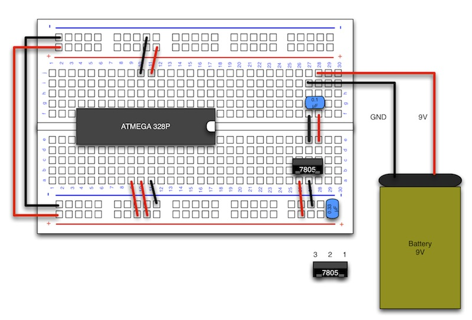

# 1.3 ICの接続

## 本項で使用するもの

|項目|入手先|
|:--|:--|
|ATMEGA 328P|[http://akizukidenshi.com/catalog/g/gI-03142/](http://akizukidenshi.com/catalog/g/gI-03142/)|

## 説明

<b>ATMEGA328P</b>
:		 
		プログラムを動作させるために必要になります。
		ArduinoIDEにてマイコンにプログラムを書込む場合、先にArduino用のブートローダーを書込む必要がありますが、今回はブートローダーが既に入っているものを使用します。

<b>ATMEGA 328P 配線図</b>
:		

ATMEGA 328Pのピンの説明

|PIN|328PIN 名称|ArduinoPIN 名称|
|:--|:--|:--|
|1|PC6|Reset|
|2|PD0|D0|
|3|PD1|D1|
|4|PD2|D2|
|5|PD3|D3|
|6|PD4|D4|
|7|VCC|5V 入力|
|8|GND|GND|
|9|PB6|XTAL1|
|10|PB7|XTAL2|
|11|PD5|D5|
|12|PD6|D6|
|13|PD7|D7|
|14|PD8|D8|

|PIN|328PIN 名称|ArduinoPIN 名称|
|:--|:--|:--|
|15|PB1|D9|
|16|PB2|D10|
|17|PB4|D11|
|18|PB5|D12|
|19|PB6|D13|
|20|AVCC|5V 入力|
|21|AREF|外部参照電圧|
|22|GND|GND|
|23|PC0|A0|
|24|PC1|A1|
|25|PC2|A2|
|26|PC3|A3|
|27|PC4|A4|
|28|PC5|A5| 

!!!Note
	D：Digitalピン 
	A：Analogピン 
	XTAL：水晶発信子 

赤い部分に5V、黒い部分にGNDを接続します。

## 配線図

