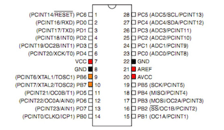
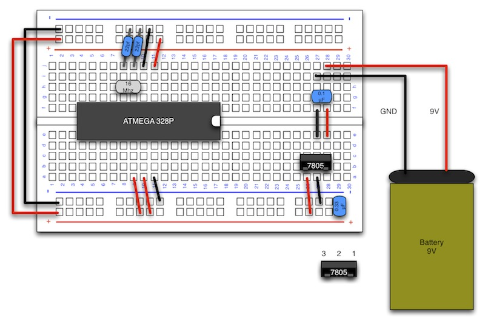

# 1.4 水晶発信子の接続

## ここで使用するもの

|項目|入手先|
|:--|:--|
|水晶発信子(16MHz)|[http://akizukidenshi.com/catalog/g/gP-08671/](http://akizukidenshi.com/catalog/g/gP-08671/)|
|セラミックコンデンサ 22pF|[http://akizukidenshi.com/catalog/g/gP-03620/](http://akizukidenshi.com/catalog/g/gP-03620/)|

## 説明

水晶発信子
:		電気を流す事でクロック信号を出力する素子。
		オレンジの部分に水晶発信子を接続します。

## 配線図

