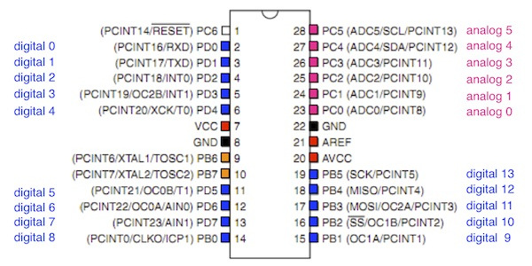

# 1.5 LEDの接続

## 本項で使用するもの

|項目|入手先|
|:--|:--|
|抵抗　 330Ω　（カラー：橙橙茶金）|[http://akizukidenshi.com/catalog/g/gR-25331/](http://akizukidenshi.com/catalog/g/gR-25331/)|
|LED|[http://akizukidenshi.com/catalog/g/gI-00562/](http://akizukidenshi.com/catalog/g/gI-00562/)|

## 説明
ATMEGA 328PのArduinoのスケッチ上でのピン配置は下記の通りになります。

## 配線図
digital 13のpinに330Ωの抵抗を接続し、LEDに接続します。

LEDは、digital 13の方が+(長い方)になります。

向きを間違えるとLEDが破損しますので注意して下さい。

