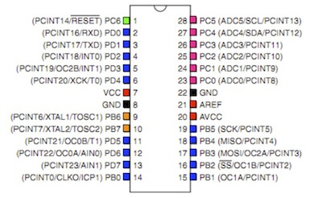
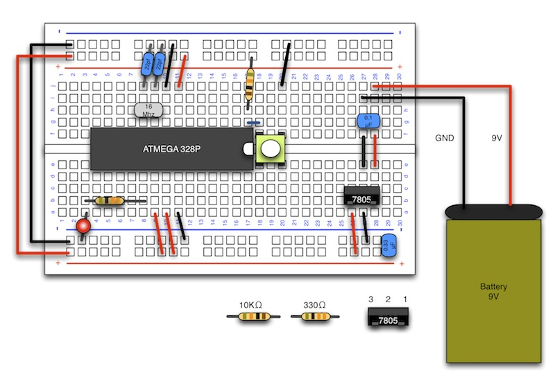

# 1.6 リセットスイッチの実装

## 本項で使用するもの

|項目|入手先|
|:--|:--|
|抵抗　10KΩ　（カラー：茶黒橙金) |[http://akizukidenshi.com/catalog/g/gR-25103/](http://akizukidenshi.com/catalog/g/gR-25103/)|
|タクトスイッチ|[http://akizukidenshi.com/catalog/g/gP-02561/](http://akizukidenshi.com/catalog/g/gP-02561/)|

## 説明

緑の部分がリセット端子になります。

## 配線図

