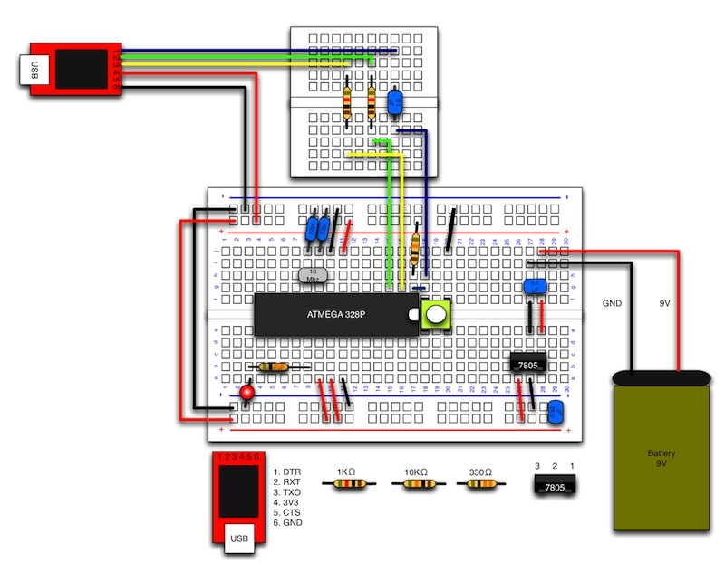

# 1.7 USBシリアル変換モジュールの接続

## 本項で使用するもの

|項目|入手先|
|:--|:--|
|FT232RL搭載小型USB-シリアルアダプタ 5V|[http://www.switch-science.com/products/detail.php?product_id=342](http://www.switch-science.com/products/detail.php?product_id=342)|
|抵抗　 1KΩ　（カラー：茶黒赤金）|[http://akizukidenshi.com/catalog/g/gR-25102/](http://akizukidenshi.com/catalog/g/gR-25102/)|
|セラミックコンデンサ 0.1uF|[http://akizukidenshi.com/catalog/g/gP-00090/](http://akizukidenshi.com/catalog/g/gP-00090/)|

## 説明

<b>FT232RL搭載小型USB-シリアルアダプタ</b>
:		PCとマイコン間をUSBケーブルで繋ぐことでデータ転送が行えるようになります。また、PCから電源供給されるため電池が無くても動かす事がことができます。

PCからスケッチが転送できるように、USBシリアル変換モジュールを接続します。

## 配線図

