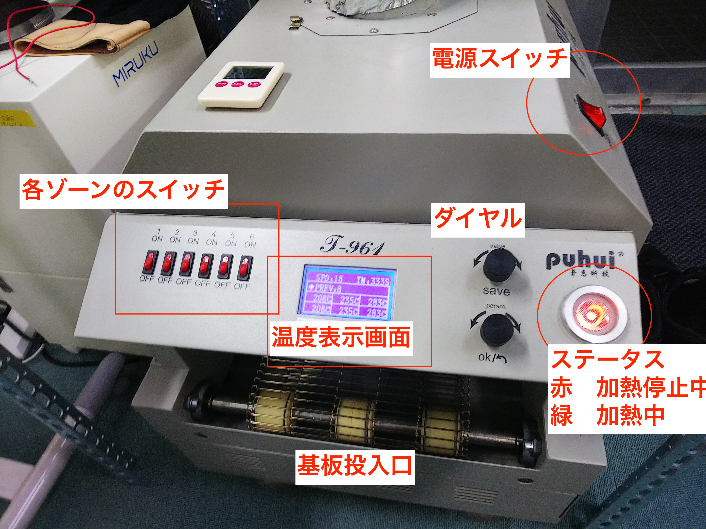

# 10.2 リフロー T-961操作方法

##リフロー の各名称

##リフロー 操作方法

起動すると下記の画面になり、ステータス画面は赤色になる。つまみを回すことにより温度設定、ベルトスピード設定するか、プロファイルを選ぶ。

OKボタンを押すと、ステータスランプが赤から緑になり加熱が始まる。

目標の温度になるまで、待つ（１５分くらい）

設定温度と現在の温度が表示されます。

設定温度が基板の温度と一致するとは限りません。必ず必要に応じて温度センサーを投入して確認して、調整し理想のプロファイルまで調整する。
