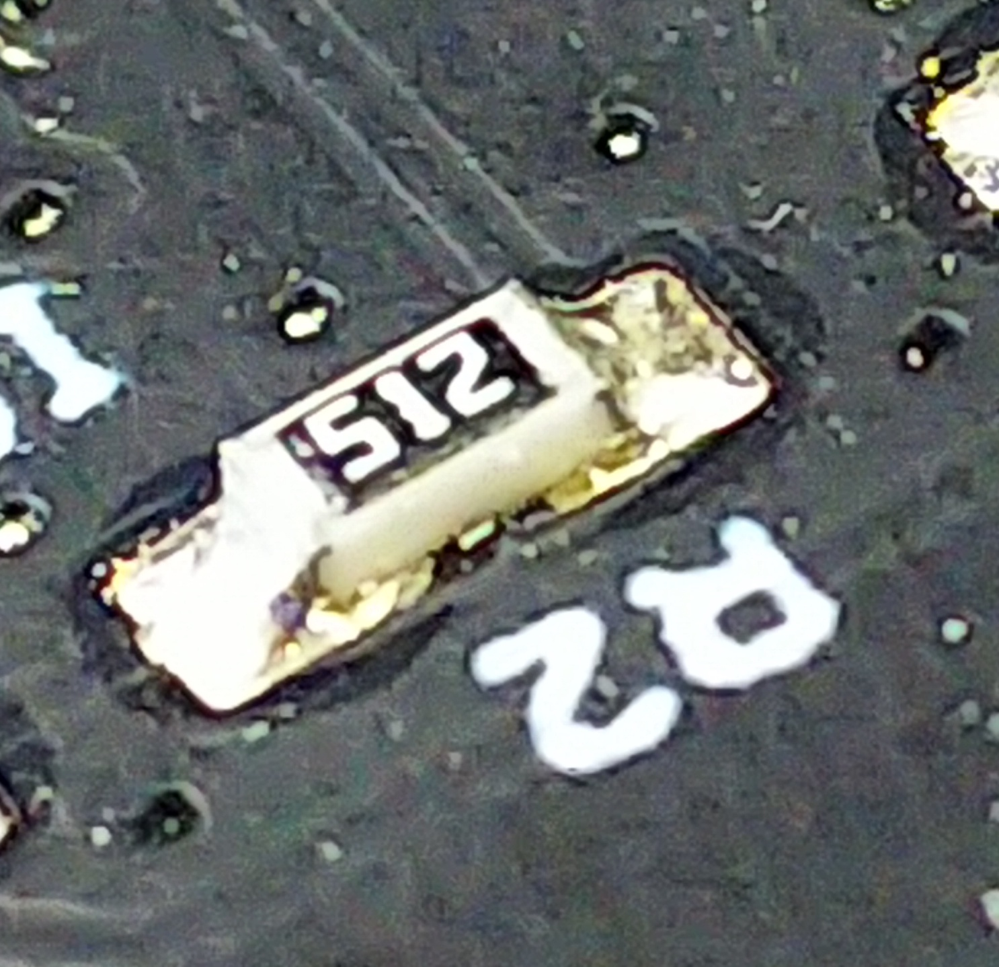

# 10.5 実装検査

## チェック項目

半田の溶け具合、濡れ等。

フィレットが形成されているか確認します。

半田のズレがないか、半田もれがないか。

不品の欠品がないか、LED、電解コンデンサ、ダイオードは、正しい方向なのか？

異状がなければ電源装置があれば、電圧調査して、通電試験を行う。

動作確認し、完成です。

## その他

電子機器は、温度や湿度などで環境で動かないこともありますので試験しましょう。

振動試験や落下試験も必要に応じて実施。

製造数が多い場合は、サンプリング検査を実施し、徹底的に詳しい検査します。
