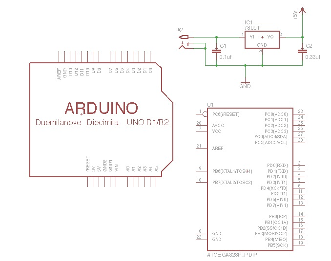
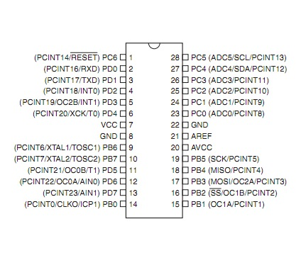
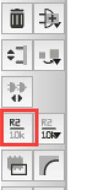
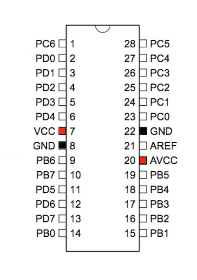
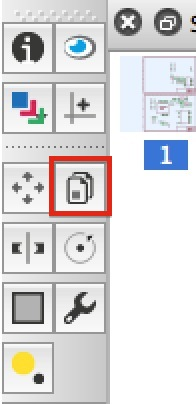

# 2.4 ICの配置

Arduino Unoで使用されている「ATMEGA328P」を配置します。

ATMEGA328P
[データシート](
http://www.atmel.com/images/Atmel-8271-8-bit-AVR-Microcontroller-ATmega48A-48PA-88A-88PA-168A-168PA-328-328P_datasheet_Complete.pdf)

## ATMEGA328の配置

ATMEGA328Pを配置します。

ツールバーのAddを選択し、ATMEGA*で検索を行い、「ATMEGA328P_PDIP」を選択します。

ATMEGA328Pは空いている箇所に配置します。

少し余裕を持って配置すると良いです。

## 線を引き、ラベル名をつける

ツールバーより「Net」を選択します。

ICから出ている線の部分全てに線を追加します。

ツールバーより「Label」を選択します。

先ほど追加した線をダブルクリックします。
１回目のクリックで対象を決め、２回目のクリックで場所が決まります。

全ての場所に追加します。

## ラベル名の変更

ATMEGA 328Pの説明

|1|2|3|4|5|6|7|8|9|10|11|12|13|14|
|--|--|--|--|--|--|--|--|--|--|--|--|--|
|Re|D0|D1|D2|D3|D4|5V   |GND|XTAL|XTAL|D5|D6|D7|D8|
|15|16|17|18|19|20|21|22|23|24|25|26|27|28|
|D9|D10|D11|D12|D13|5V|外|GND|A0|A1|A2|A3|A4|A5|

Re：Reset

外：外部電源

5V：5V入力

ツールバーより「Label」を選択します。

先ほど引いた線をクリックし、それぞれの名称を入力します。

## GNDと5V電源

+5VとGNDを追加しますが、既に配置している部品については、ツールバーの「Copy」にてコピーすることができます。

使用方法はCopyツール選択後、配置済みの部品をクリックし、次に配置したい場所にクリックすれば完了です。

コピーした部品は下のように配置します。

ツールバーの「Net」を使用し配線します。

+5Vは「AVCC」と「VCC」へ、GNDは左下にあるGND2箇所にそれぞれ配線します。

