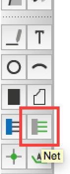
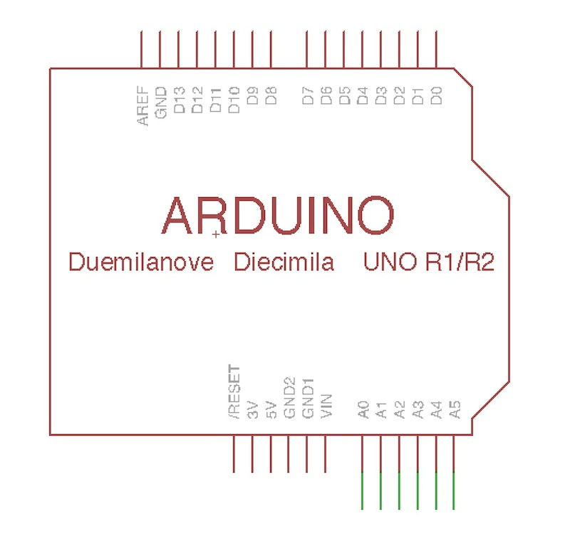
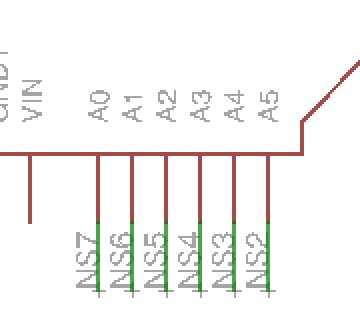
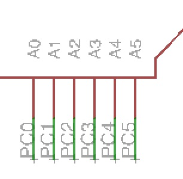
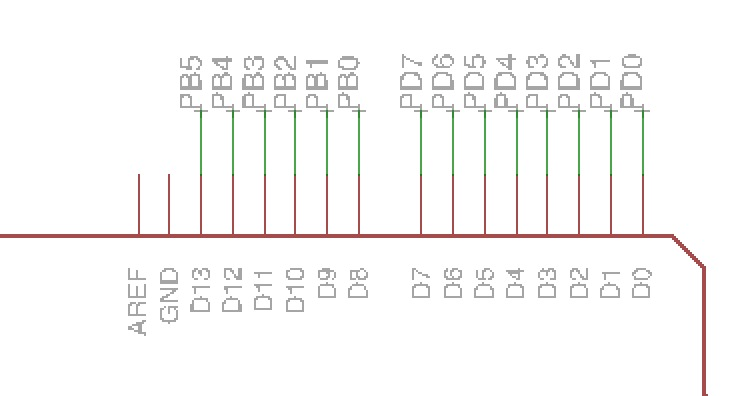

# 2.6 配線

基板とICの配線を行います。

#### Analogの配線
analog0-analog5(a0-a5)まで配線します。

ツールバーより「Net」を選択します。

基板データの右下にある「A0」〜「A5」に対して線を引きます。

ツールバーより「Label」を選択します。

先ほど引いた線をクリックしラベルを追加します。

この状態ではラベルの文字が見えないので文字を回転させます。

ツールバーより「Rotate」を選択します。

文字の隣にある小さな「+」の箇所を選択すると文字を回転させることができます。

全てに対して回転を行い、下のようにします。

次にラベルの名称を変更します。

ツールバーより「Name」を選択します。

それぞれの名前を変更します。

## Digitalの配線
Digital 0-13(D0-D13)も配線します。

ツールバーの「Net」と「Name」を使用し配線後、名前を変更します。

## 5V、GNDの配線

配置済みのGNDをコピーし、新たに２つ配置します。

上下のGNDに対してそれぞれ配線します。

+5Vも同様に配置し、配線します。

AREFから線を引き、名称を「AREF」に変更します。

