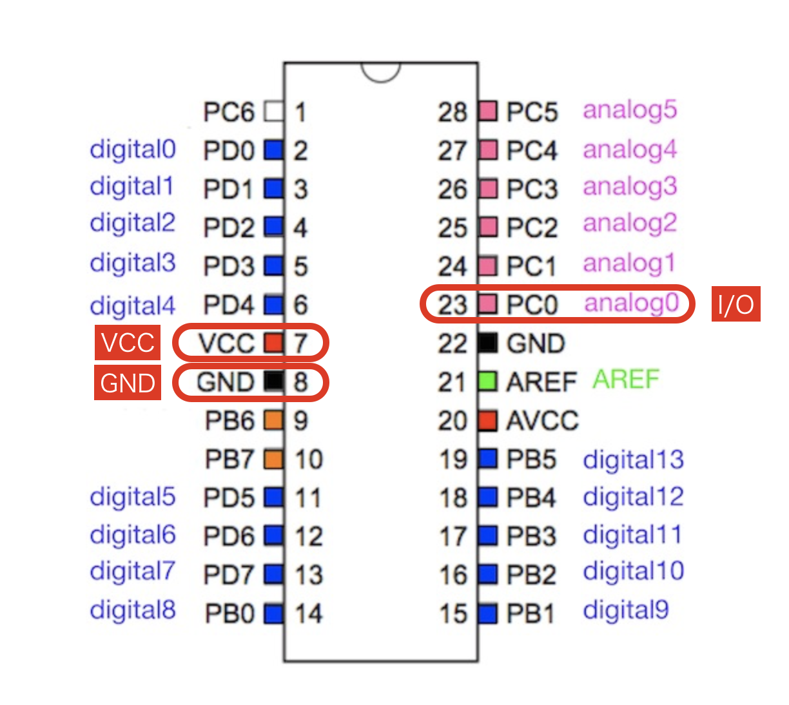
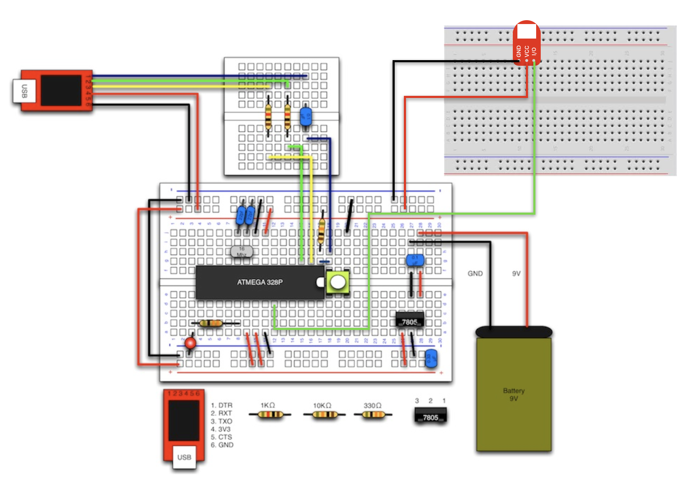

# #101 LED Brick

## Overview

LEDのBrickです。発光色は5色（青・緑・赤・白・黄）あります。Lチカのおともにもどうぞ。

## 接続先



## 配線



## Sample Code

D2コネクタにLED Brickを接続し、一定時間(1秒=1000ms)ごとに点灯/消灯（Lチカ）させています。

|定数|値|
|:--|:--|
|HIGH|1|
|LOW|0|

```c
#define ledPin 2 // LEDピン

void setup() {
  // LED接続ピンを出力に設定
  pinMode(ledPin, OUTPUT);
}

void loop() {
  // LEDを一定時間で点滅
  digitalWrite(ledPin, HIGH);
  delay(1000);
  digitalWrite(ledPin, LOW);
  delay(1000);
}
```

## 構成パーツParts
- 5mm LED(各色)

## GitHub
- https://github.com/FaBoPlatform/FaBo/tree/master/101_led
