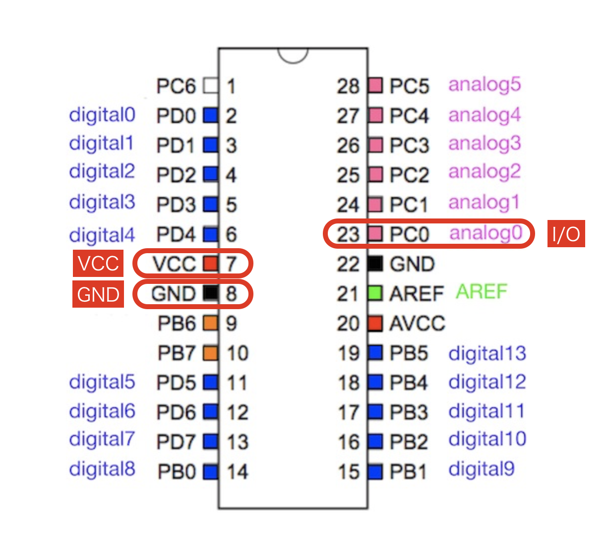
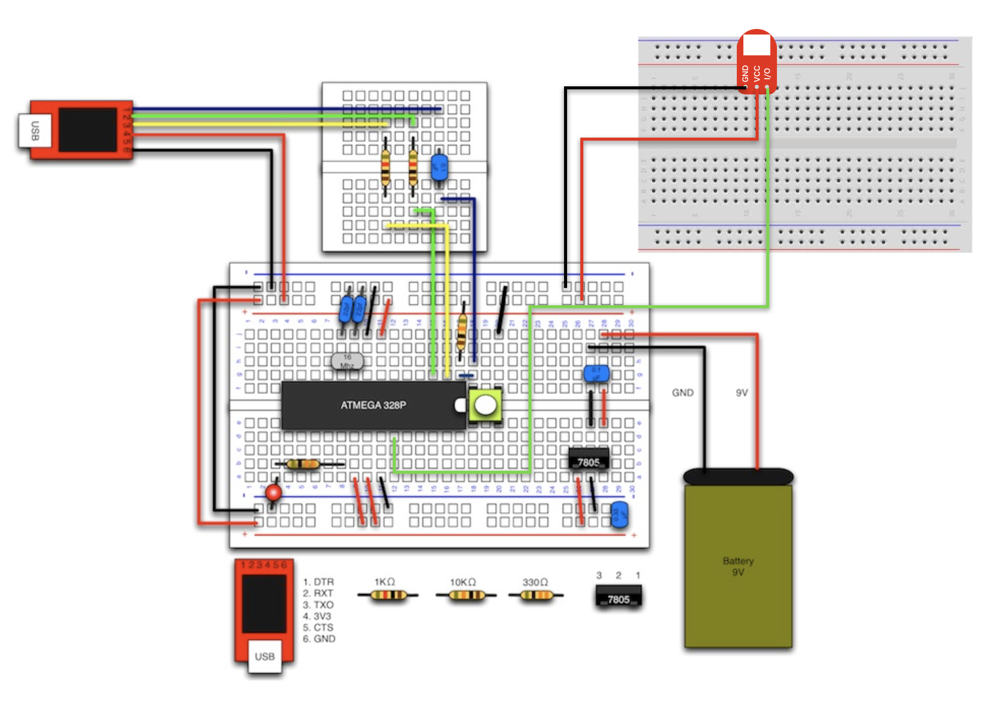
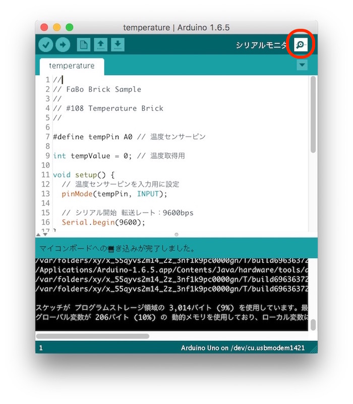
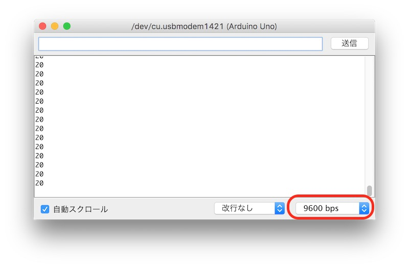
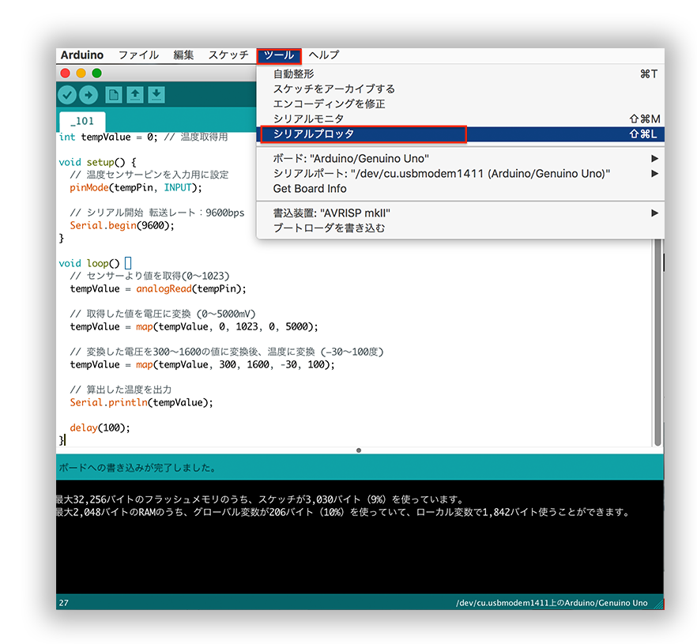
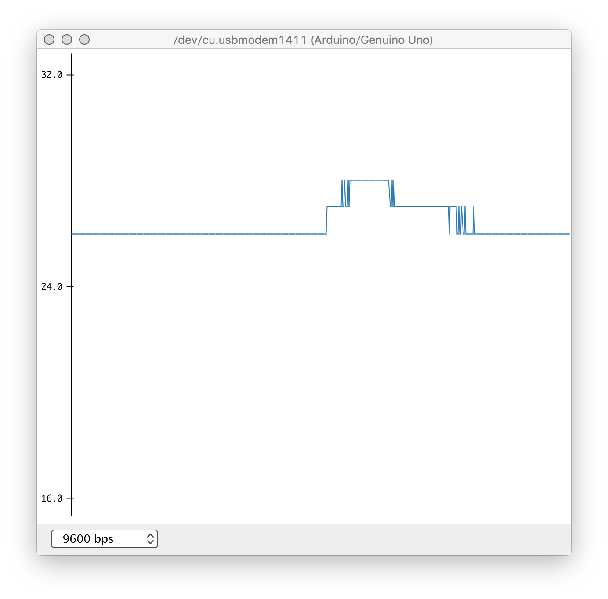

# 2.3 #108 Temperature Brick

## Overview
温度を計測するBrickです。

アナログ値(0〜1023)を取得でき、変換することで−30度から100度までの温度を計測することができます。

## 接続先



## 配線



## LM61CIZ Datasheet
| Document |
|:--|
| [LM61CIZ Datasheet](http://akizukidenshi.com/catalog/g/gI-02726/) |

## Sample Code

A0コネクタにTemprature Brickを接続して、取得した温度をシリアルモニタへ出力します。

```c
#define tempPin A0 // 温度センサーピン

void setup() {
  // 温度センサーピンを入力用に設定
  pinMode(tempPin, INPUT);

  // シリアル開始 転送レート：9600bps
  Serial.begin(9600);
}

void loop() {
  // センサーより値を取得(0〜1023)
  int tempValue = analogRead(tempPin);

  // 取得した値を電圧に変換 (0〜5000mV)
  tempValue = map(tempValue, 0, 1023, 0, 5000);

  // 変換した電圧を300〜1600の値に変換後、温度に変換 (−30〜100度)
  tempValue = map(tempValue, 300, 1600, -30, 100);

  // 算出した温度を出力
  Serial.println(tempValue);

  delay(100);
}

```

## 出力データの確認方法

Serial.printlnなどで出力した内容はシリアルモニタを使用して確認します。

シリアルモニタはArduinoIDEのメニューより++"ツール"+"シリアルモニタ"++を選択することで起動できます。

Arduinoのコードを書く画面の右上にある虫メガネマークをクリックしても起動することができます。



起動後、画面右下に転送レートを選択する箇所があるので、その箇所をコードに合わせて変更してください。



サンプルコードの転送レートを設定している箇所
```
Serial.begin(9600);
```

## シリアルプロッタ

AndroidIDEではシリアルプロッタでも値を確認することが可能です。

ArduinoIDEのメニューより[ツール]->[シリアルプロッタ]を選択することで起動できます。






## 構成Parts
- IC温度センサ LM61CIZ

## GitHub
- https://github.com/FaBoPlatform/FaBo/tree/master/108_temperature
