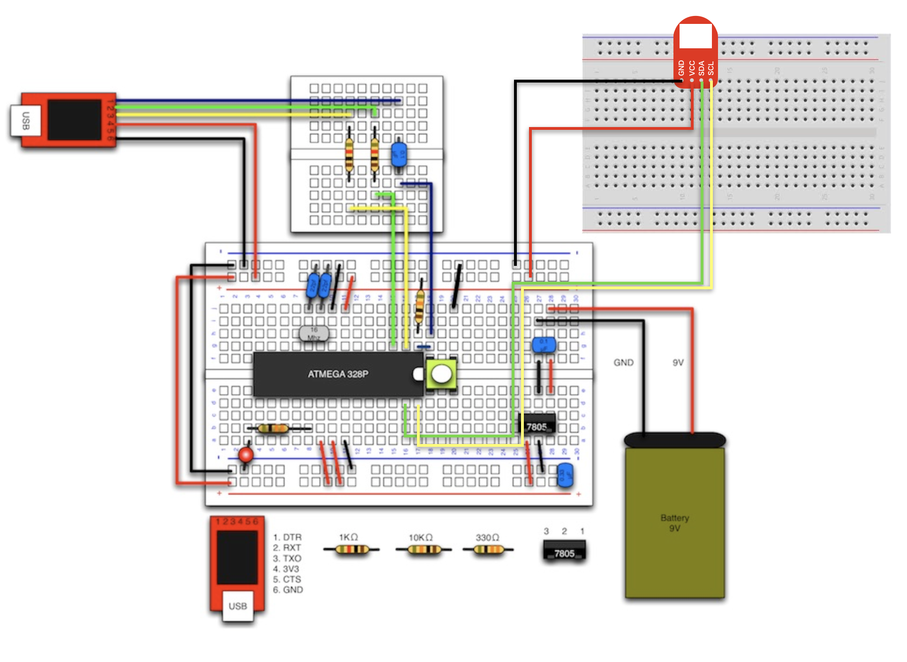

# #201 3Axis I2C Brick

## Overview

3軸加速度センサーを使用したBrickです。

I2Cで3軸の加速度データを取得することがきます。

## センサー取得データについて

このBrickでは下の図の3軸の値を取得します。


それぞれ矢印の方向に力がかかるとプラス、逆方向ではマイナスとなります。

なお、このBrickを水平に置いた場合、重力がZ軸にかかっている状態となるので、X軸、Y軸が0に近く、Z軸のみ高い値となります。

## Connecting




## ADXL345 Datasheet

| Document |
|:--|
| [ADXL345 Datasheet](http://www.analog.com/media/en/technical-documentation/data-sheets/ADXL345.pdf) |

## Register
| I2C Slave Address |
|:-- |
| 0x53 |

## Schematic


## Library


  ライブラリ名：「FaBo 201 3Axis ADXL345」

- [Library GitHub](https://github.com/FaBoPlatform/FaBo3Axis-ADXL345-Library)
- [Library Document](http://fabo.io/doxygen/FaBo3Axis-ADXL345-Library/)

## Sample Code 1

I2Cコネクタに接続した3Axis I2C Brickより３軸の加速度情報を取得し、シリアルモニタに出力します。
```c
/**
 @file accelerometer.ino
 @brief This is an Example for the FaBo 3AXIS I2C Brick.

   http://fabo.io/201.html

   Released under APACHE LICENSE, VERSION 2.0

   http://www.apache.org/licenses/

 @author FaBo<info@fabo.io>
*/

#include <Wire.h>
#include <FaBo3Axis_ADXL345.h>

FaBo3Axis fabo3axis;

void setup()
{
  Serial.begin(9600); // シリアルの開始デバック用
  
  Serial.println("Checking I2C device...");
  
  if(fabo3axis.searchDevice()){
    Serial.println("I am ADXL345");
  }
  Serial.println("Init...");
  fabo3axis.configuration();
  fabo3axis.powerOn();
}

void loop() {
  int x;
  int y;
  int z;
  
  fabo3axis.readXYZ(&x,&y,&z);

  Serial.print("x: ");
  Serial.print(x);
  Serial.print(", y: ");
  Serial.print(y);
  Serial.print(", z: ");
  Serial.println(z);
 
  delay(1000);
}

```

## Sample Code 2

シングルタップとダブルタップを取得する例です。

```c
/**
 @file accelerometer.ino
 @brief This is an Example for the FaBo 3AXIS I2C Brick.

   http://fabo.io/201.html

   Released under APACHE LICENSE, VERSION 2.0

   http://www.apache.org/licenses/

 @author FaBo<info@fabo.io>
*/


#include <Wire.h>
#include <FaBo3Axis_ADXL345.h>

FaBo3Axis fabo3axis;

void setup()
{
  Serial.begin(9600); // シリアルの開始デバック用
  
  Serial.println("Checking I2C device...");
  
  if(fabo3axis.searchDevice()){
    Serial.println("I am ADXL345");
    fabo3axis.configuration();
    fabo3axis.powerOn();
    fabo3axis.enableTap();  
  }

}

void loop() {

  byte tap = fabo3axis.readIntStatus();

  if(fabo3axis.isDoubleTap(tap)){
    Serial.println("Double Tap");
  } else if(fabo3axis.isSingleTap(tap)){
    Serial.println("Single Tap");
  }
  delay(10);
}

```


## Parts
- Analog Devices ADXL345

## GitHub
- https://github.com/FaBoPlatform/FaBo3Axis-ADXL345-Library
