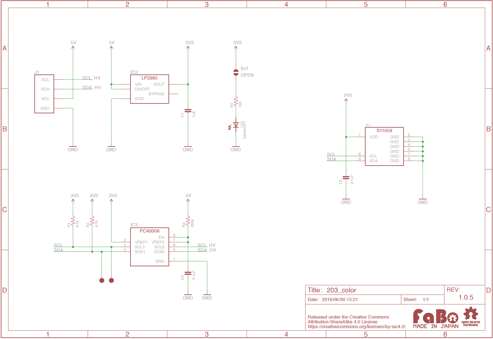

# #203 Color I2C Brick

## Overview
カラーセンサを使用したBrickです。

センサーより読み取った赤、緑、青、赤外線(明るさ)の4つのデータを、I2Cにて取得することができます。

## Connecting

I2Cコネクタへ接続します。


## S11059 Datasheet
| Document |
| -- |
| [S11059 Datasheet](http://www.hamamatsu.com/resources/pdf/ssd/s11059-02dt_etc_kpic1082j.pdf) |

## Register
| Slave Address |
| -- |
| 0x2A |

## Schematic


## Library


  ライブラリ名：「FaBo 203 Color S11059」

- [Library GitHub](https://github.com/FaBoPlatform/FaBoColor-s11059-Library)
- [Library Document](http://fabo.io/doxygen/FaBoColor-s11059-Library/)

## Sample Code

I2Cコネクタに接続したColor Brickにより、赤、緑、青、赤外の値を読み取り、シリアルモニタに出力します。

```c
//
// FaBo Brick Sample
//
// #203 Color Sensor I2C Brick
//
/**
 @file color.ino
 @brief This is an Example for the FaBo Color I2C Brick.

   http://fabo.io/203.html

   Released under APACHE LICENSE, VERSION 2.0

   http://www.apache.org/licenses/

 @author FaBo<info@fabo.io>
*/

#include <Wire.h>
#include <FaBoColor_S11059.h>

FaBoColor faboColor;

void setup() {
  Serial.begin(9600);
  Serial.println();
  Serial.println("RESET");
  faboColor.begin();
}

void loop() {
  uint16_t r,g,b,i;

  faboColor.readRGBI(&r, &g, &b, &i);

  Serial.print("r: ");
  Serial.print(r);
  Serial.print(", g: ");
  Serial.print(g);
  Serial.print(", b: ");
  Serial.print(b);
  Serial.print(", i: ");
  Serial.println(i);

  delay(1000);
}
```

## Parts
- HAMAMATSU S11059

## GitHub
- https://github.com/FaBoPlatform/FaBoColor-s11059-Library
