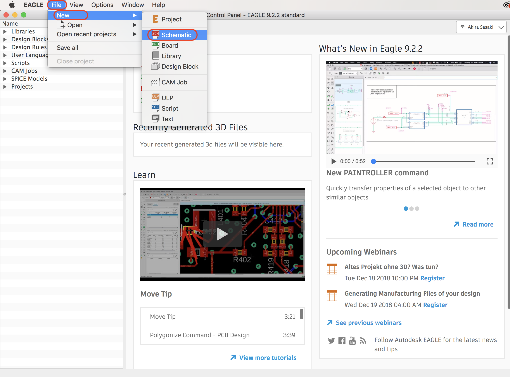

# 2.1 環境設定

## Eagleのダウンロード

基板データ作成にはEagleという回路図作成用のCADツールを使用します。

|||
|:--|:--|
|EagleのDownload|[https://www.autodesk.com/products/eagle/free-download](https://www.autodesk.com/products/eagle/free-download)|

## プロジェクトの新規作成

起動するとControl Panel Windowが表示されます。Control Panel Windowから++"File"+"New"+"Schematic"++を選択する事で回路設計のWindowが表示されます。

## ライブラリを取り込む

|||
|:--|:--|
|FaBo Eagle lib|[https://github.com/FaBoPlatform/FaBo-Eagle-Libraries](https://github.com/FaBoPlatform/FaBo-Eagle-Libraries)|

下記のライブラリをダウンロードし「Eagle-8.x.x > lbr」に保存します。

## Eagleの実行

Eagleを実行します。

