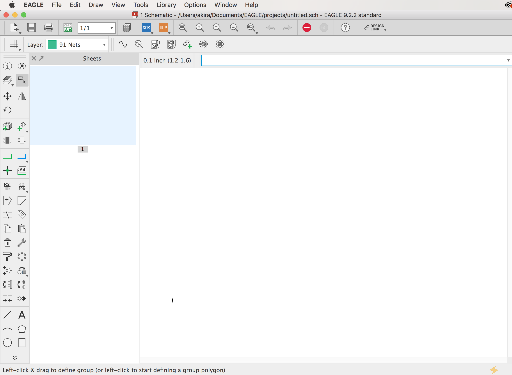

# 3.1 環境設定

## Eagleのダウンロード

基板データ作成にはEagleという回路図作成用のCADツールを使用します。

|||
|:--|:--|
|EagleのDownload|[https://www.autodesk.com/products/eagle/free-download](https://www.autodesk.com/products/eagle/free-download)|

## プロジェクトの新規作成

起動するとControl Panel Windowが表示されます。Control Panelから++"File"+"New"+"Schematic"++を選択する事で回路設計のWindowが表示されます。

++"File"+"Save As"++で、ファイルを保存します。

!!!Warning
	この保存をおこないと、Untitled.schという名称で保存されます。

++"Window"+"Control Panel"++を選ぶことで、Control Panelに戻れます。

