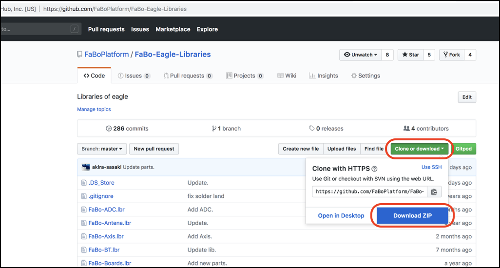
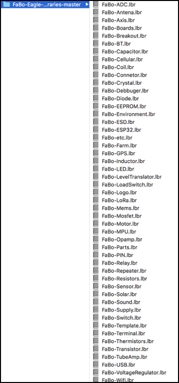
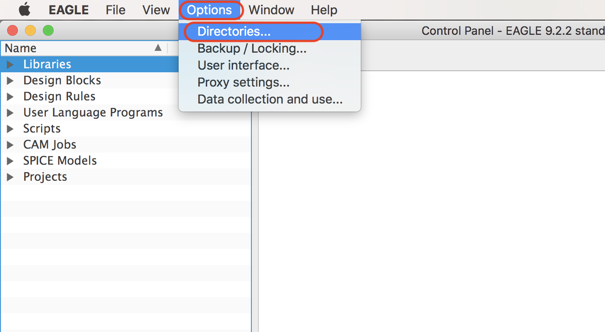
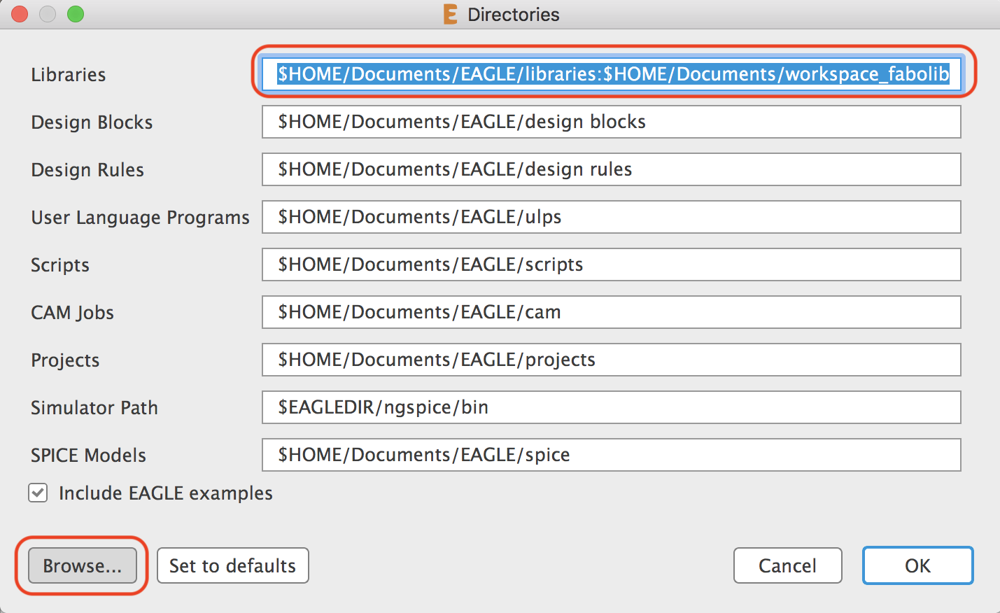
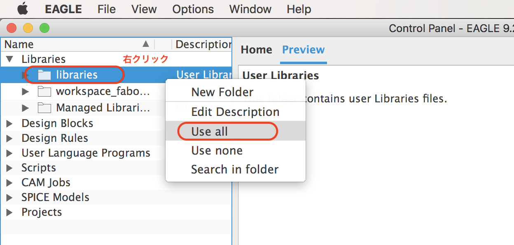
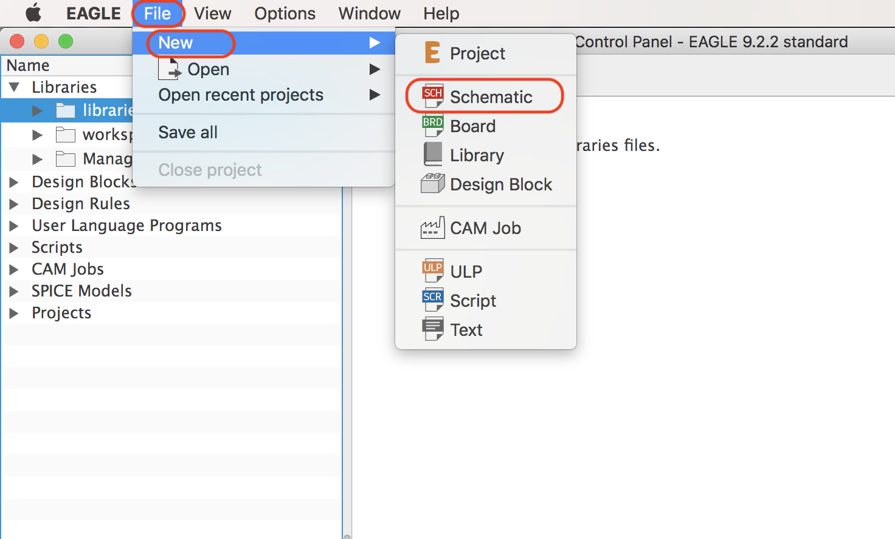
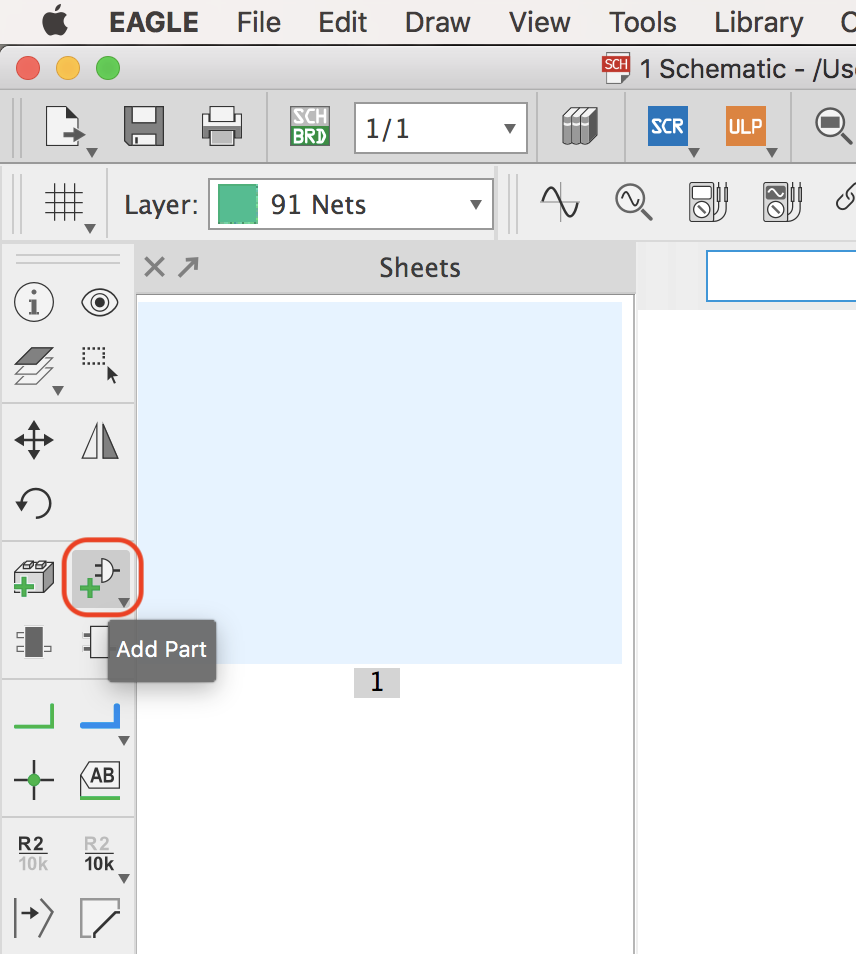
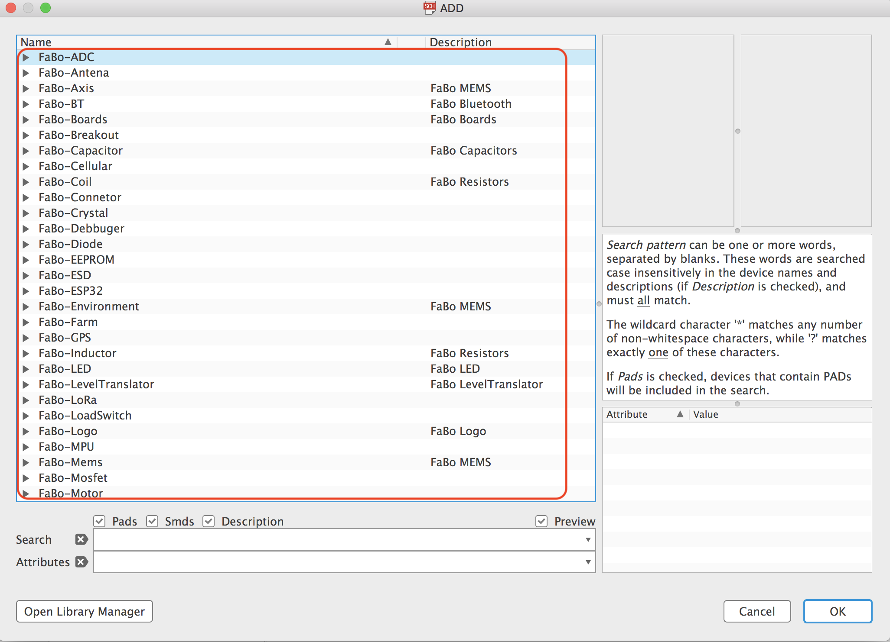

# 3.2 ライブラリ

## ライブラリ取得

|||
|:--|:--|
|FaBo Eagle lib|[https://github.com/FaBoPlatform/FaBo-Eagle-Libraries](https://github.com/FaBoPlatform/FaBo-Eagle-Libraries)|

++"Clone or Download"+"Download ZIP"++を選択し、RepositoryをZIPでローカルにダウンロードします。

ZIPファイルを解答すると、`FaBo-Eagle-Libraries-master`フォルダと、lbrファイル一式が展開されます。`FaBo-Eagle-Libraries-master`フォルダをまるごと、任意のフォルダに移動します。

## ライブラリの設定

Controlパネルを表示し、++"Option"++を選択します。

Directoryダイアログボックスのlibrariesの項目に、`FaBo-Eagle-Libraries-master`フォルダを設定します。

Control Panelの++"Libraries"+"libraries"++を開き、libraryの上で右クリックし表示されるショートカットメニューで、`use all`を選択します。

## 確認

Control Panelから++"File"+"New"+"Schematic"++を選択します。

Add Partを選択します。

FaBoのライブラリが組み込まれた事を確認します。

