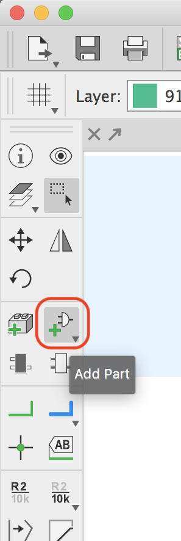
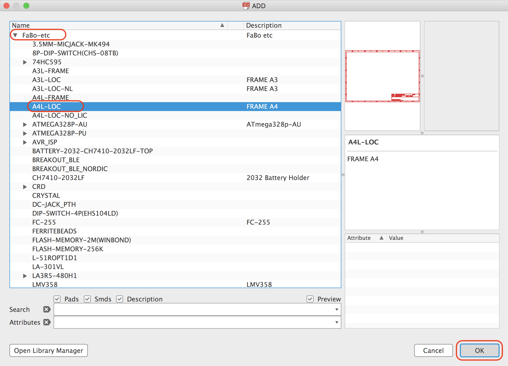
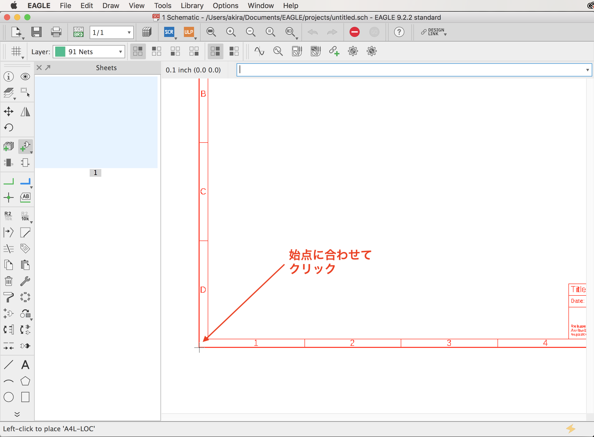
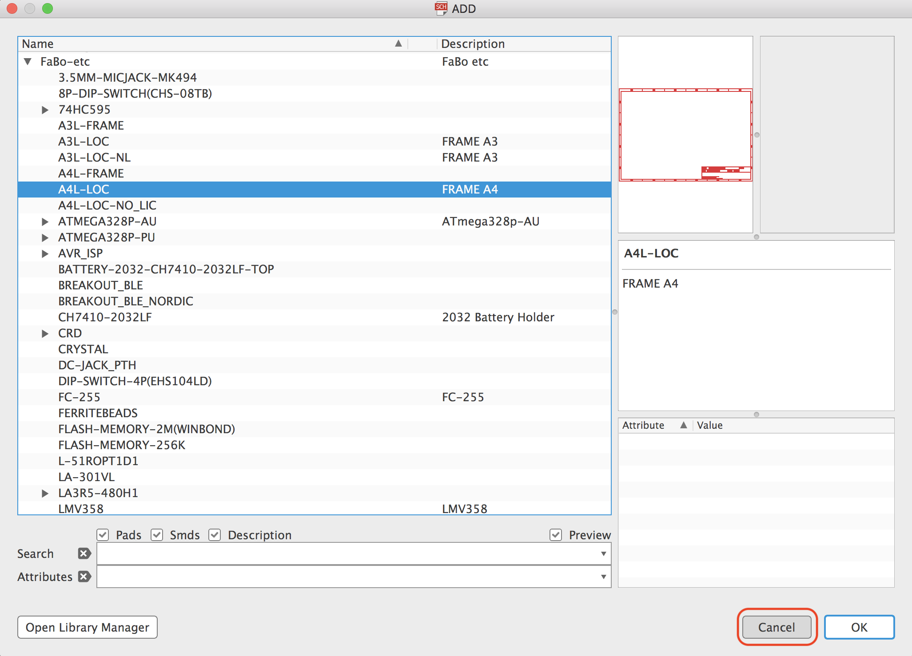

# 3.3 下地の配置

## 配置するパーツ

|部品名|場所|
|:--|:--|
|A4L-LOC|++"FaBo-etc"+"A4L-LOC"++|

## 操作

EagleのSchematic画面のメニューから、++"Add Part"++を選択します。

++"FaBo-etc"+"A4L-LOC"++を選択します。

始点に合わせクリックし、配置します。

!!!Warning
	配置が完了しても、同じモードが続きますので、ESCでキャンセルします。

++"ESC"++を押してキャンセルします。

++"Cancel"++でキャンセルします。

