# 3.4 Arduino基板の配置

## 配置するパーツ

|部品名|場所|
|:--|:--|
|Arduino基板のテンプレート|++"FaBo-Template"+"FABO-ARDUINO"++|

## 配置

EagleのSchematicのメニューから、++"Add Part"++を選択します。

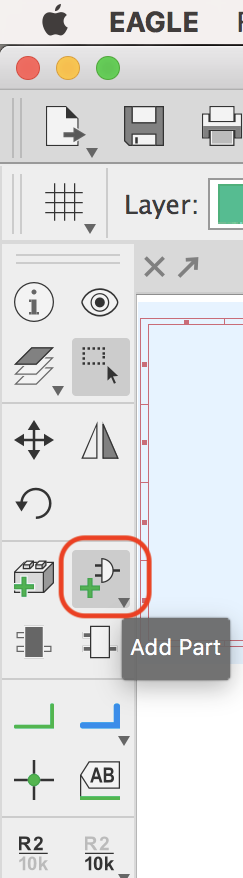

++"FaBo-Template"+"FABO-ARDUINO"++を選択します。

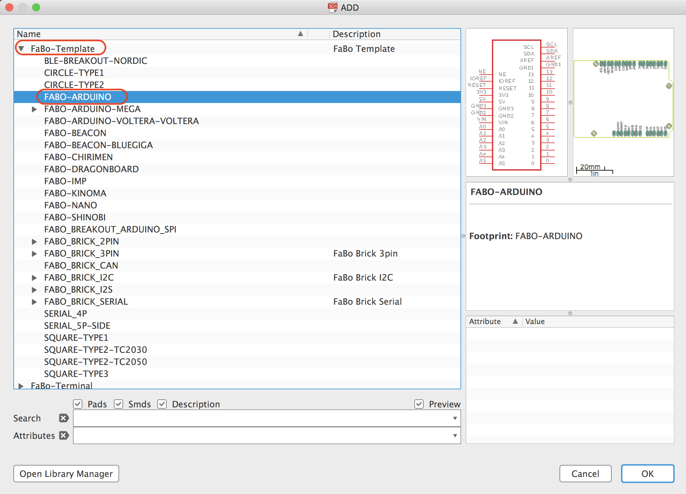

部品を配置します。

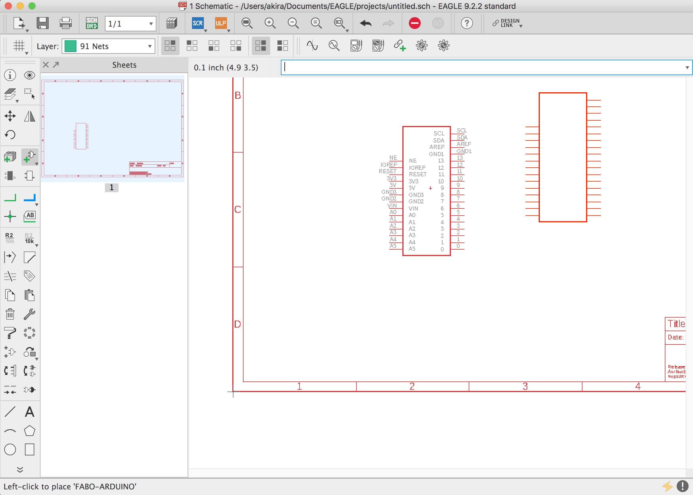

!!!Warning
	配置が完了しても、同じモードが続きますので、ESCでキャンセルします。

## 保存　

Eagleメニューから++"File"+"Save As"++を選択します。

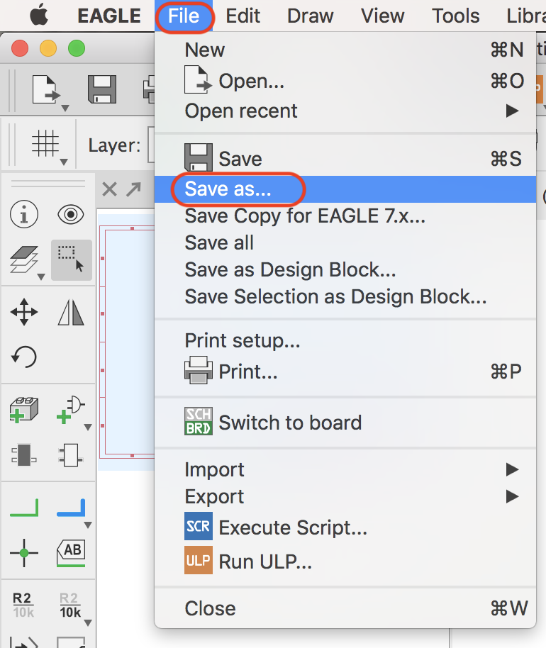

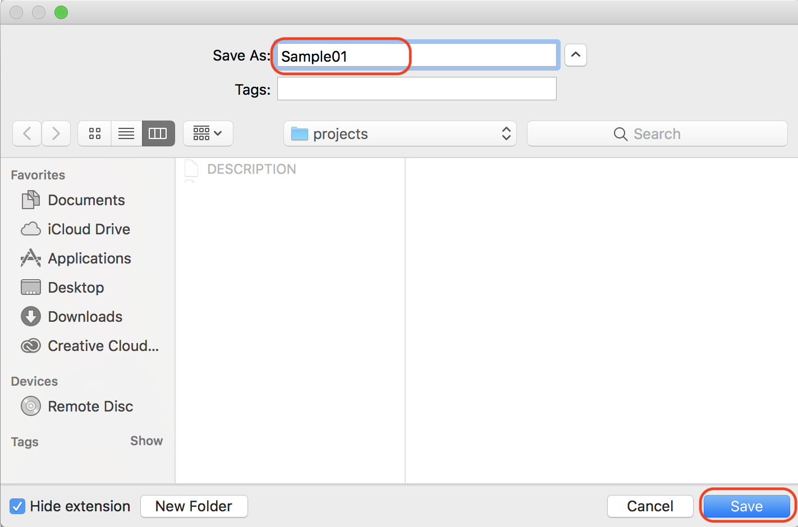

## レイアウト

EagleのSchematicのメニューから、++"Generate/switch to boards"++を選択します。

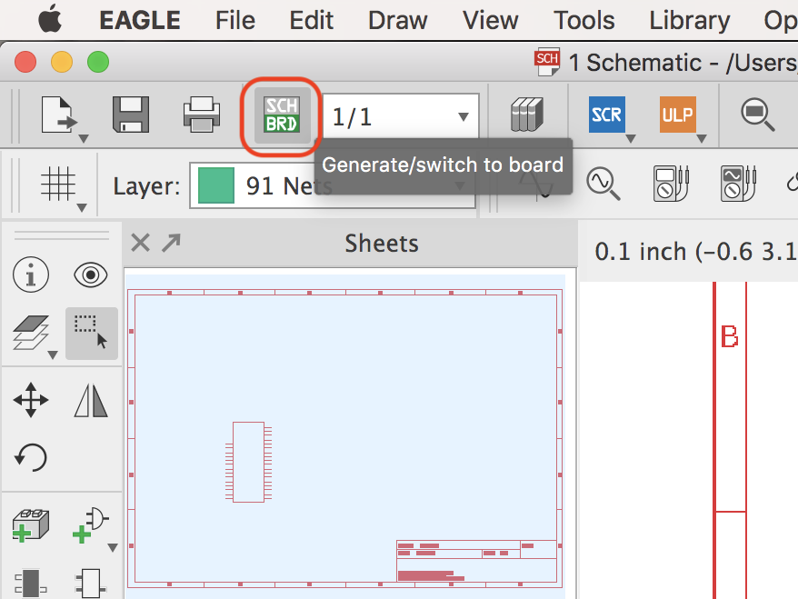

++"DELETE"++ を選択し、境界線を削除します。

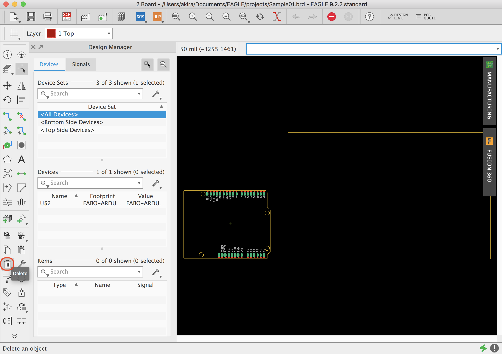

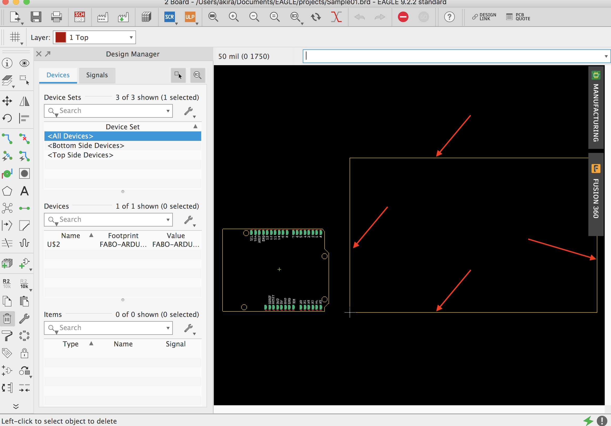

++"MOVE"++ を選択し、左端の下が中央に来るように合わせます。

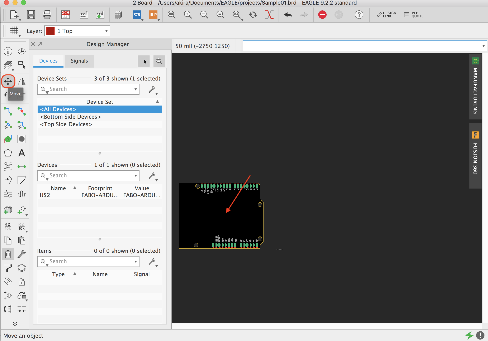

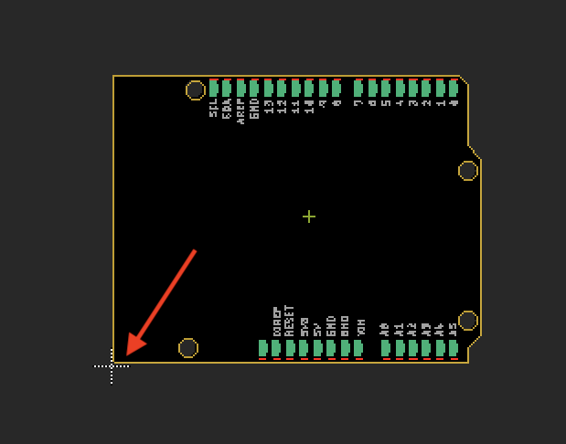

## レイアウトプレビュー

++"MANUFACTURING"++ を選択し、プレビューを表示します。

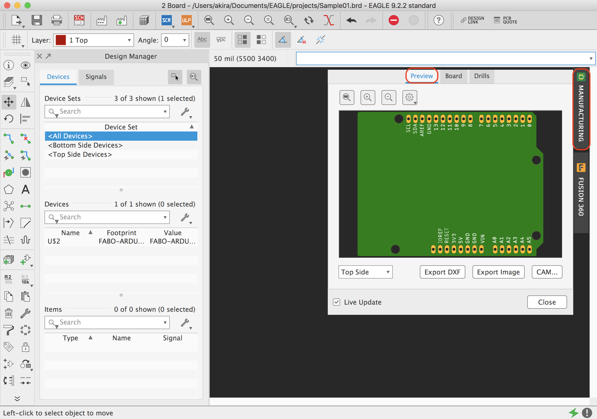

