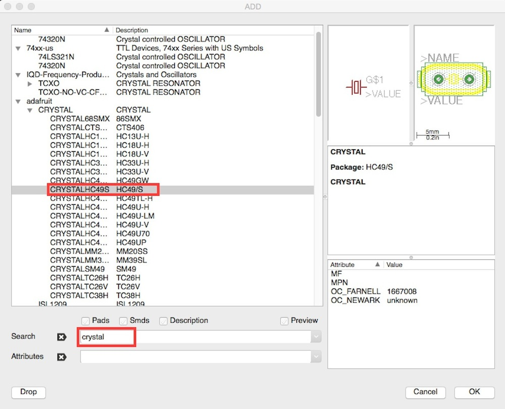
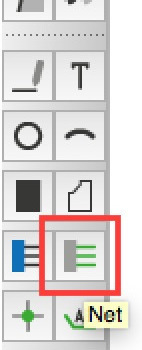
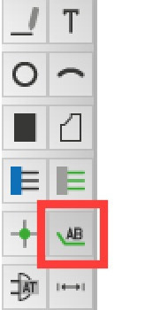
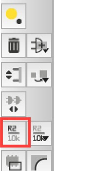
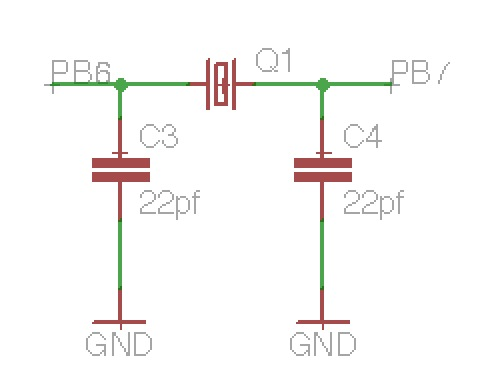

# 2.5 水晶発信子の配置

水晶発振子を取り付けます。

ツールバーの「Add」より水晶発振子を選択します。

選択した部品を配置します。

水晶発信子の両側の線を伸ばします。

ツールバーより「Net」を選択します。

水晶発信子の左右に線を引きます。

表示用のラベルを追加します。

ツールバーより「Label」を選択します。

左右のそれぞれの線に対してラベルを追加します。

追加した線の名称の変更をします。

ツールバーより「Name」を選択します。

左右の線の名称を「PB6」「PB7」に変更します。

コンデンサとGNDを追加します。

どちらも既に配置済みですので、コピーして配置します。

