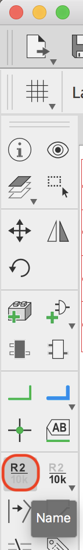

# 3.6 ICの配置

Arduino Unoで使用されている「ATMEGA328P」を配置します。

## 配置するパーツ

|部品名|場所|データシート|
|:--|:--|:--|
|ATMEGA328P|++"FaBo-MPU"+"ATMEGA328P_PDIP"++|[データシート](http://www.atmel.com/images/Atmel-8271-8-bit-AVR-Microcontroller-ATmega48A-48PA-88A-88PA-168A-168PA-328-328P_datasheet_Complete.pdf)|

## ATMEGA328の配置

ATMEGA328Pを配置します。

ツールバーより++"Add Part"++を選択します。

++"FaBo-MPU"+"ATMEGA328P_PDIP"++を選択します。

ATMEGA328Pは空いている箇所に配置します。

!!!Note
	余裕を持って配置してください。

## 線を引き、ラベル名をつける

ツールバーより++"Net"++を選択します。

ICから出ている線、電源関連の線以外の全てに線を追加します。

ツールバーより++"Label"++を選択します。

１回目のクリックで対象を決め、２回目のクリックで場所が決まります。電源関連以外の部分に追加します。

## ラベル名の変更

ツールバーより++"Value"++を選択します。

先ほど引いた線をクリックし、それぞれの名称を入力します。

## GNDと5V電源

`+5V`と`GND`を追加しますが、既に配置している部品については、ツールバーの++"Copy"++にてコピーすることができます。

使用方法は++"Copy"++選択後、配置済みの部品をクリックし、次に配置したい場所にクリックすれば完了です。

コピーした部品は下のように配置します。

ツールバーの++"Copy"++を選択し配線します。

+5Vは「AVCC」と「VCC」へ、GNDは左下にあるGND2箇所にそれぞれ配線します。

## AREFの配線

1.++"Net"++で線を引きます。
2.++"Label"++でラベルをつけます。
3.++"Value"++で名前をAREFに変更します。

