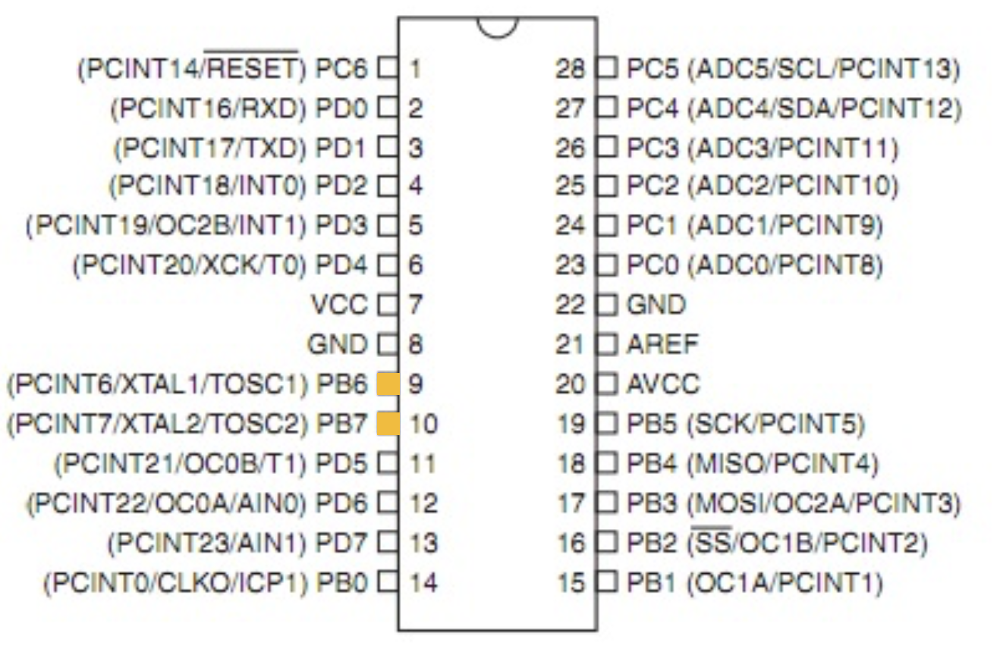
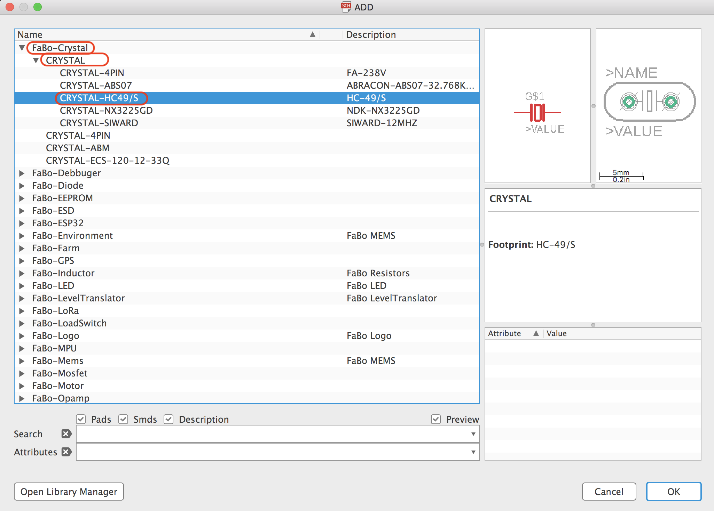
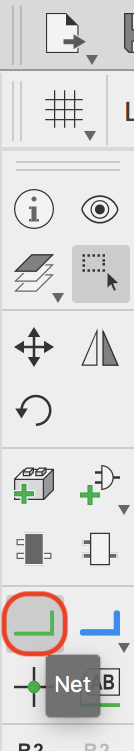
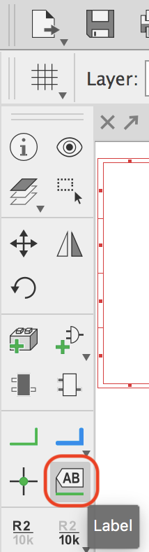
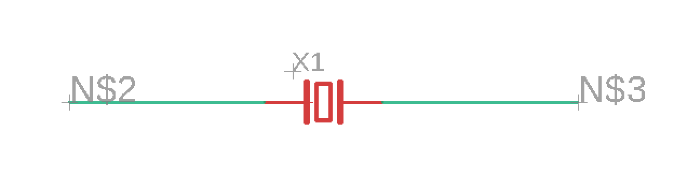
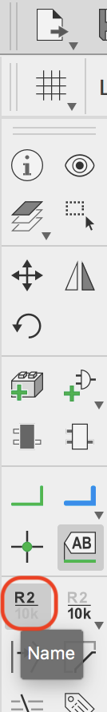
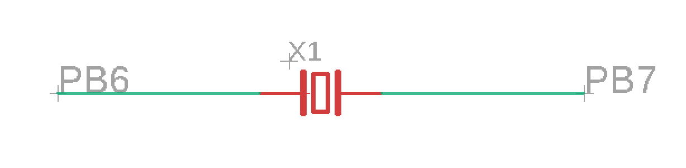
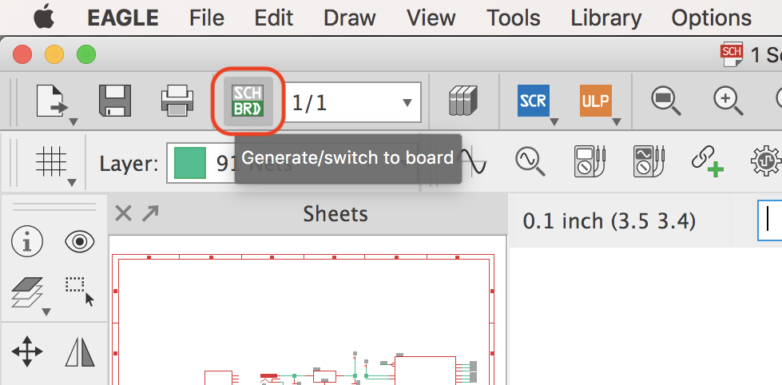
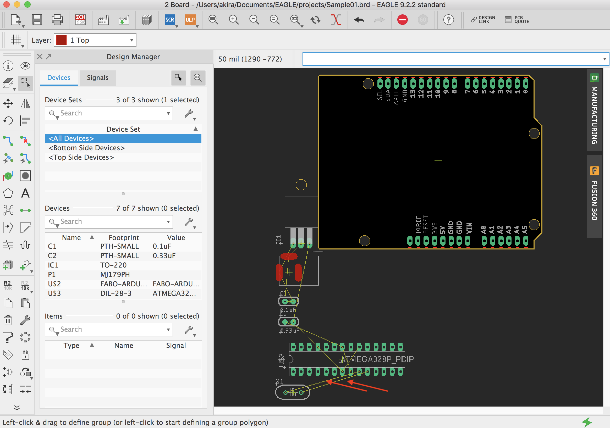
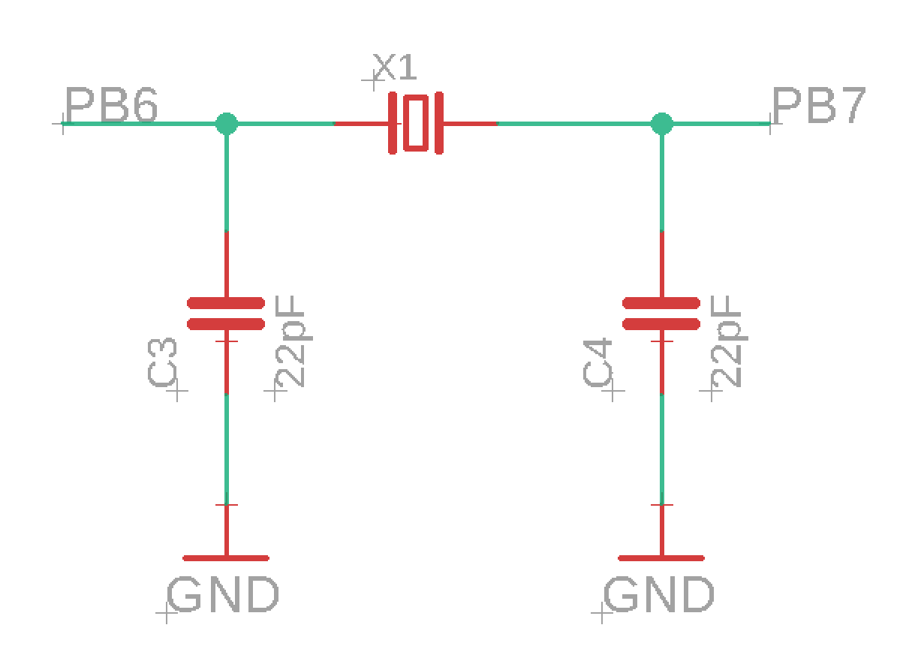

# 3.7 水晶発信子の配置

## 配置するパーツ

|部品名|場所|データシート|
|:--|:--|:--|
|クリスタル(16MHz)|++"FaBo-Crystal"+"CRYSTAL"+"CRYSTAL-HC49/S"++|[データシート](http://akizukidenshi.com/download/ds/mercuryelectronic/hus.pdf)|

## XTALの配置

ツールバーより++"Add Part"++を選択します。

++"FaBo-Crystal"+"CRYSTAL"+"CRYSTAL-HC49/S"++を選択します。

水晶発信子の両側の線を伸ばします。

ツールバーより++"Net"++を選択します。

水晶発信子の左右に線を引きます。

表示用のラベルを追加します。

ツールバーより++"Label"++を選択します。

左右のそれぞれの線に対してラベルを追加します。

追加した線の名称の変更をします。

ツールバーより++"Name"++を選択します。

左右の線の名称を「PB6」「PB7」に変更します。

## 接続の確認

## セラミックコンデンサとGNDの追加

コンデンサとGNDを追加します。

どちらも既に配置済みですので、コピーして配置します。

1. GNDを++"Copy"++して配置。
2. コンデンサを++"Copy"++して配置。
3. ++"Net"++で配線。
4. ++"Value"++でコンデンサの値を22pFに書き換え

