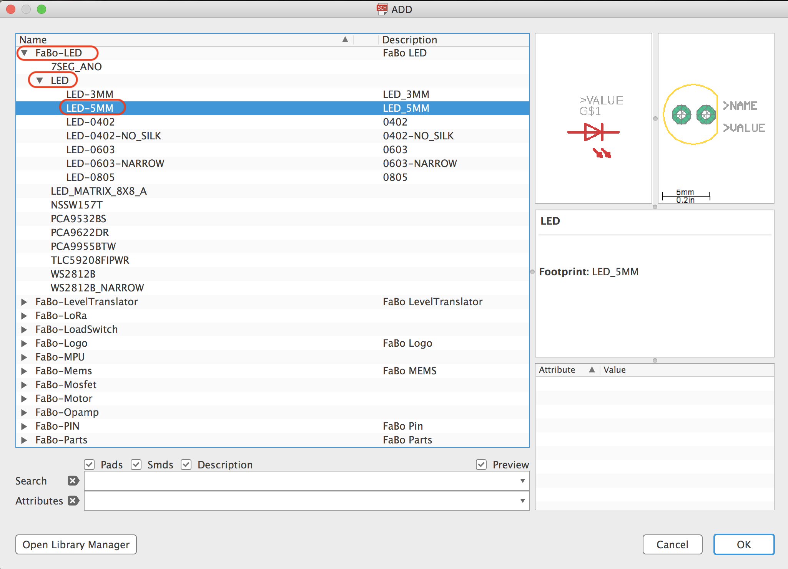
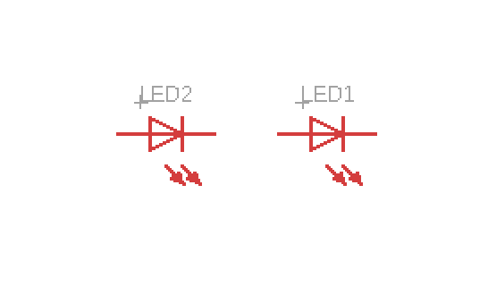
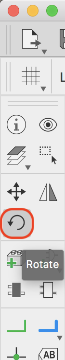
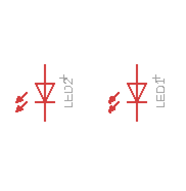
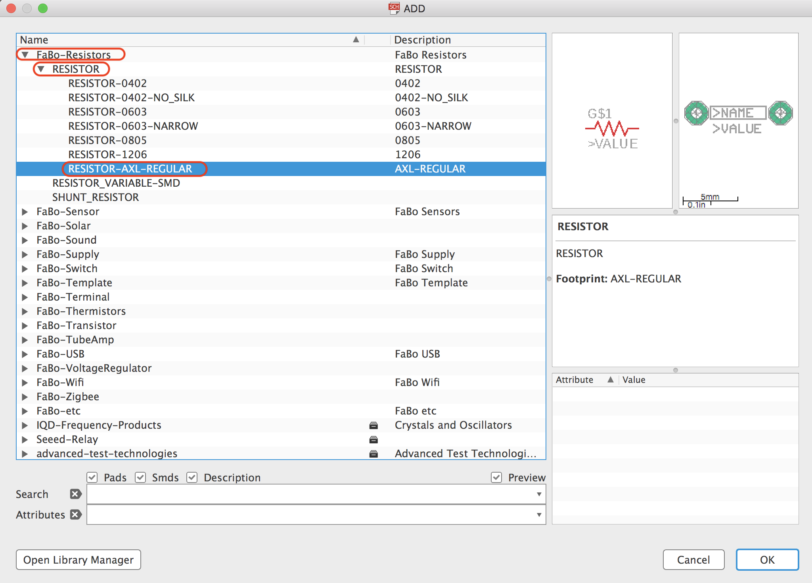
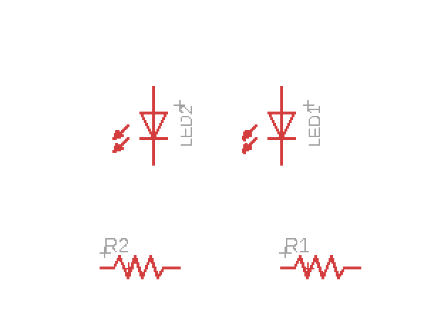
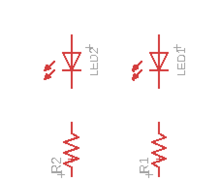
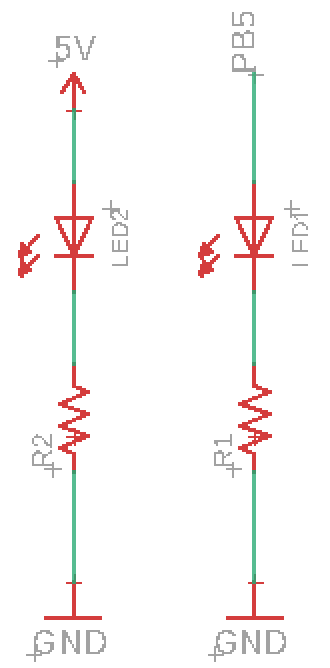

# 2.8 LEDの配置

## 配置するパーツ

|部品名|場所|データシート|
|:--|:--|:--|
|5mm LED|++"FaBo-LED"+"LED"+"LED-5MM"++||
|抵抗|++"FaBo-Resistors"+"RESISTOR"+"RESISTOR-AXL-REGULAR"++||

## LEDの配置

ツールバーより++"Add Part"++を選択します。

++"FaBo-LED"+"LED"+"LED-5MM"++を選択します。

LEDを2つ並べて配置します。

ツールバーより++"Rotate"++を選択し、回転します。

## 抵抗の配置

ツールバーより++"Add Part"++を選択します。

++"FaBo-Resistors"+"RESISTOR"+"RESISTOR-AXL-REGULAR"++

それぞれのLEDの下に配置し、配線します。

ツールバーより++"Ratate"++と++"Move"++で向きと場所を調整します。

## そのほかの配線

1. GNDを++"Copy"++して配置。
2. 5Vを++"Copy"++して配置。
3. ++"Net"++で配線。
4. 線に++"Label"++でラベル付け。
5. 線に++"Name"++で名前を書き換える

