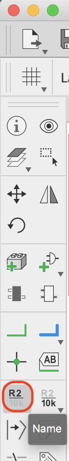
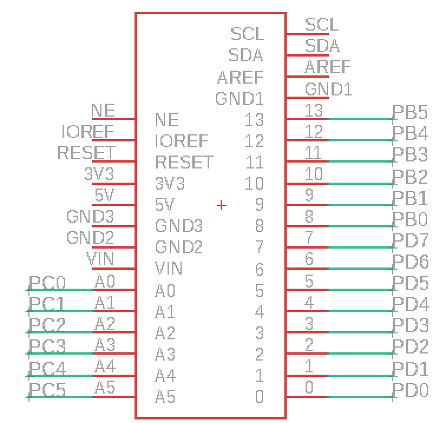

# 3.9 配線

基板とICの配線を行います。

## Analogの配線
analog0-analog5(A0-A5)まで配線します。

ツールバーより++"Net"++を選択します。

基板データの右下にある「A0」〜「A5」に対して線を引きます。

ツールバーより++"Label"++を選択します。

先ほど引いた線をクリックしラベルを追加します。

ツールバーより++"Name"++を選択します。

先ほど引いた線をクリックしラベルを追加します。

## Digitalの配線

Digital 0-13(D0-D13)も配線します。

ツールバーの++"Net"++と++"Label"++と++"Name"++を使用し配線後、名前を変更します。

## 5V、GNDの配線

配置済みのGNDをコピーし、新たに２つ配置します。

上下のGNDに対してそれぞれ配線します。

+5Vも同様に配置し、配線します。

AREFから線を引き、名称を「AREF」に変更します。

## I2C

