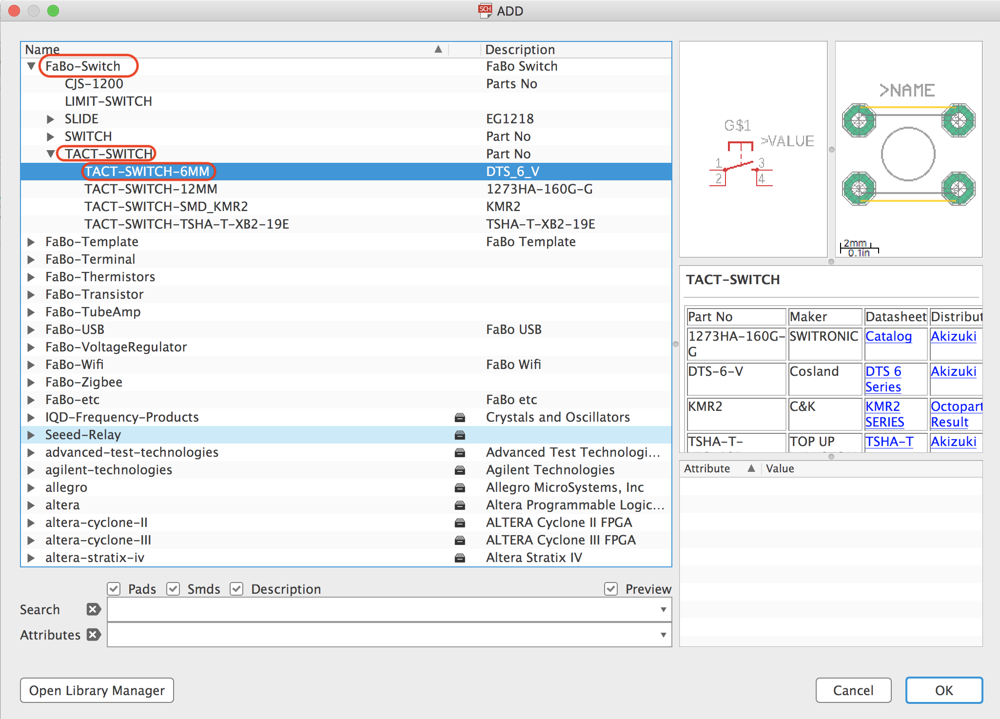
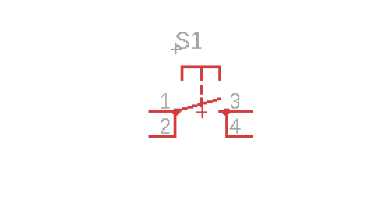
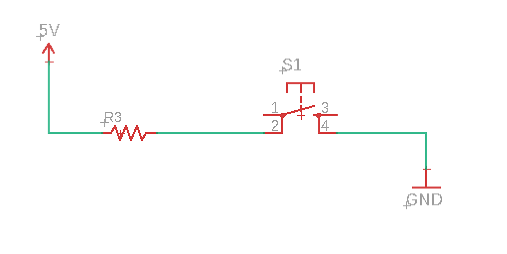
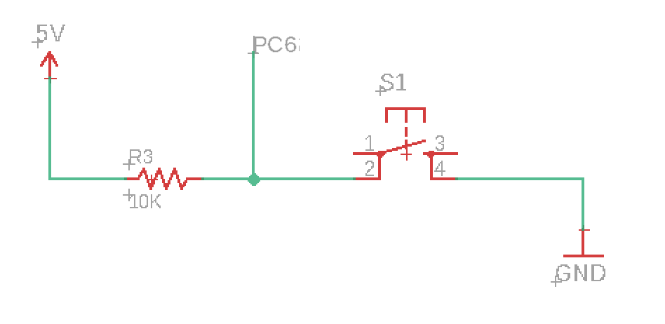

# 2.10 リセット機能

リセット機能を作成します。

## 配置するパーツ

|部品名|場所|データシート|
|:--|:--|:--|
|タクトスイッチ|++"FaBo-Switch"+"TACT-SWITCH"+"TACT-SWITCH-6MM"++||

## RESETスイッチの配置

ツールバーより++"Add Part"++を選択します。

++"FaBo-Switch"+"TACT-SWITCH"+"TACT-SWITCH-6MM"++を選択します。

ある程度の広さの場所を確保し、スイッチを配置します。

