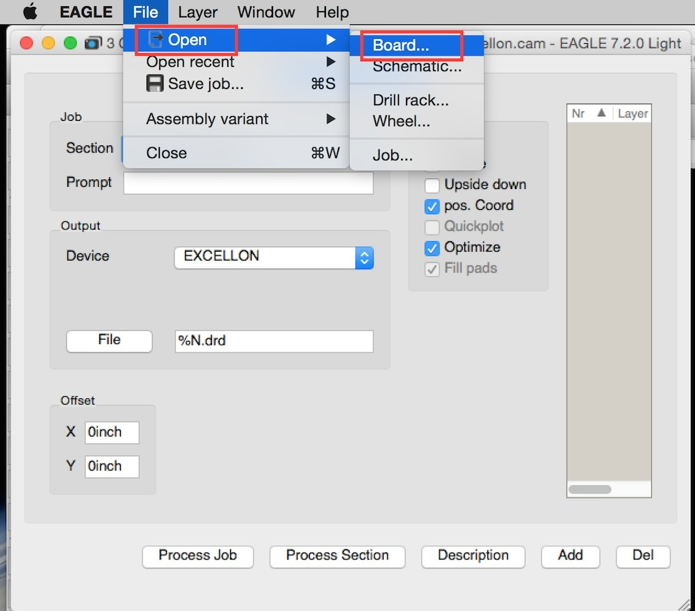
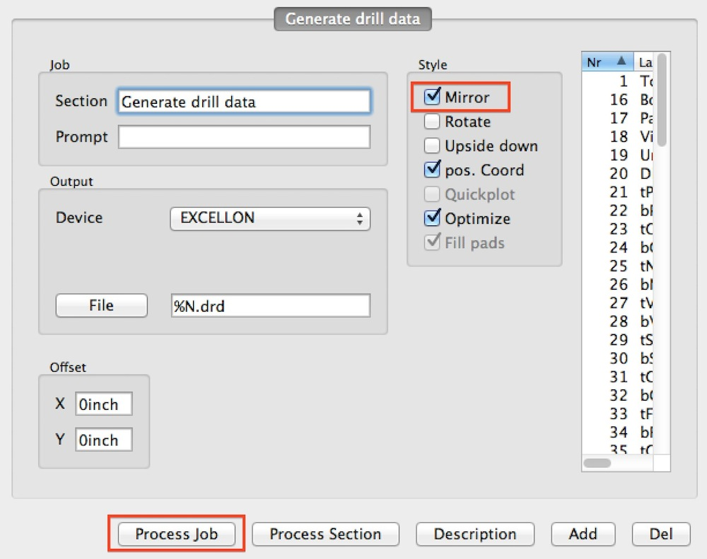
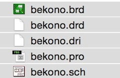
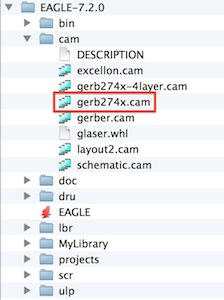

# 2.11発注用データ作成

発注用データ作成には以下の３ファイルを使用します。

EAGLEフォルダ（実行ファイルがあるフォルダ）内にあるcamより、以下の２つのものを使用します。

最初に「excellon.cam」を実行します。

excellon.camを実行すると、以下のウィンドウが表示されます。

メニューより、「File」>「Open」>「Board…」を選択します。

今回作成したボードファイルを開きます。
拡張子が「brd」のものがボードファイルになります。

Styleの「Mirror」にチェックを付け、「Process Job」ボタンを押します。

処理が終わると以下のようなファイルが作成されます。

次に「gerb247.cam」を実行します。

先ほどと同じようなウィンドウが表示されますので、StyleよりMirrorにチェックを付け、「Prosess Job」ボタンを押します。

作成したファイルが以下のようになれば完了となります。

