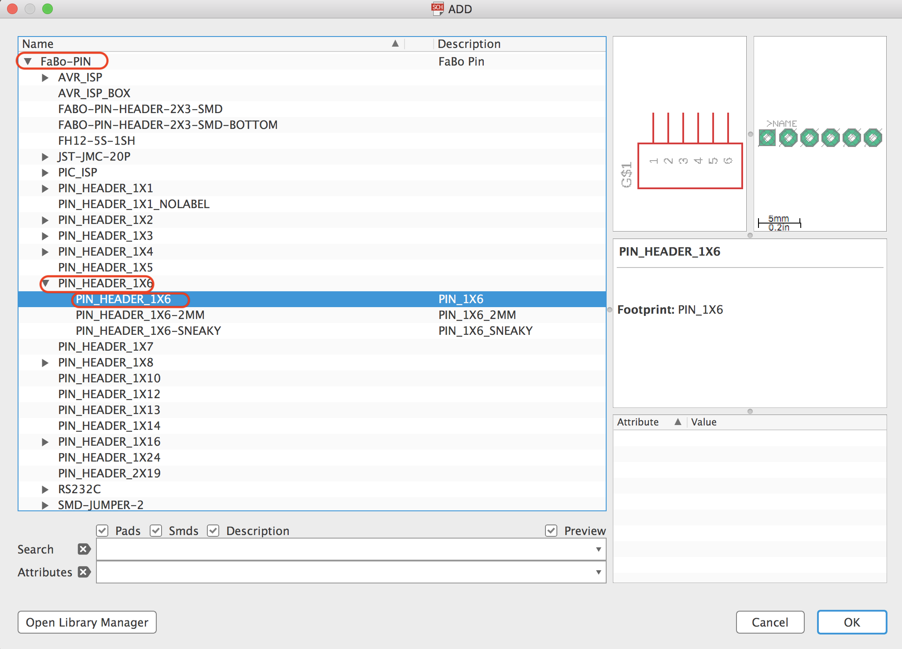
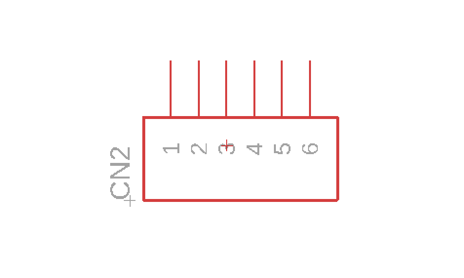
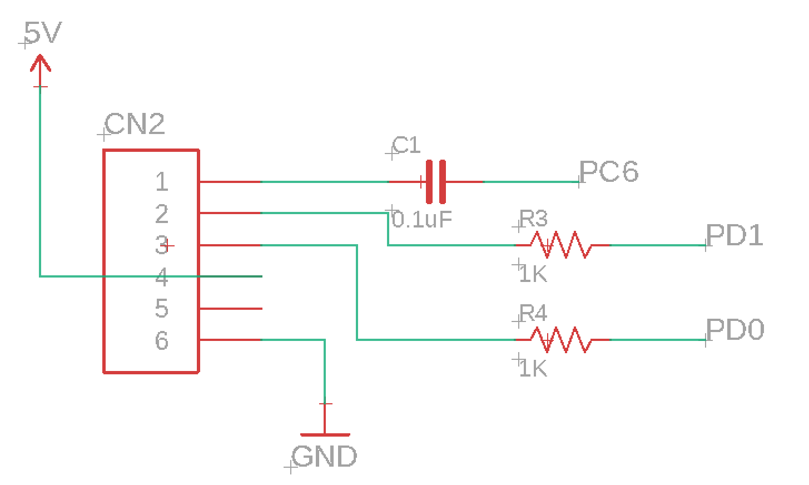

# 2.11 USBシリアル変換アダプタの配置

USB-シリアル変換ボードでの転送用ピンを作成します。

## 配置するパーツ

|部品名|場所|データシート|
|:--|:--|:--|
|PIN Header|++"FaBo-PIN"+"PIN_HEADER_1x6"+"PIN_HEADER_1x6"++||

## PIN Headerの配置

ツールバーより++"Add Part"++を選択します。

++"FaBo-PIN"+"PIN_HEADER_1x6"+"PIN_HEADER_1x6"++

それぞれ部品を下の様に配置します。

