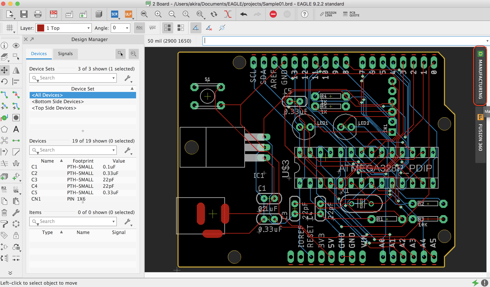
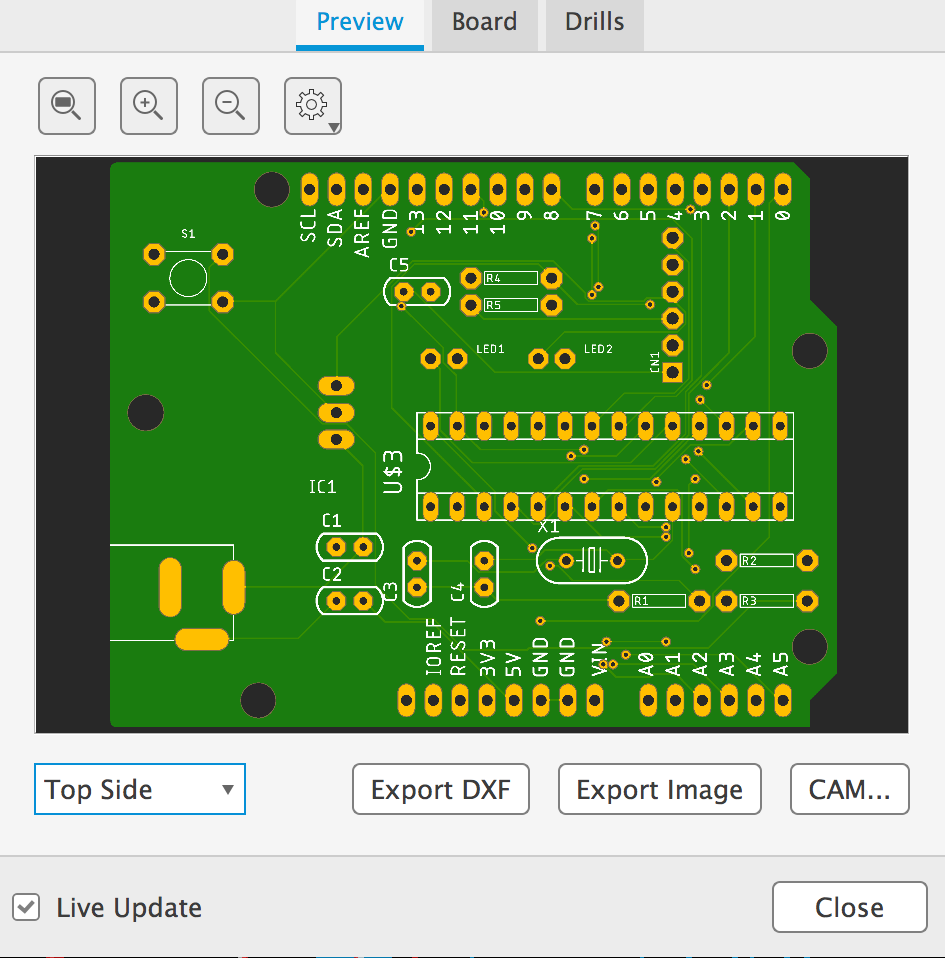
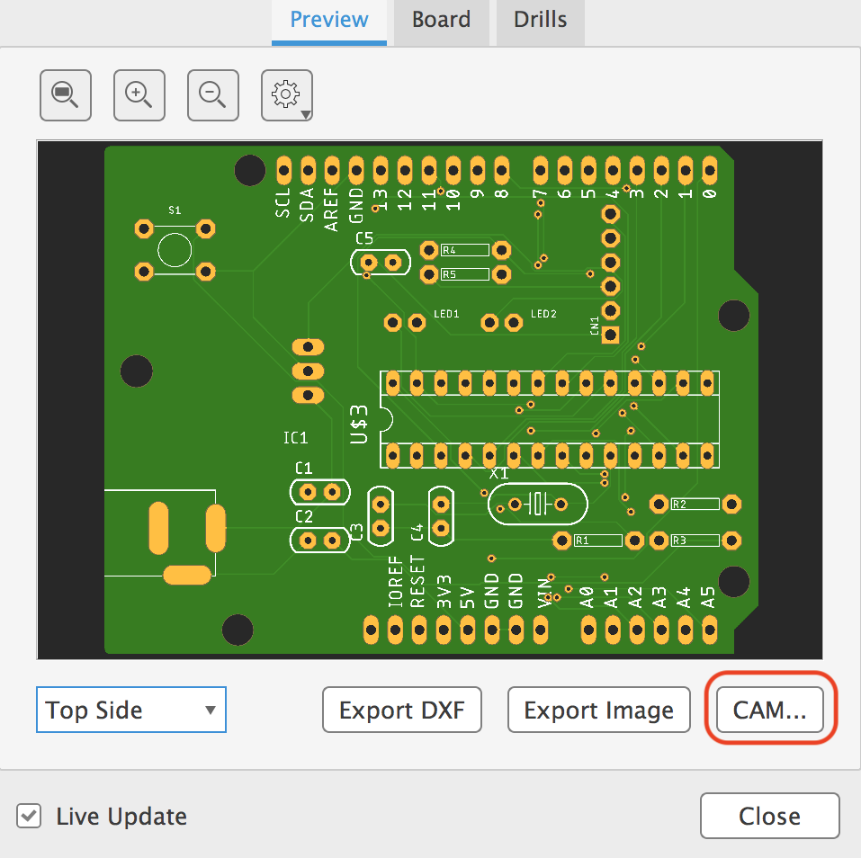
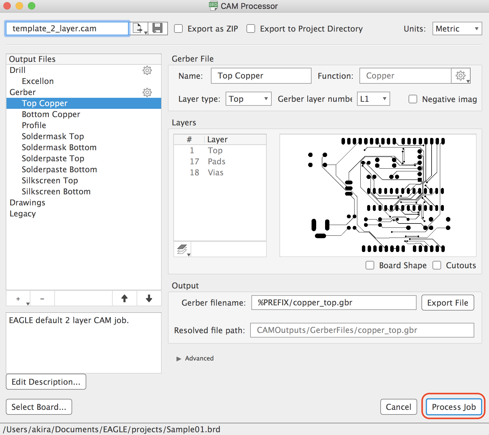

# 2.12 発注用データ作成

工場発注用には、Gerber形式のデータを出力します。

## 完成イメージのレビュー

## 発注用データの作成

メニューより、「File」>「Open」>「Board…」を選択します。

今回作成したボードファイルを開きます。
拡張子が「brd」のものがボードファイルになります。

Styleの「Mirror」にチェックを付け、「Process Job」ボタンを押します。

処理が終わると以下のようなファイルが作成されます。

次に「gerb247.cam」を実行します。

先ほどと同じようなウィンドウが表示されますので、StyleよりMirrorにチェックを付け、「Prosess Job」ボタンを押します。

作成したファイルが以下のようになれば完了となります。

