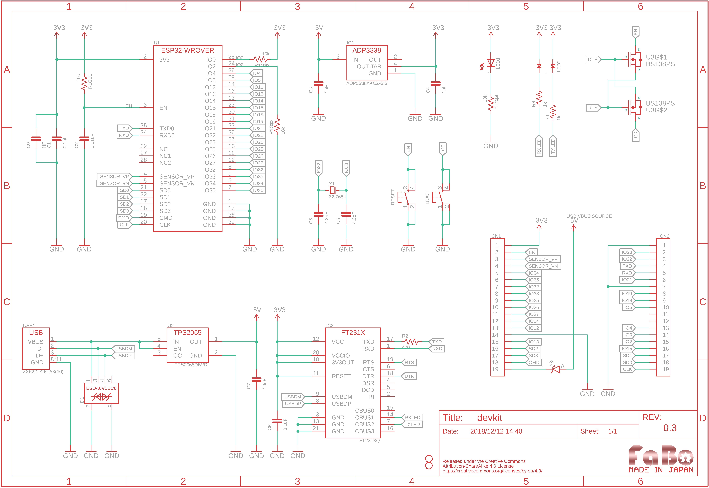

# EAGLEの事前設定

## ライブラリの準備

次のEAGLEライブラリファイルをダウンロードして、所定の場所に保存してください。

[ライブラリファイル](./files/devkit.lbr)

## 回路図の新規作成

EAGLEにて、Schematicファイルを新規作成し、名前をつけて保存しておきます。

## 参考回路図

[PDFでダウンロード](./files/devkit.pdf)
