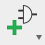
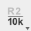

# 回路図：パーツの追加

参考回路図を元にパーツ（部品）を追加していきます。

!!! Tip
	パーツを追加するには、ツールバーのAdd Partアイコンをクリックします。  
	

## パーツの追加

### フレーム
A4L-FRAME-LIC

### 電源
3V3  
5V  
GND

!!! Note
	後でコピーできますので、とりあえず1個づつ追加します。

### ESP32モジュール
ESP32-WROVER-B

### LDO
ADP3338AKCZ

### USBコネクタ
USB

### 電流制限IC
TPS2065DBV

### USBシリアル変換IC
FT231XQ

### クリスタル
CRYSTAL-ABS07

### 押ボタンスイッチ
TACTILE-KMR2（2個）

### LED
LED-0603  
HSMF-C16X

### MOSFET
BS138PS（2個）

### ピンヘッダ
PIN_1X19（2個）

### アレイ抵抗
RESISTOR-ARRAY

!!! Note
	アレイ抵抗は、ひとつの部品に4つ分の抵抗回路が内蔵された部品です。回路図に追加する際に4回クリックします。

### 抵抗
RESISTOR-0603（3個）

### コンデンサ
CAPACITOR-0603（8個）

!!! Note
	参考回路図にある、「C0」は無くても構いません。

### ダイオード
DIODE_SCHOTTKY-RB161MM-20  
ESDA6V1BC6

## 定数の設定

### 抵抗値とコンデンサ容量数を設定
参考回路図を見ながら、それぞれの定数を設定してください。

定数を設定するには、ツールバーのValueアイコンをクリックします。  
