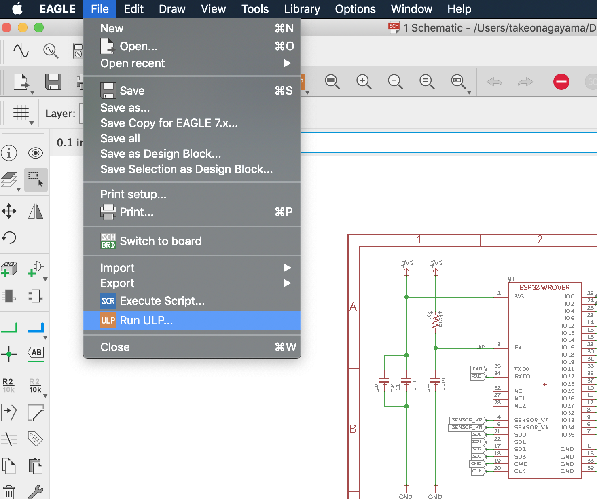
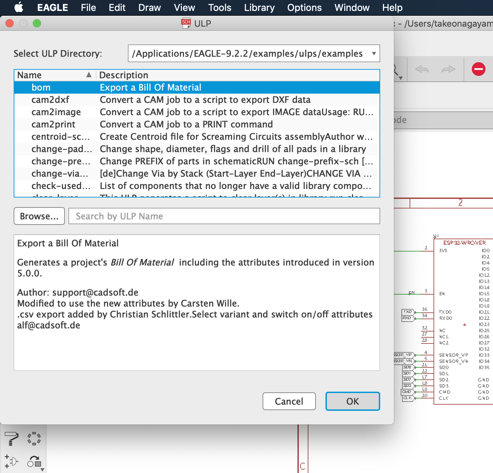
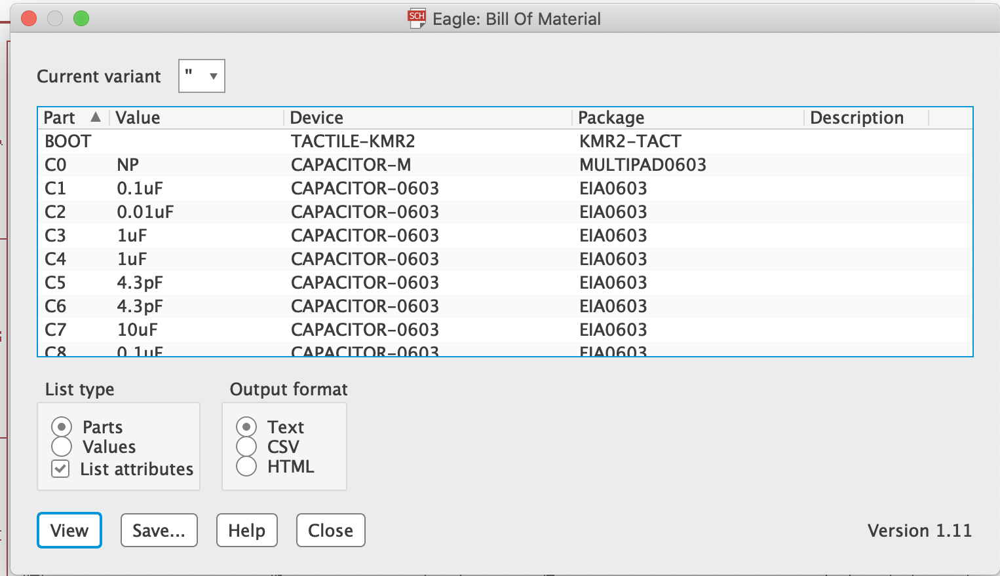
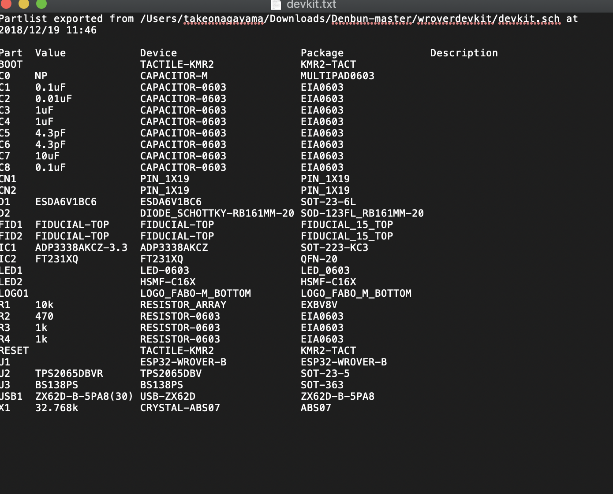

# 8.1 チップマウンタ準備設定

## 概要

表面実装機（チップマウンタ）と呼ばれる機器により自動で、小さな部品である表面実装部品（SMD）を実装します。

## 準備

回路図データ

https://github.com/FaBoPlatform/Denbun.git

回路図からBOM（部品表）を作成し、必要なリール部品を揃えます。

対象Eagleのファイルから、ファイル　RUN ULPを選択します。



BOMを選択 OKボタンを押します。



OUTPUTフォーマットをTEXTにします。　



BOMリストの完成を確認します。　



## 部品の手配

リール部品は、チップ部品をリール上に配置、まとめられたものです。リール部品は抵抗４０００個
など、まとめて買うことが多いのですが、少量でリールに巻くサービスがあります。その場合は、手数料が発生致します。

表面実装機（チップマウンタ、ピックアンドプレースマシン）　ここでは、Neoden４を使用します。

## 参考　BOMリストから、以下のCSVファイルを作成することで作業が楽になります。

```

#Feeder,Feeder ID,Type,Nozzle,X,Y,Angle,Footprint,Value,Pick height,Pick delay,Placement height,Placement delay,Vacuum detection,Vacuum value,Vision alignment,Speed,
stack,20,0,1234,23.63,20.97,90.00,,,1.20,0,0.00,0,No,-40,1,60,4,60,20,No,No,-40,-40,-40,-40,
stack,21,0,1234,23.71,34.99,-90.00,,,1.20,0,0.00,0,No,-40,1,60,4,60,20,No,No,-40,-40,-40,-40,
stack,22,0,1234,23.64,48.62,-90.00,,,1.20,0,0.00,0,No,-40,1,60,4,60,20,No,No,-40,-40,-40,-40,
stack,23,0,1234,23.65,62.50,-90.00,,,1.20,0,0.00,0,No,-40,1,60,4,60,20,No,No,-40,-40,-40,-40,
stack,24,0,1234,23.35,75.70,-90.00,,,1.20,0,0.00,0,No,-40,1,60,4,60,20,No,No,-40,-40,-40,-40,
stack,25,0,1234,23.56,89.82,-90.00,,,1.20,0,0.00,0,No,-40,1,60,4,60,20,No,No,-40,-40,-40,-40,
stack,26,0,1234,23.09,103.57,-90.00,,,1.20,0,0.00,0,No,-40,1,60,4,60,20,No,No,-40,-40,-40,-40,
pcb,Manual,Lock,100,100,350,150,Back,10,10,0,
mark,Whole,Auto,107.74,216.371,
markext,0,0.8,3,2,0,
test,No,
mirror_create,1,1,179.92,250.75,0,0,0,0,21.0068,
mirror,179.86,250.79,0,No,
#Chip,Feeder ID,Nozzle,Name,Value,Footprint,X,Y,Rotation,Skip
comp,21,1,R3,,0603,179.93,250.70,-90.00,No,
comp,20,2,LED1,,0603,182.16,250.74,-90.00,No,
comp,22,3,R5,,0603,181.54,246.16,180.00,No,
comp,22,4,R4,,0603,181.54,243.19,180.00,No,
comp,23,1,C6,,0603,179.82,238.77,-90.00,No,
comp,23,2,C1,,0603,124.62,216.38,-90.00,No,
comp,24,3,R1,,0603,124.64,221.30,-90.00,No,
comp,25,4,C2,,0603,124.55,226.45,-90.00,No,
comp,25,1,C3,,0603,124.60,236.32,-90.00,No,
comp,26,2,R2,,0603,124.48,231.39,-90.00,No,

```
