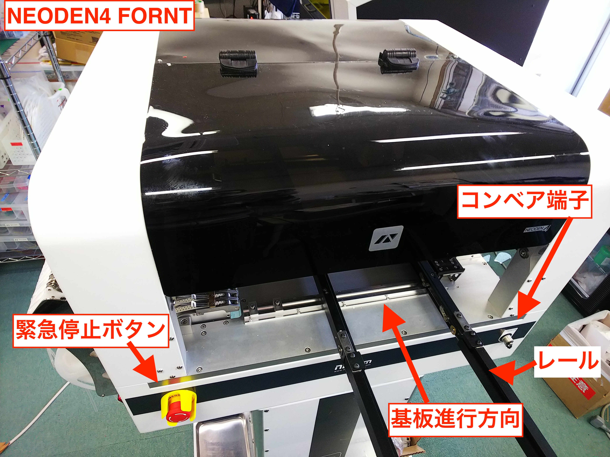

# 8.2 チップマウンタの各部の名称

## Neoden４

誰にでもお求めやすい中国製チップマウンタ。一式１００万円ぐらい。

Neodenについて

2009年設立 デスクトップ型のチップマウンタを主力製品としている。日本にはまだ代理店がない。

[NEODENUSA](https://neodenusa.com/)

## Neoden４の各名称

パネライズした場合は、ベルトコンベアで実装

一枚基板の場合は、据え置いて実装

Neoden4では、フィーダーは2つに分割されおり、フィードボックス、ペールボックスと言います。

フィードボックスは、部品送り、ペールボックスは、皮を捲る役割を果たします。

USBは、キーボードマウスを繋げるためのものです。内部のメモリに保存できますが、外部のUSBメモリにプログラミングデータを保存することができます。

## Neoden４のサンプル付属品

サンプルの基板が付属しています。様々なパッケージに対応し、レール幅など、参考に基板を作成するといいでしょう。

## Neoden４のスペック

ヘッド数：4配置率：10000PCS / H

フィーダ容量：テープリールフィーダ：48テープ幅：8mm、12mm、16mm、24mm振動フィーダ：5

5000PCS / H

ICトレイ容量：5

ビジョン最小コンポーネントサイズ：0201最大コンポーネントサイズ：TQFP240

適用部品：0201、BGA、SOIC、SSOP、QFN、TQFP、LEDコンポーネント、ダイオード、三極管、タクトスイッチ

コンポーネントの高さ：最大5mm

分解能X / Y軸：0.01mm Z軸：0.1mm

回転：+/- 180（360）

位置決め精度：+/- 0.02mm

X-Y再現性：+/- 0.02mm

適用基板面積：310mm * 1500mm

配置場所：310 * 1500mm（ワッフルトレイなし）

プログラミング：ソフトウエア自動プログラミング/手動機械プログラミング

メインコントロール：GUI

電源：220V、50Hz（110Vに変換可能）

電源：180W

外形寸法：機械：87 * 68 * 48CM

パッキングサイズ：94 * 74 * 60CM

正味重量：60KGS

総重量：80kg

## Neoden４の構成

ディスプレイ（アナログ対応品）、キーボード、マウス

ベルトコンベアで連結可能。

リフロー 機と繋げて、PCBライン構築ができます。
