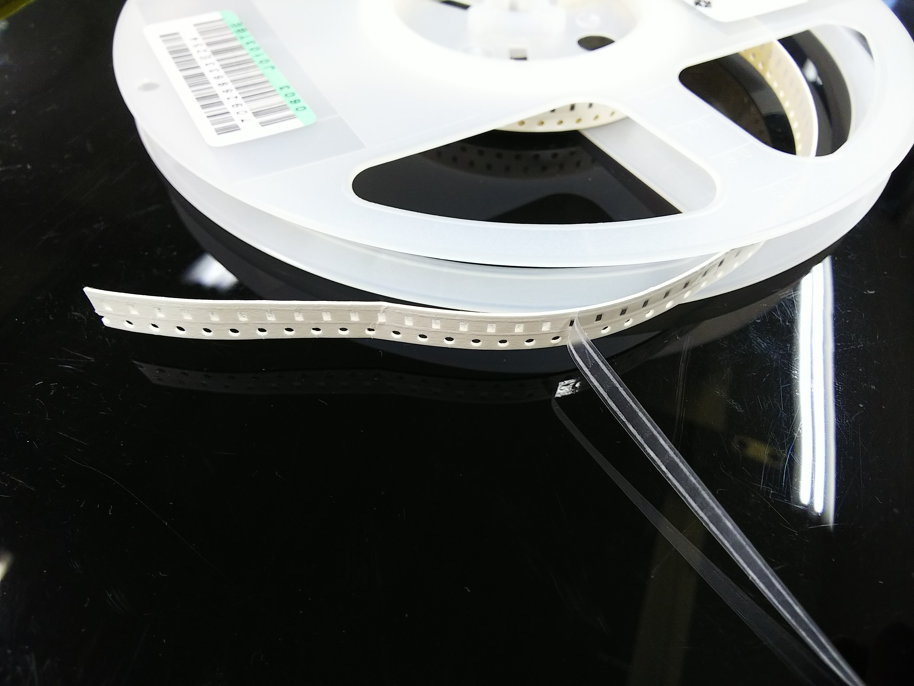
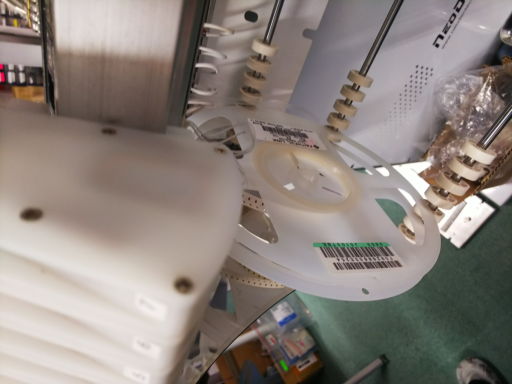
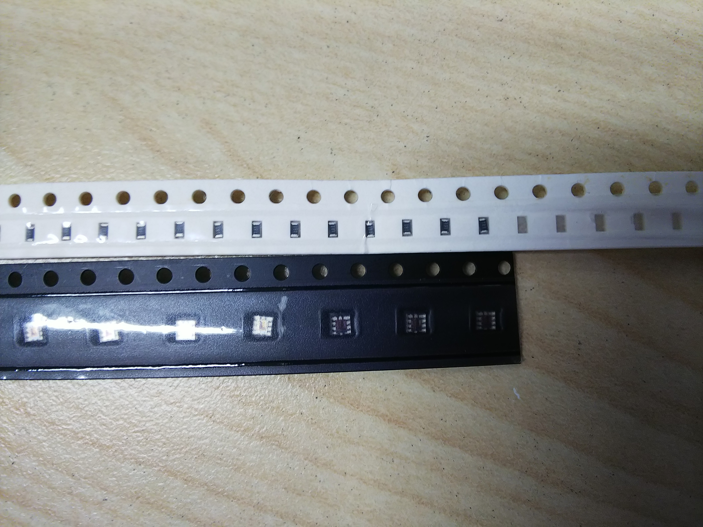
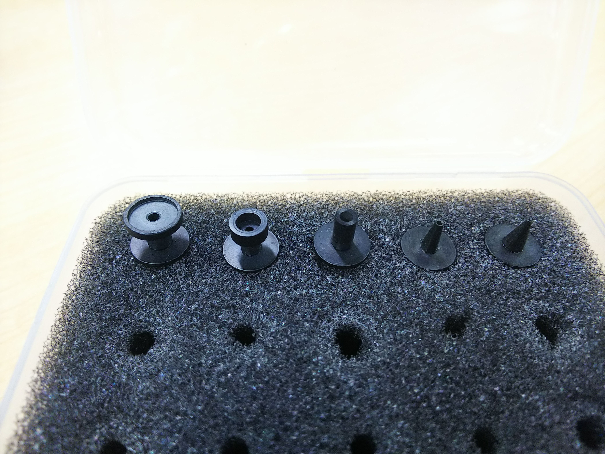
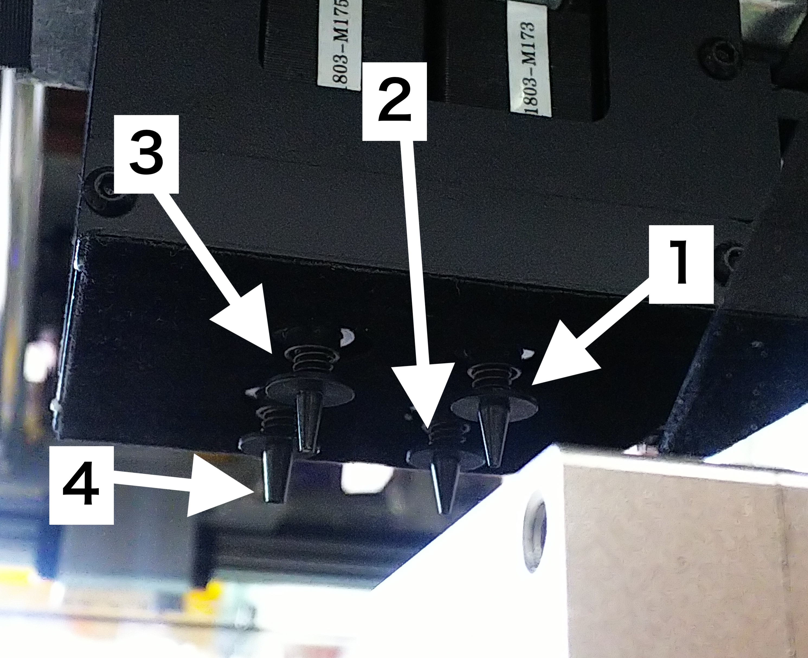

# 8.3 リールセット方法

## リールセット

フィーダーにリールをセットします。

はじめに、テープを出して、皮をめくります。だいたい５cmぐらい

次にリールとトレイにおきます。

レーバーを上げて、挟みます。皮は、写真のように出します。

皮は、下記の写真のように引っ掛けます。

フィーダーも下記の写真のようにギアに噛ませます。

フィーダーには、幅があり、リールの幅に合わせて使用します。

NEODEN4 は8MM,12MM,16MM,24MMの４種類が使用可能です。

リールには部品ピッチがあり、各部品、あらかじめ確認します。

下記の写真は、ピッチが違う例（上は4mm,下が8mmピッチ）

## ノズルセット

部品の大きさにより使用するノズルを使い分けます。

ノズル番号（Neoden4 左側から見た場合）

