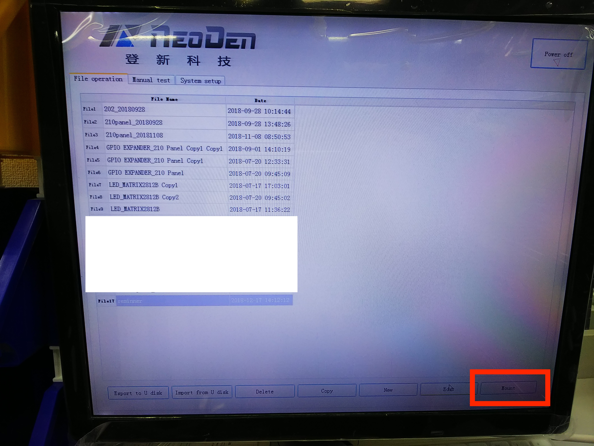

# 8.6 プログラミング　ボード配置入力

## 概要

基板上に部品を配置するプログラミングします。

## 操作手順

### パネライズリスト作成

パネライズで実装する場合は、列、行を入力して設定いたします。

シングルでの実装は、設定不要です。

### ファーストマウント設定

右、左、下一番最初に配置する部品を入力します。

一番最初に配置するそれぞれの基板を指定します。

### マークポイントの設定

マークポイントは、基板のずれを自動的に補正するためのマークです。

マークポイントがあれば、シングル、パネライズいずれかを選択して選択します。

### チップリスト作成

チップリストを作成し、各部品の配置をプログラミングします。

Newボタンを押します。

すると、1つのレコードが追加され、こちらを編集します。

使用するノズル番号、フィーダー番号、Name,Value,footprint,Rotationを入力し、Alinをクリックして、部品を置く場所を確定いたします。

抵抗、電解コンデンサ、ダイオードなどの向きを確認します。

saveで保存。次にADDボタンを押して追加していきます。

これらを全て部品を繰り返します。

### プログラミングの実行

プログラミングが完成したら、一番最初の画面に戻り、Mountボタンを押します。

スタートボタンを押す。または、NEODEN本体のボタンで繰り返しスタートできます。

実装に数回失敗すると止まります。原因を取り除いてください。

フィーダの不調、位置ずれなど
