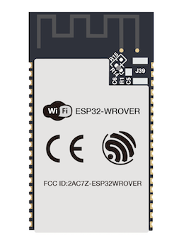

# 8.1 ESP32について

## ESP32とは
ESP32シリーズは、Espressif Systems社のWi-FiとBluetoothを内蔵する低コスト、低消費電力なSoCのマイクロコントローラです。

## ESP32モジュール
ESP32モジュール基板はESP SoCを内蔵し他の基板上に実装できる形で販売されています。

今回は何種類かあるモジュールのうち、ESP32-WROVERを使います。

これらのモジュールは、買ってそのままでは使いにくいため、ブレッドボードに挿せるような開発ボード(Development Boards)を作ります。

ちなみに、このような開発ボードは、数社から様々な形のものが販売されています。

例えば、Espressif Systems社自身で作っているものは、次のようなものがあります。

[ESP32-DevKitC](https://www.espressif.com/en/products/hardware/esp32-devkitc/overview)
