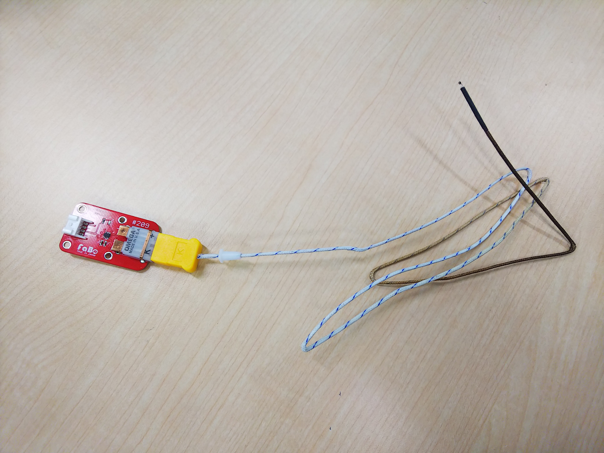
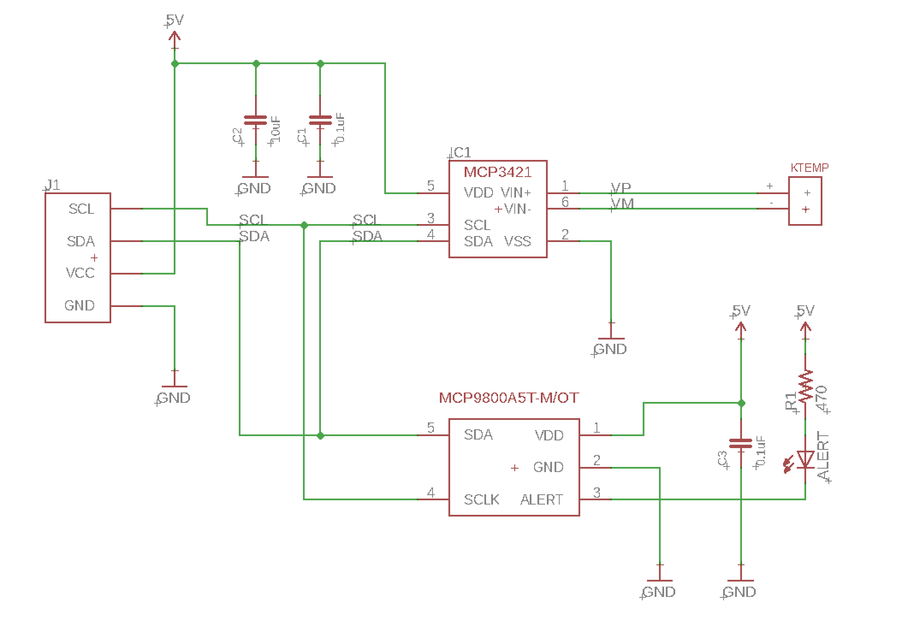

# 9.3 K熱電対

## 概要

K熱でリフロー 温度を調べるのに使います。

温度が高すぎると、部品が壊れ、温度が低すぎると半田が溶けません。温度は品質、歩留まりに大きく関わるので重要です。

季節の変わり目など、リフロー の温度も変わりますので小まめな調整が必要となります。

## 準備

ESP32

Ktemp(FaBo)

K熱電対


## 測定原理

２種類の金属は繋げて、その接点をホット、コールドとすると温度を与えると起電力発生し、その電位差を測ることで温度が測れます。

その２種類の金属は、＋側　クロメル、ー側　アトメルとし、JIS規格では記号はKとなります。

JISのK熱は、測定範囲は、−２００度〜１０００度までですが、使用するものは、－２００℃～＋１２５０℃になります。

温度差があると、電位差が生じて１度あたりの温度約４０μＶ／℃となります。

しかし、これを１０ビット等のマイコンのA/Dコンバータでは正確には出ないので

８倍増幅、１８ビットで電位差を計測します。

コールド側の温度計は、通常の温度系で十分です。

この2つの温度を合計したものが、温度になります。


## Ktemp Brick

FaBo 209 Ktemp



先端が温度計測地点になります。

## FaBo 209 Ktempで使用するI2Cセンサ

FaBo 209 Ktemp　回路図



ホット側測定

２線式高精度温度センサ　マイクロチップ MCP3421　解像度最大１２ビット

[MCP3421](http://ww1.microchip.com/downloads/jp/DeviceDoc/22003E_JP.pdf)

温度レンジ　0～1250 °C

コールド側測定

I2Cインターフェース　18ビットA/D コンバータ マイクロチップ　MCP9800

[MCP9800](http://ww1.microchip.com/downloads/en/devicedoc/21909d.pdf)

温度レンジ　-55～125 °C

符合つき１８ビットの正の範囲は、0~131071

基準電圧は2.048Vであるから、

2.048/131071=15.625μV

使用するK熱電対ケーブルの温度係数は40μV

これをゲイン８倍なので

40μV * 8 = 0.00032 μV

15.625 / 0.00032 = 20.48 code/温度


## ソースコード

FaBo Ktemp 1.0.5 用ソースコード

```c
#include <Wire.h>
//TWI ADDRESS
#define MCP9800_BASE_ADDR   0x4D
#define MCP3421_BASE_ADDR   0x69

#define MCP9800_CONFIG_REG          1
#define MCP9800_ONE_SHOT            0x80
#define MCP9800_ADC_RES_9BITS       0x00
#define MCP9800_ADC_RES_10BITS      0x20
#define MCP9800_ADC_RES_11BITS      0x40
#define MCP9800_ADC_RES_12BITS      0x60
#define MCP9800_FAULT_QUEUE_1       0x00
#define MCP9800_FAULT_QUEUE_2       0x08
#define MCP9800_FAULT_QUEUE_4       0x10
#define MCP9800_FAULT_QUEUE_6       0x18
#define MCP9800_ALERT_POLARITY_HIGH 0x04
#define MCP9800_INTERRUPT_MODE      0x02
#define MCP9800_SHUTDOWN            0x01
#define MCP3421_AMBIENT             0x00
#define MCP3421_Ktep                20.48

uint16_t tick = 0;
char st1[20];
int MCP3421_init(int address, byte sr, byte pga);
int  _adr;
byte _sr[]={12,14,16,18};
byte _pga[] = {1,2,4,8};
byte _confWrite;
byte _confRead;
byte _b2,_b3,_b4;
long _l1;
double getLong();
double vin;
double Ktemprature;
double Atemprature;

int readTemp(uint8_t reg);
void writeTempC2(uint8_t reg, int value);
uint8_t readConfig();
void writeConfig(uint8_t value);
float mcp9800_temp(void);

void setup()
{
 Serial.begin(9600);
 Wire.begin();
 writeConfig(MCP9800_ADC_RES_12BITS);
 MCP3421_init(MCP3421_BASE_ADDR,3,3);
}

void loop()
{
 float Atemprature = mcp9800_temp();
 float Ktemprature = getLong();
 if (0 == tick){
 Serial.print("time,");
 Serial.print("HOT,");
 Serial.print("COLD,");
 Serial.println("KTEMP");
 }
 Serial.print(tick++);
 Serial.print(",");
 Serial.print(Ktemprature);
 Serial.print(",");
 Serial.print(Atemprature);
 Serial.print(",");
 Serial.println(Ktemprature+Atemprature);
 delay(1000);
}


float mcp9800_temp(void)
{
   uint8_t config = readConfig();
   return readTemp(MCP3421_AMBIENT) / 16.0;
}


int readTemp(uint8_t reg)
{
   Wire.beginTransmission(MCP9800_BASE_ADDR);
   Wire.write(reg);
   Wire.endTransmission();
   Wire.requestFrom(MCP9800_BASE_ADDR, (uint8_t)2);
   int8_t msb = Wire.read();
   uint8_t lsb = Wire.read();
   return (msb << 4) + (lsb >> 4);
}

void writeTempC2(uint8_t reg, int value)
{
   union intByte_t
   {
       int i;
       byte b[2];
   } t;

   if (reg > 0x00) {    // ambient temp reg is read-only
       t.i = value << 7;
       Wire.beginTransmission(MCP9800_BASE_ADDR);
       Wire.write(reg);
       Wire.write(t.b[1]);
       Wire.write(t.b[0]);
       Wire.endTransmission();
   }
}

uint8_t readConfig()
{
   Wire.beginTransmission(MCP9800_BASE_ADDR);
   Wire.write(MCP9800_CONFIG_REG);
   Wire.endTransmission();    
   Wire.requestFrom(MCP9800_BASE_ADDR, (uint8_t)1);
   return Wire.read();
}

void writeConfig(uint8_t value)
{
   Wire.beginTransmission(MCP9800_BASE_ADDR);
   Wire.write(MCP9800_CONFIG_REG);
   Wire.write(value);
   Wire.endTransmission();
}

int MCP3421_init(int address, byte sr, byte pga) {
 _adr = address;
 _sr[sr]=sr & 3;
 _pga[pga]=pga & 3;
 Wire.beginTransmission(_adr);
 _confWrite=0;    
 _confWrite=_confWrite | ( _sr[sr]  << 2 );     
 _confWrite=_confWrite | _pga[pga];     
 bitWrite (_confWrite,7,1);    
 bitWrite (_confWrite,4,1);    
 Wire.write(_confWrite);
 Wire.endTransmission();
}

double getLong() {
 if (_sr < 3) {
 Wire.requestFrom(_adr, 3);
 _b2 = Wire.read();
 _b3 = Wire.read();
 _confRead = Wire.read();
 Wire.endTransmission();
  _l1= _b2<<8 +_b3;
 } else {
     Wire.requestFrom(_adr, 4);
 _b2 = Wire.read();
 _b3 = Wire.read();
 _b4 = Wire.read();
 _confRead = Wire.read();
 Wire.endTransmission();
 _l1= (long)_b3<<8;
 _l1=_l1+_b4;
 _l1=_l1+0x10000 * _b2;
 if ( _b2 > 0x10 ) _l1=_l1 + 0xFF000000;
    }
 #ifdef DEBUG
   sprintf(st1,"ld %ld",_l1);
   Serial.println(st1);
 #endif
 return (double)(_l1 / MCP3421_Ktep);
}

```
