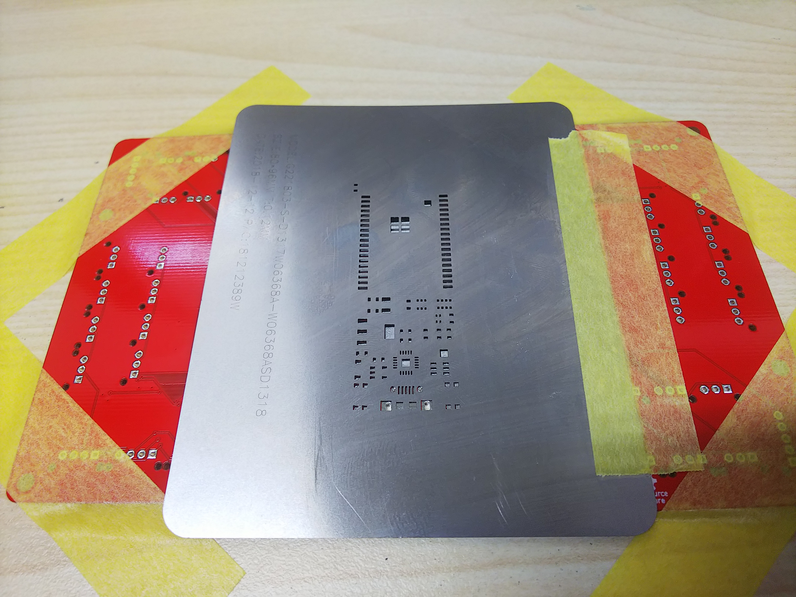
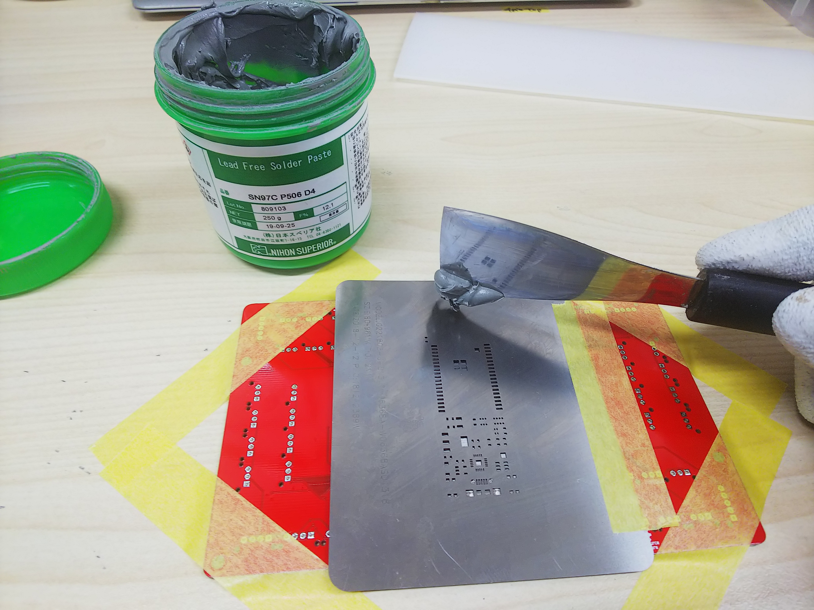
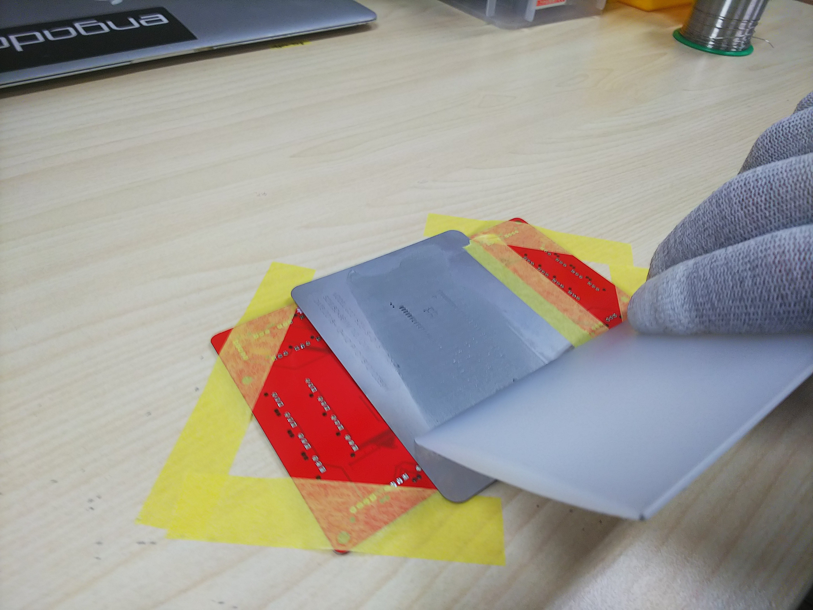

# A.2 印刷

基板を固定し、印刷をします。歪みなどで、うまく印刷できないので注意します。

メタルマスク（ステンシル）を合わせます。

半田をおきます。

スキージで印刷します。

余分な半田をカットさせ

印刷完了です。

再印刷する場合は、キムワイプで裏を清掃します。

半田の量が適正か？ズレ、にじむ等がないか確認をします。（半田ボールの原因となる）

異常がなければ実装工程に進みます。

印刷して、戻します。

失敗したらエタノールで洗浄します。

印刷したら、裏面を吹きます。

## 注意事項

※手袋を使用のこと。

※使用後は、手洗いを行ってください。
