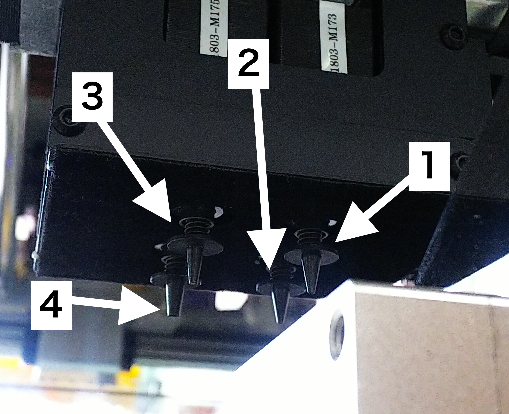

# 4.3 リールセット方法

## リールセット

フィーダーにリールをセットします。

はじめに、テープを出して、皮をめくります。だいたい５cmぐらい

フィーダーには、幅があり、リールの幅に合わせて使用します。

リールには部品ピッチがあり、あらかじめ確認します。

必要なテープをめくり、写真のようにセットします。

テストフィードします。

## ノズルセット

部品の大きさにより使用するノズルを使い分けます。

ノズル番号（Neoden4 左側から見た場合）

