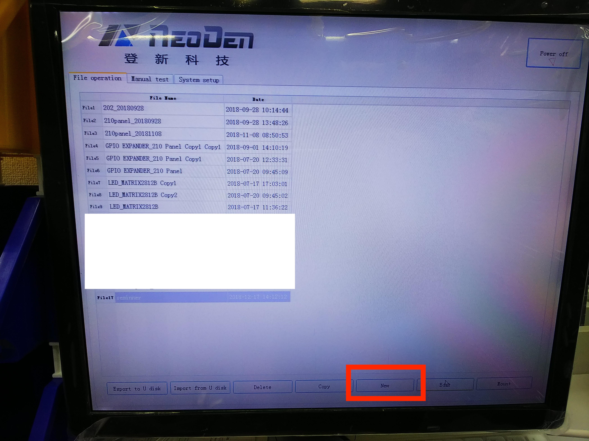
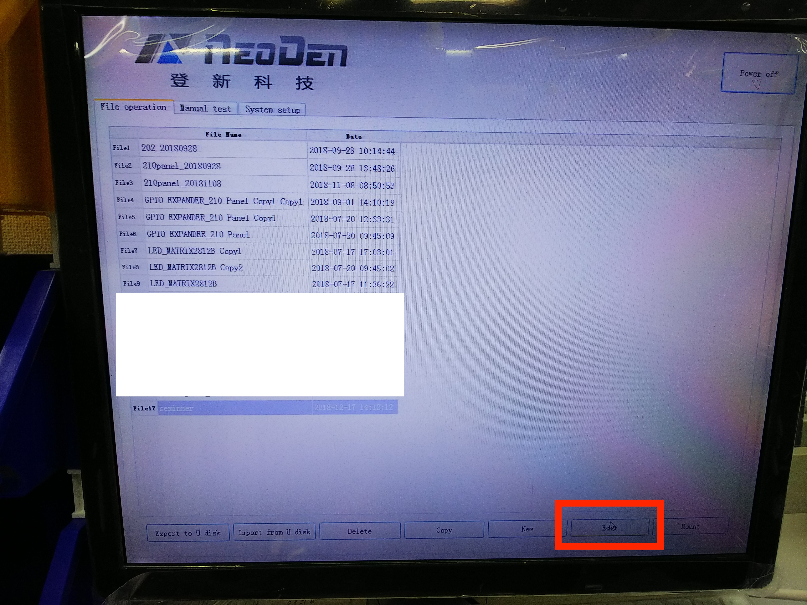
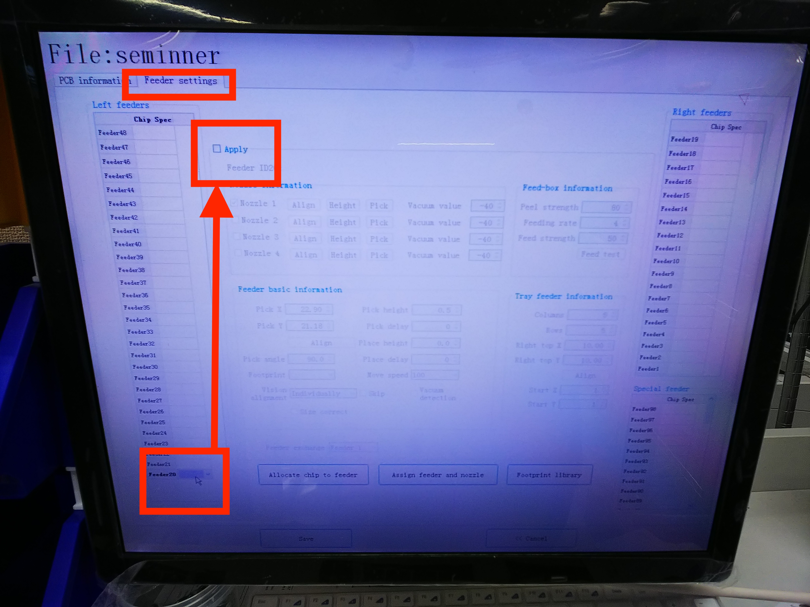

# 5.4　プログラミング（パーツの認識）

## 概要

リールのセットが完了したら、装置にセットした部品の場所を入力します。

設定が悪いと部品が落ちたり、時間が掛かったり部品の無駄が多くなります。

## プログラミング

Neoden4の電源を投入します。

OSが立ち上がり、起動します。

### プログラムの保存先を設定

NEWボタンを押して、任意の名前で、保存先を作ります。

### プログラムの編集

下記のEditボタンを押します。

### フィードボックスの編集

FeedSettingタブを選択します。

FeedSettingを選びますと、下記の画面が表示されます。

設定したいフィードボックスを指定し、Appyで有効化します。

すると、半透明だった入力ボックスが入力できるようになります。

テストフィードして部品が見えるまでフィードします。

ノズルの先端を部品中央に合わせてsaveボタンを押します。

### ノズルの設定

フィーダー対する使用するノズルを設定いたします。

吸い込み量設定

### フィードの設定

リードを皮むきの強さ、テープの進む強さを設定します。

### フットプリントの設定

ノズルが部品を取り、位置ずれ、角度ズレを調整するために設定いたします。

数値はインチになります。

### 角度の設定

部品を取りにくいくヘッドの角度を設定します。（通常はデフォルト）

### ピックの設定

部品を取りにくいくノズルの高さを調整します。

部品の高さによって調整する。

### マウントの設定

部品を配置する時のノズルの高さを調整します。

部品の高さによって調整する。

### ディレイ設定

部品を配置する時のノズルの静止時間を調整します。

部品によって調整します。

### スピード設定

ヘッドが動くスピードを調整します。

## 注意事項

実装しない部品は誤配の原因となりますので取り外してください。

定期的なフィーダーの清掃を実施します。

※緊急停止ボタン

※動作中は、ヘッド作業エリア内のは、手などを入れないでください。

フィーダーのセット番号は以下の様になります。

各番号にフィーダに対応する部品の位置情報を入力します。
