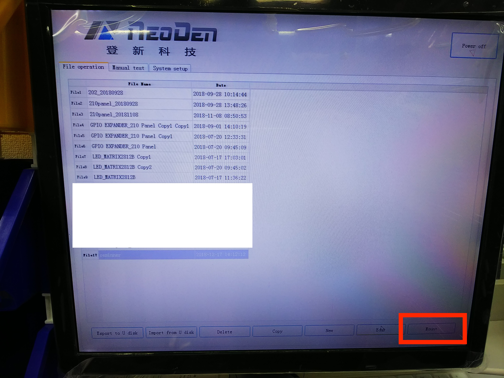

# 4.6 プログラミング　ボード配置入力

## 概要

基板上に部品を配置するプログラミングします。

パネライズする場合は、列、行を入力して

右、左、下一番最初に配置する部品を入力します。

一番最初に配置するそれぞれの基板を指定します。

マークポイントがあれば、シングル、パネライズいずれかを選択して選択します。

チップリストを作成し、各部品の配置をプログラミングします。

プログラミングが完成したら、一番最初の画面に戻り、Editボタンを押します。

